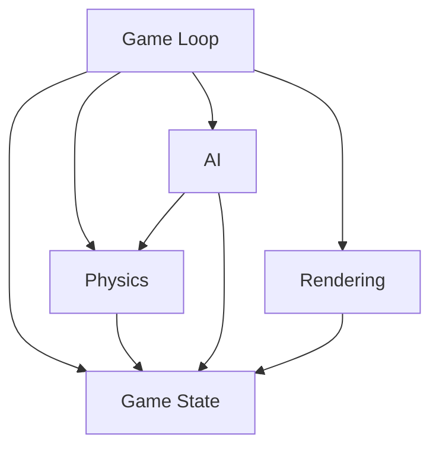

# Top-Down 2D Racing Game Prototype - Technical Specification

## 1. Core Architecture

### 1.1 Game Loop with Fixed Timestep

**Implementation Strategy:**
- Use a dual-loop pattern: one loop for rendering (variable timestep) and one for game logic (fixed timestep)
- Fixed timestep ensures deterministic physics and game state updates
- Rendering loop runs as fast as possible, but game logic updates at fixed intervals

**Data Structures:**
```javascript
{
  lastUpdateTime: number,  // Last timestamp when game logic was updated
  accumulator: number,     // Accumulates elapsed time for fixed updates
  fixedTimestep: number,   // Target time per logic update (e.g., 1/60)
  maxFrameSkip: number,    // Maximum number of fixed updates per render (e.g., 5)
  lag: number              // Tracks how much time needs to be caught up
}
```

**Algorithm:**
```
function gameLoop(currentTime) {
  // Calculate frame time
  frameTime = currentTime - lastUpdateTime
  lastUpdateTime = currentTime
  
  // Accumulate time
  accumulator += frameTime
  
  // Process fixed updates
  while (accumulator >= fixedTimestep && frameSkip < maxFrameSkip) {
    updateGameState(fixedTimestep)
    accumulator -= fixedTimestep
    frameSkip++
  }
  
  // Interpolation for smooth rendering
  alpha = accumulator / fixedTimestep
  
  // Render with interpolation
  render(alpha)
  
  // Schedule next frame
  requestAnimationFrame(gameLoop)
}
```

### 1.2 Deterministic RNG Seed Initialization

**Implementation Strategy:**
- Use a seed-based PRNG (Pseudo-Random Number Generator)
- Seed should be derived from game start time or user input
- Same seed always produces same sequence of random numbers

**Data Structures:**
```javascript
class PRNG {
  constructor(seed: number) {
    this.seed = seed
    this.state = seed
  }
  
  next(): number {
    // Xorshift algorithm for good distribution
    this.state ^= this.state << 13
    this.state ^= this.state >> 17
    this.state ^= this.state << 5
    return (this.state >>> 0) / 0xFFFFFFFF
  }
}
```

**Initialization:**
```javascript
// Derive seed from game start time
const seed = Math.floor(Date.now() / 1000) % 1000000
const rng = new PRNG(seed)
```

### 1.3 Module Structure

**Directory Structure:**
```
src/
├── core/
│   ├── gameLoop.js        // Game loop implementation
│   ├── rng.js             // Random number generation
│   └── constants.js       // Game constants
├── physics/
│   ├── vehicle.js         // Vehicle physics
│   ├── collision.js       // Collision detection/resolution
│   └── track.js           // Track boundaries
├── ai/
│   ├── waypoints.js       // Waypoint system
│   ├── pathfinding.js     // A* pathfinding
│   └── opponent.js        // AI opponent behavior
├── rendering/
│   ├── renderer.js        // Main renderer
│   ├── hud.js             // HUD elements
│   └── assets.js          // Asset loading
├── state/
│   ├── gameState.js       // Game state management
│   ├── player.js          // Player state
│   └── race.js            // Race timing
└── main.js                // Entry point
```

**Module Dependencies:**


## 2. Physics System

### 2.1 Vehicle Physics Model

**Data Structures:**
```javascript
class Vehicle {
  constructor(x, y, angle) {
    this.position = { x, y }
    this.velocity = { x: 0, y: 0 }
    this.angle = angle          // Current facing angle (radians)
    this.angularVelocity = 0   // Rate of rotation
    this.speed = 0              // Current speed
    this.maxSpeed = 10          // Maximum speed
    this.acceleration = 0.2     // Acceleration rate
    this.deceleration = 0.1    // Deceleration rate
    this.steeringSpeed = 3      // How fast car can turn
    this.steeringAngle = 0      // Current steering angle
    this.mass = 1               // Vehicle mass
    this.width = 20             // Bounding box width
    this.height = 40            // Bounding box height
  }
}
```

**Physics Update Algorithm:**
```javascript
function updateVehicle(vehicle, deltaTime, controls) {
  // Apply acceleration/braking
  if (controls.accelerate) {
    vehicle.speed += vehicle.acceleration * deltaTime
  } else if (controls.brake) {
    vehicle.speed -= vehicle.deceleration * deltaTime
  }
  
  // Apply friction/deceleration
  if (!controls.accelerate && !controls.brake) {
    vehicle.speed = Math.max(0, vehicle.speed - vehicle.deceleration * deltaTime)
  }
  
  // Clamp speed
  vehicle.speed = Math.min(vehicle.speed, vehicle.maxSpeed)
  
  // Apply steering
  if (controls.steerLeft) {
    vehicle.steeringAngle = Math.min(
      vehicle.steeringAngle + vehicle.steeringSpeed * deltaTime,
      Math.PI / 4
    )
  } else if (controls.steerRight) {
    vehicle.steeringAngle = Math.max(
      vehicle.steeringAngle - vehicle.steeringSpeed * deltaTime,
      -Math.PI / 4
    )
  } else {
    // Return to center if no steering input
    if (vehicle.steeringAngle > 0) {
      vehicle.steeringAngle = Math.max(0, vehicle.steeringAngle - vehicle.steeringSpeed * 0.5 * deltaTime)
    } else if (vehicle.steeringAngle < 0) {
      vehicle.steeringAngle = Math.min(0, vehicle.steeringAngle + vehicle.steeringSpeed * 0.5 * deltaTime)
    }
  }
  
  // Update angle based on steering
  const turnAngle = vehicle.steeringAngle * (vehicle.speed / vehicle.maxSpeed)
  vehicle.angle += turnAngle * deltaTime
  
  // Update velocity based on angle and speed
  vehicle.velocity.x = Math.cos(vehicle.angle) * vehicle.speed
  vehicle.velocity.y = Math.sin(vehicle.angle) * vehicle.speed
  
  // Update position
  vehicle.position.x += vehicle.velocity.x * deltaTime
  vehicle.position.y += vehicle.velocity.y * deltaTime
}
```

### 2.2 Collision Detection

**Circle Collision Detection:**
```javascript
function circleCollision(circle1, circle2) {
  const dx = circle2.x - circle1.x
  const dy = circle2.y - circle1.y
  const distance = Math.sqrt(dx * dx + dy * dy)
  return distance < (circle1.radius + circle2.radius)
}
```

**Bounding Box Collision Detection:**
```javascript
function boundingBoxCollision(box1, box2) {
  return (
    box1.x < box2.x + box2.width &&
    box1.x + box1.width > box2.x &&
    box1.y < box2.y + box2.height &&
    box1.y + box1.height > box2.y
  )
}
```

**Track Boundary Collision:**
```javascript
function checkTrackCollision(vehicle, track) {
  // Check if vehicle is outside track boundaries
  for (const boundary of track.boundaries) {
    if (pointInPolygon(vehicle.position, boundary)) {
      return false  // Inside track
    }
  }
  return true  // Outside track
}
```

### 2.3 Collision Response with Impulse Resolution

**Impulse-Based Collision Resolution:**
```javascript
function resolveCollision(vehicle1, vehicle2) {
  // Calculate normal vector
  const dx = vehicle2.position.x - vehicle1.position.x
  const dy = vehicle2.position.y - vehicle1.position.y
  const distance = Math.sqrt(dx * dx + dy * dy)
  
  // Avoid division by zero
  if (distance === 0) return
  
  const nx = dx / distance
  const ny = dy / distance
  
  // Calculate relative velocity
  const rvx = vehicle2.velocity.x - vehicle1.velocity.x
  const rvy = vehicle2.velocity.y - vehicle1.velocity.y
  
  // Calculate relative velocity in terms of the normal direction
  const velocityAlongNormal = rvx * nx + rvy * ny
  
  // Do not resolve if objects are moving apart
  if (velocityAlongNormal > 0) return
  
  // Calculate impulse scalar
  const e = 0.8  // Restitution coefficient (0 = perfectly inelastic, 1 = perfectly elastic)
  const j = -(1 + e) * velocityAlongNormal
  
  // Apply impulse
  const impulseX = j * nx
  const impulseY = j * ny
  
  vehicle1.velocity.x -= impulseX / vehicle1.mass
  vehicle1.velocity.y -= impulseY / vehicle1.mass
  vehicle2.velocity.x += impulseX / vehicle2.mass
  vehicle2.velocity.y += impulseY / vehicle2.mass
  
  // Position correction to prevent sticking
  const percent = 0.2  // Penetration correction percentage
  const correction = (distance - vehicle1.radius - vehicle2.radius) * percent
  vehicle1.position.x -= correction * nx
  vehicle1.position.y -= correction * ny
  vehicle2.position.x += correction * nx
  vehicle2.position.y += correction * ny
}
```

### 2.4 Lap Detection Mechanism

**Data Structures:**
```javascript
class LapDetector {
  constructor(checkpoints) {
    this.checkpoints = checkpoints  // Array of checkpoint positions
    this.nextCheckpointIndex = 0
    this.lapCount = 0
    this.lastCheckpoint = null
  }
}
```

**Algorithm:**
```javascript
function checkLapProgress(vehicle, lapDetector) {
  const vehiclePos = vehicle.position
  
  // Check if vehicle passed next checkpoint
  for (let i = 0; i < lapDetector.checkpoints.length; i++) {
    const checkpoint = lapDetector.checkpoints[i]
    const distance = Math.sqrt(
      Math.pow(vehiclePos.x - checkpoint.x, 2) +
      Math.pow(vehiclePos.y - checkpoint.y, 2)
    )
    
    if (distance < 30) {  // Checkpoint radius
      if (i === lapDetector.nextCheckpointIndex) {
        lapDetector.nextCheckpointIndex = (i + 1) % lapDetector.checkpoints.length
        lapDetector.lastCheckpoint = checkpoint
        
        // Check if completed lap
        if (i === lapDetector.checkpoints.length - 1) {
          lapDetector.lapCount++
          return true  // Lap completed
        }
        return false
      }
    }
  }
  
  return false
}
```

## 3. AI System

### 3.1 Waypoint Path System

**Data Structures:**
```javascript
class Waypoint {
  constructor(x, y) {
    this.x = x
    this.y = y
    this.connections = []  // Indices of connected waypoints
  }
}

class WaypointGraph {
  constructor() {
    this.waypoints = []
  }
  
  addWaypoint(x, y) {
    const waypoint = new Waypoint(x, y)
    this.waypoints.push(waypoint)
    return this.waypoints.length - 1
  }
  
  connect(a, b) {
    this.waypoints[a].connections.push(b)
    this.waypoints[b].connections.push(a)
  }
}
```

**Track Creation Example:**
```javascript
function createTrackWaypoints() {
  const graph = new WaypointGraph()
  
  // Create waypoints along track
  const waypointIndices = []
  for (let i = 0; i < trackPoints.length; i += 5) {
    waypointIndices.push(graph.addWaypoint(trackPoints[i].x, trackPoints[i].y))
  }
  
  // Connect waypoints in order
  for (let i = 0; i < waypointIndices.length - 1; i++) {
    graph.connect(waypointIndices[i], waypointIndices[i + 1])
  }
  
  // Connect last to first to complete loop
  graph.connect(waypointIndices[waypointIndices.length - 1], waypointIndices[0])
  
  return graph
}
```

### 3.2 AI Opponent Behavior

**Data Structures:**
```javascript
class AIOpponent {
  constructor(vehicle, waypointGraph) {
    this.vehicle = vehicle
    this.waypointGraph = waypointGraph
    this.currentWaypoint = 0
    this.targetSpeed = 0.8  // 80% of max speed
    this.reactionTime = 0.5  // Time to react to obstacles
    this.lastObstacleCheck = 0
  }
}
```

**Waypoint Following Algorithm:**
```javascript
function updateAIOpponent(opponent, deltaTime) {
  const vehicle = opponent.vehicle
  const graph = opponent.waypointGraph
  
  // Get current waypoint
  const currentWaypoint = graph.waypoints[opponent.currentWaypoint]
  
  // Calculate direction to waypoint
  const dx = currentWaypoint.x - vehicle.position.x
  const dy = currentWaypoint.y - vehicle.position.y
  const distance = Math.sqrt(dx * dx + dy * dy)
  
  // Calculate target angle
  let targetAngle = Math.atan2(dy, dx)
  
  // Check if need to change waypoint
  if (distance < 20) {
    // Find next waypoint
    const connections = currentWaypoint.connections
    let nextWaypoint = connections[0]
    
    // Check all connections to find best next waypoint
    let bestDistance = Infinity
    for (const conn of connections) {
      const wp = graph.waypoints[conn]
      const d = Math.sqrt(
        Math.pow(vehicle.position.x - wp.x, 2) +
        Math.pow(vehicle.position.y - wp.y, 2)
      )
      if (d < bestDistance) {
        bestDistance = d
        nextWaypoint = conn
      }
    }
    
    opponent.currentWaypoint = nextWaypoint
    return  // Skip rest of logic if just changed waypoint
  }
  
  // Calculate steering
  const angleDiff = targetAngle - vehicle.angle
  const normalizedDiff = ((angleDiff + Math.PI) % (2 * Math.PI)) - Math.PI
  
  let controls = {
    accelerate: true,
    brake: false,
    steerLeft: false,
    steerRight: false
  }
  
  // Steer towards target
  if (normalizedDiff > 0.1) {
    controls.steerRight = true
  } else if (normalizedDiff < -0.1) {
    controls.steerLeft = true
  }
  
  // Adjust speed based on curve
  const lookAhead = 50
  const lookAheadX = vehicle.position.x + Math.cos(targetAngle) * lookAhead
  const lookAheadY = vehicle.position.y + Math.sin(targetAngle) * lookAhead
  
  // Find waypoint closest to lookahead point
  let minDist = Infinity
  for (let i = 0; i < graph.waypoints.length; i++) {
    const wp = graph.waypoints[i]
    const d = Math.sqrt(
      Math.pow(lookAheadX - wp.x, 2) +
      Math.pow(lookAheadY - wp.y, 2)
    )
    if (d < minDist) {
      minDist = d
    }
  }
  
  // Calculate curve radius approximation
  const curveRadius = minDist
  const targetSpeed = Math.min(
    vehicle.maxSpeed * opponent.targetSpeed,
    vehicle.maxSpeed * 0.7 * (curveRadius / 100)
  )
  
  // Adjust acceleration based on speed difference
  if (vehicle.speed < targetSpeed * 0.9) {
    controls.accelerate = true
  } else if (vehicle.speed > targetSpeed * 1.1) {
    controls.brake = true
  }
  
  // Update vehicle with AI controls
  updateVehicle(vehicle, deltaTime, controls)
}
```

### 3.3 A* Pathfinding for Dynamic Obstacle Avoidance

**Data Structures:**
```javascript
class Node {
  constructor(x, y) {
    this.x = x
    this.y = y
    this.g = Infinity  // Cost from start
    this.h = Infinity  // Heuristic cost to end
    this.f = Infinity  // Total cost (g + h)
    this.parent = null  // Parent node
    this.walkable = true
  }
}

class Pathfinder {
  constructor(width, height, nodeSize) {
    this.width = width
    this.height = height
    this.nodeSize = nodeSize
    this.nodes = []
    this.openSet = []
    this.closedSet = new Set()
  }
  
  initializeGrid(obstacles) {
    this.nodes = []
    for (let y = 0; y < this.height; y += this.nodeSize) {
      const row = []
      for (let x = 0; x < this.width; x += this.nodeSize) {
        const node = new Node(x, y)
        
        // Check if node is walkable
        node.walkable = !this.isInObstacle(x, y, obstacles)
        
        row.push(node)
      }
      this.nodes.push(row)
    }
  }
  
  findPath(start, end, obstacles) {
    this.initializeGrid(obstacles)
    
    const startNode = this.getNode(start.x, start.y)
    const endNode = this.getNode(end.x, end.y)
    
    if (!startNode || !endNode) return []
    
    this.openSet = [startNode]
    
    while (this.openSet.length > 0) {
      // Get node with lowest f score
      this.openSet.sort((a, b) => a.f - b.f)
      const current = this.openSet.shift()
      
      if (current === endNode) {
        return this.reconstructPath(current)
      }
      
      this.closedSet.add(current)
      
      // Check neighbors
      for (const neighbor of this.getNeighbors(current)) {
        if (!neighbor.walkable || this.closedSet.has(neighbor)) continue
        
        const tentativeG = current.g + this.distance(current, neighbor)
        
        if (tentativeG < neighbor.g) {
          neighbor.parent = current
          neighbor.g = tentativeG
          neighbor.h = this.heuristic(neighbor, endNode)
          neighbor.f = neighbor.g + neighbor.h
          
          if (!this.openSet.includes(neighbor)) {
            this.openSet.push(neighbor)
          }
        }
      }
    }
    
    return []  // No path found
  }
  
  reconstructPath(node) {
    const path = []
    let current = node
    while (current.parent) {
      path.unshift(current)
      current = current.parent
    }
    return path
  }
}
```

**Usage in AI:**
```javascript
function updateAIOpponentWithPathfinding(opponent, deltaTime, obstacles) {
  // Use A* to find path around obstacles
  const pathfinder = new Pathfinder(
    gameWidth, gameHeight, 20
  )
  
  const start = {
    x: opponent.vehicle.position.x,
    y: opponent.vehicle.position.y
  }
  
  // Find next waypoint
  const currentWaypoint = opponent.waypointGraph.waypoints[opponent.currentWaypoint]
  const end = {
    x: currentWaypoint.x,
    y: currentWaypoint.y
  }
  
  const path = pathfinder.findPath(start, end, obstacles)
  
  if (path.length > 0) {
    // Follow the path
    const target = path[0]
    const dx = target.x - opponent.vehicle.position.x
    const dy = target.y - opponent.vehicle.position.y
    const targetAngle = Math.atan2(dy, dx)
    
    // Steer towards target
    const angleDiff = targetAngle - opponent.vehicle.angle
    const normalizedDiff = ((angleDiff + Math.PI) % (2 * Math.PI)) - Math.PI
    
    let controls = {
      accelerate: true,
      brake: false,
      steerLeft: false,
      steerRight: false
    }
    
    if (normalizedDiff > 0.1) {
      controls.steerRight = true
    } else if (normalizedDiff < -0.1) {
      controls.steerLeft = true
    }
    
    updateVehicle(opponent.vehicle, deltaTime, controls)
  } else {
    // Fall back to waypoint following
    updateAIOpponent(opponent, deltaTime)
  }
}
```

## 4. Game State Management

### 4.1 Player and AI Car States

**Data Structures:**
```javascript
class GameState {
  constructor() {
    this.players = []
    this.aiOpponents = []
    this.track = null
    this.raceStarted = false
    this.raceFinished = false
    this.currentTime = 0
    this.lapTimes = []
    this.completedLaps = []
  }
  
  addPlayer(vehicle) {
    this.players.push({
      vehicle,
      laps: 0,
      bestLap: Infinity,
      currentLapTime: 0,
      position: 1,
      finished: false
    })
  }
  
  addAIOpponent(vehicle, waypointGraph) {
    this.aiOpponents.push(new AIOpponent(vehicle, waypointGraph))
  }
  
  update(deltaTime) {
    if (!this.raceStarted) return
    
    this.currentTime += deltaTime
    
    // Update all vehicles
    for (const player of this.players) {
      if (!player.finished) {
        player.currentLapTime += deltaTime
        updateVehicle(player.vehicle, deltaTime, player.controls)
      }
    }
    
    for (const opponent of this.aiOpponents) {
      updateAIOpponent(opponent, deltaTime)
    }
    
    // Check collisions
    this.checkCollisions()
    
    // Check lap progress
    this.checkLapProgress()
    
    // Update positions
    this.updatePositions()
  }
  
  checkCollisions() {
    // Check vehicle-vehicle collisions
    for (let i = 0; i < this.players.length; i++) {
      for (let j = i + 1; j < this.players.length; j++) {
        resolveCollision(
          this.players[i].vehicle,
          this.players[j].vehicle
        )
      }
    }
    
    // Check vehicle-AI collisions
    for (const player of this.players) {
      for (const opponent of this.aiOpponents) {
        resolveCollision(player.vehicle, opponent.vehicle)
      }
    }
    
    // Check AI-AI collisions
    for (let i = 0; i < this.aiOpponents.length; i++) {
      for (let j = i + 1; j < this.aiOpponents.length; j++) {
        resolveCollision(
          this.aiOpponents[i].vehicle,
          this.aiOpponents[j].vehicle
        )
      }
    }
  }
  
  checkLapProgress() {
    for (const player of this.players) {
      if (player.finished) continue
      
      const lapCompleted = checkLapProgress(player.vehicle, player.lapDetector)
      if (lapCompleted) {
        player.laps++
        player.completedLaps.push(player.currentLapTime)
        player.bestLap = Math.min(player.bestLap, player.currentLapTime)
        player.currentLapTime = 0
        
        // Check if race is finished
        if (player.laps >= this.totalLaps) {
          player.finished = true
          player.finishTime = this.currentTime
        }
      }
    }
  }
  
  updatePositions() {
    // Sort players by distance from start/finish line
    this.players.sort((a, b) => {
      const aDist = this.calculateDistanceFromStart(a.vehicle)
      const bDist = this.calculateDistanceFromStart(b.vehicle)
      return aDist - bDist
    })
    
    // Update positions
    for (let i = 0; i < this.players.length; i++) {
      this.players[i].position = i + 1
    }
  }
}
```

### 4.2 HUD Display

**Data Structures:**
```javascript
class HUD {
  constructor(gameState) {
    this.gameState = gameState
    this.font = '16px Arial'
    this.textColor = '#FFFFFF'
    this.backgroundColor = 'rgba(0, 0, 0, 0.5)'
  }
  
  render(ctx) {
    // Draw background
    ctx.fillStyle = this.backgroundColor
    ctx.fillRect(10, 10, 200, 150)
    
    // Draw race time
    ctx.fillStyle = this.textColor
    ctx.font = this.font
    ctx.fillText(`Time: ${formatTime(this.gameState.currentTime)}`, 20, 30)
    
    // Draw player info
    for (let i = 0; i < this.gameState.players.length; i++) {
      const player = this.gameState.players[i]
      const y = 50 + i * 20
      
      let status = ''
      if (player.finished) {
        status = `FINISHED (${formatTime(player.finishTime)})`
      } else {
        status = `${player.position}. P${i+1} - Lap ${player.laps}/${this.gameState.totalLaps}`
      }
      
      ctx.fillText(status, 20, y)
    }
    
    // Draw best lap
    if (this.gameState.players[0].bestLap !== Infinity) {
      ctx.fillText(
        `Best Lap: ${formatTime(this.gameState.players[0].bestLap)}`,
        20, 120
      )
    }
    
    // Draw current lap time
    ctx.fillText(
      `Current Lap: ${formatTime(this.gameState.players[0].currentLapTime)}`,
      20, 140
    )
  }
}

function formatTime(seconds) {
  const mins = Math.floor(seconds / 60)
  const secs = Math.floor(seconds % 60)
  const centis = Math.floor((seconds % 1) * 100)
  return `${mins}:${secs.toString().padStart(2, '0')}.${centis.toString().padStart(2, '0')}`
}
```

### 4.3 Race Timing and Scoring

**Data Structures:**
```javascript
class RaceManager {
  constructor(gameState, totalLaps) {
    this.gameState = gameState
    this.totalLaps = totalLaps
    this.startTime = null
    this.countdown = 3
    this.countdownTimer = 0
    this.countdownActive = false
  }
  
  startCountdown() {
    this.countdownActive = true
    this.countdownTimer = 0
    this.countdown = 3
  }
  
  update(deltaTime) {
    if (this.countdownActive) {
      this.countdownTimer += deltaTime
      
      if (this.countdownTimer >= 1) {
        this.countdown--
        this.countdownTimer = 0
        
        if (this.countdown <= 0) {
          this.countdownActive = false
          this.gameState.raceStarted = true
          this.startTime = Date.now()
        }
      }
    }
  }
  
  getRaceResults() {
    // Sort players by finish time
    const finishedPlayers = this.gameState.players
      .filter(p => p.finished)
      .sort((a, b) => a.finishTime - b.finishTime)
    
    // Sort players by position for those who haven't finished
    const unfinishedPlayers = this.gameState.players
      .filter(p => !p.finished)
      .sort((a, b) => a.position - b.position)
    
    return [...finishedPlayers, ...unfinishedPlayers]
  }
}
```

## 5. Technical Constraints

### 5.1 No External Physics Engines

**Implementation Notes:**
- All physics calculations must be implemented from scratch
- Use basic vector math for velocity, acceleration, and forces
- Implement collision detection using simple geometric primitives (circles, rectangles)
- Use impulse-based resolution for collision response
- Ensure all calculations are deterministic

### 5.2 Pure JavaScript Implementation

**Implementation Notes:**
- No WebAssembly, no TypeScript (unless transpiled to JS)
- Use vanilla JavaScript with ES6+ features
- Use Canvas API for rendering
- Use keyboard events for input
- No external libraries (except for development tools)

### 5.3 Deterministic Behavior

**Implementation Notes:**
- Use seed-based PRNG for all randomness
- Ensure all calculations are order-independent
- Sort arrays consistently (always ascending or descending)
- Avoid floating-point precision issues by:
  - Using consistent epsilon values for comparisons
  - Rounding to fixed precision when necessary
  - Using integer arithmetic where possible

**Deterministic RNG Usage:**
```javascript
// Initialize RNG with seed
const seed = 12345  // Can be derived from game start or user input
const rng = new PRNG(seed)

// Use RNG for all random operations
function getRandomInRange(min, max) {
  return min + (max - min) * rng.next()
}

// Example: Random track generation
function generateRandomTrack(rng, width, height) {
  const track = []
  const segments = 20
  
  for (let i = 0; i < segments; i++) {
    const angle = getRandomInRange(0, 2 * Math.PI)
    const radius = getRandomInRange(50, 150)
    
    track.push({
      x: width / 2 + Math.cos(angle) * radius,
      y: height / 2 + Math.sin(angle) * radius,
      angle
    })
  }
  
  return track
}
```

## 6. Additional Implementation Details

### 6.1 Input Handling

**Data Structures:**
```javascript
class InputManager {
  constructor() {
    this.keys = {}
    this.controls = {
      accelerate: false,
      brake: false,
      steerLeft: false,
      steerRight: false
    }
  }
  
  setupEventListeners() {
    window.addEventListener('keydown', (e) => this.onKeyDown(e))
    window.addEventListener('keyup', (e) => this.onKeyUp(e))
  }
  
  onKeyDown(e) {
    this.keys[e.code] = true
    this.updateControls()
  }
  
  onKeyUp(e) {
    this.keys[e.code] = false
    this.updateControls()
  }
  
  updateControls() {
    this.controls.accelerate = this.keys['ArrowUp'] || this.keys['KeyW']
    this.controls.brake = this.keys['ArrowDown'] || this.keys['KeyS']
    this.controls.steerLeft = this.keys['ArrowLeft'] || this.keys['KeyA']
    this.controls.steerRight = this.keys['ArrowRight'] || this.keys['KeyD']
  }
  
  getControls() {
    return this.controls
  }
}
```

### 6.2 Rendering System

**Data Structures:**
```javascript
class Renderer {
  constructor(canvas) {
    this.canvas = canvas
    this.ctx = canvas.getContext('2d')
    this.scale = 1
  }
  
  resize(width, height) {
    this.canvas.width = width
    this.canvas.height = height
    this.ctx.scale(this.scale, this.scale)
  }
  
  clear() {
    this.ctx.clearRect(0, 0, this.canvas.width, this.canvas.height)
  }
  
  renderVehicle(vehicle) {
    this.ctx.save()
    
    // Draw vehicle body
    this.ctx.translate(vehicle.position.x, vehicle.position.y)
    this.ctx.rotate(vehicle.angle)
    
    this.ctx.fillStyle = '#3498db'
    this.ctx.fillRect(-vehicle.width / 2, -vehicle.height / 2, vehicle.width, vehicle.height)
    
    // Draw wheels
    this.ctx.fillStyle = '#000000'
    this.ctx.fillRect(-10, vehicle.height / 2 - 5, 20, 10)
    this.ctx.fillRect(-10, -vehicle.height / 2 - 5, 20, 10)
    
    this.ctx.restore()
  }
  
  renderTrack(track) {
    this.ctx.strokeStyle = '#2ecc71'
    this.ctx.lineWidth = 5
    this.ctx.beginPath()
    
    for (let i = 0; i < track.points.length; i++) {
      const point = track.points[i]
      if (i === 0) {
        this.ctx.moveTo(point.x, point.y)
      } else {
        this.ctx.lineTo(point.x, point.y)
      }
    }
    
    this.ctx.closePath()
    this.ctx.stroke()
  }
  
  renderHUD(hud) {
    hud.render(this.ctx)
  }
}
```

### 6.3 Game Initialization

**Main Game Loop Setup:**
```javascript
function initGame() {
  // Initialize canvas
  const canvas = document.getElementById('gameCanvas')
  const renderer = new Renderer(canvas)
  
  // Initialize input
  const inputManager = new InputManager()
  inputManager.setupEventListeners()
  
  // Create track
  const track = createTrack()
  const waypointGraph = createTrackWaypoints(track)
  
  // Create player vehicle
  const playerVehicle = new Vehicle(
    track.start.x,
    track.start.y,
    track.start.angle
  )
  
  // Create AI opponents
  const aiOpponents = []
  for (let i = 0; i < 3; i++) {
    const angleOffset = (i / 3) * Math.PI * 2
    const aiVehicle = new Vehicle(
      track.start.x + Math.cos(angleOffset) * 50,
      track.start.y + Math.sin(angleOffset) * 50,
      track.start.angle + angleOffset
    )
    aiOpponents.push(new AIOpponent(aiVehicle, waypointGraph))
  }
  
  // Initialize game state
  const gameState = new GameState()
  gameState.addPlayer(playerVehicle)
  gameState.aiOpponents = aiOpponents
  gameState.track = track
  gameState.totalLaps = 3
  
  // Initialize HUD
  const hud = new HUD(gameState)
  
  // Initialize race manager
  const raceManager = new RaceManager(gameState, 3)
  
  // Start countdown
  raceManager.startCountdown()
  
  // Initialize game loop
  const gameLoop = new GameLoop(
    gameState,
    renderer,
    hud,
    raceManager,
    inputManager
  )
  
  gameLoop.start()
}

// Start game when DOM is loaded
window.addEventListener('DOMContentLoaded', initGame)
```

## 7. Testing and Validation

### 7.1 Determinism Testing

**Test Strategy:**
1. Run game with same seed multiple times
2. Compare final game states (positions, times, etc.)
3. Ensure all runs produce identical results

**Test Implementation:**
```javascript
function testDeterminism() {
  const seed = 12345
  const runs = 5
  const results = []
  
  for (let i = 0; i < runs; i++) {
    const rng = new PRNG(seed)
    const gameState = runGameWithRNG(rng)
    results.push(serializeGameState(gameState))
  }
  
  // Check if all results are identical
  for (let i = 1; i < results.length; i++) {
    if (results[i] !== results[0]) {
      throw new Error(`Run ${i} differs from run 0`)
    }
  }
  
  console.log('Determinism test passed!')
}
```

### 7.2 Physics Testing

**Test Strategy:**
1. Test vehicle acceleration/deceleration
2. Test steering and turning
3. Test collision detection and response
4. Test lap detection

**Test Implementation:**
```javascript
function testPhysics() {
  // Test acceleration
  const vehicle = new Vehicle(0, 0, 0)
  const controls = { accelerate: true, brake: false, steerLeft: false, steerRight: false }
  
  updateVehicle(vehicle, 1, controls)
  assert(vehicle.speed > 0, 'Vehicle should accelerate')
  
  // Test braking
  updateVehicle(vehicle, 1, { accelerate: false, brake: true, steerLeft: false, steerRight: false })
  assert(vehicle.speed < 1, 'Vehicle should decelerate when braking')
  
  // Test collision
  const vehicle2 = new Vehicle(50, 0, 0)
  const beforeX1 = vehicle.position.x
  const beforeX2 = vehicle2.position.x
  
  resolveCollision(vehicle, vehicle2)
  
  assert(vehicle.position.x !== beforeX1 || vehicle2.position.x !== beforeX2, 
    'Collision should move vehicles')
  
  console.log('Physics tests passed!')
}
```

## 8. Performance Considerations

### 8.1 Optimization Techniques

1. **Object Pooling:**
   - Reuse collision objects instead of creating new ones each frame
   - Pool waypoint nodes for pathfinding

2. **Spatial Partitioning:**
   - Use grid-based spatial partitioning for collision detection
   - Only check collisions with nearby objects

3. **Early Culling:**
   - Skip rendering objects outside viewport
   - Skip physics updates for distant objects

4. **Fixed Timestep:**
   - Already implemented to ensure consistent performance
   - Prevents 