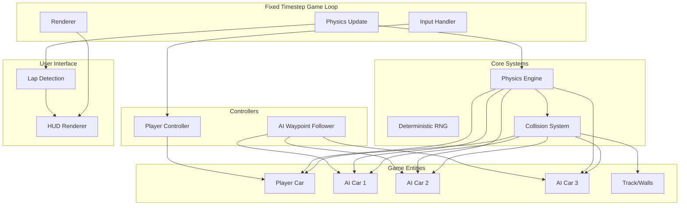
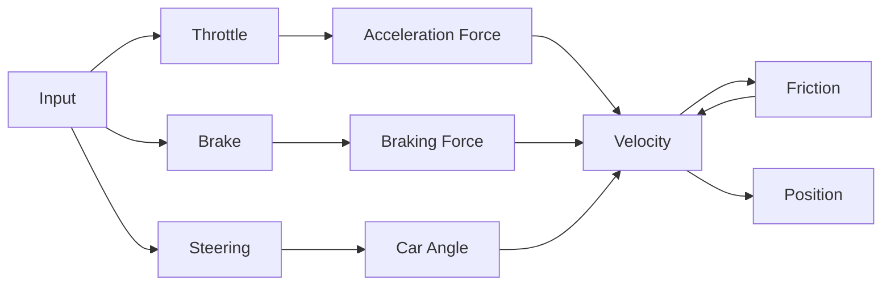
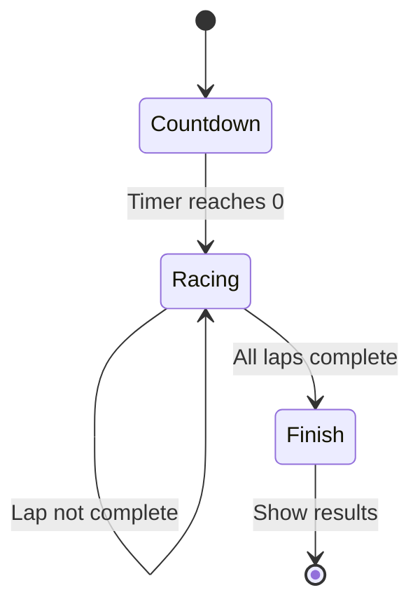

# Top-Down 2D Racing Prototype - Architecture Plan

## Overview

A JavaScript-based top-down 2D racing game featuring a player-controlled car and 3 AI opponents competing on an oval track. The game implements deterministic physics with a fixed timestep, waypoint-following AI, collision detection/response, and a HUD displaying race progress.

## Technical Constraints

- **Deterministic RNG**: Seeded random number generator for reproducible behavior
- **Fixed Timestep**: Physics updates at consistent intervals (e.g., 1/60s)
- **No External Physics Engines**: All physics implemented from scratch
- **Resolution**: 800x600 Canvas

---

## System Architecture



---

## File Structure

```
/
├── index.html          # Main HTML file with canvas
├── style.css           # Basic styling
├── js/
│   ├── main.js         # Entry point, game initialization
│   ├── game.js         # Main Game class, game loop
│   ├── utils/
│   │   ├── rng.js      # Deterministic seeded RNG
│   │   ├── vector2d.js # 2D vector math utilities
│   │   └── math.js     # General math utilities
│   ├── physics/
│   │   ├── physics.js  # Physics engine with fixed timestep
│   │   └── collision.js# Collision detection and resolution
│   ├── entities/
│   │   ├── car.js      # Car class with physics
│   │   └── track.js    # Track with boundaries and waypoints
│   ├── controllers/
│   │   ├── playerController.js    # Keyboard input handling
│   │   └── aiController.js        # Waypoint following AI
│   └── ui/
│       ├── hud.js      # HUD rendering
│       └── lapDetector.js # Lap and checkpoint tracking
```

---

## Core Classes Design

### 1. Deterministic RNG (rng.js)

```javascript
class SeededRNG {
    constructor(seed)
    next() // Returns value 0-1
    nextInt(min, max)
    reset(seed)
}
```

Uses a simple LCG (Linear Congruential Generator) or mulberry32 algorithm for deterministic randomness.

### 2. Vector2D (vector2d.js)

```javascript
class Vector2D {
    constructor(x, y)
    add(v), sub(v), mul(scalar), div(scalar)
    dot(v), cross(v)
    length(), lengthSq()
    normalize(), normalized()
    rotate(angle)
    angle()
    clone()
    static fromAngle(angle, length)
}
```

### 3. Car Class (car.js)

```javascript
class Car {
    // Properties
    position: Vector2D
    velocity: Vector2D
    angle: number           // Heading direction in radians
    angularVelocity: number
    
    // Physics constants
    mass: number
    friction: number
    turnRate: number
    acceleration: number
    brakingForce: number
    maxSpeed: number
    
    // Dimensions
    width: number
    height: number
    
    // State
    isPlayer: boolean
    currentLap: number
    lastCheckpoint: number
    
    // Methods
    update(dt, inputs)
    applyThrottle(amount)
    applyBrake(amount)
    steer(direction) // -1 left, 0 straight, 1 right
    getBoundingBox()
    getCorners()
}
```

### 4. Track Class (track.js)

```javascript
class Track {
    // Properties
    width: number          // Track width
    height: number
    innerBoundary: Path    // Inner oval wall
    outerBoundary: Path    // Outer oval wall
    waypoints: Vector2D[]  // AI navigation points
    checkpoints: Line[]     // Lap counting segments
    startLine: Line
    
    // Methods
    render(ctx)
    getClosestWaypoint(position)
    getNextWaypoint(currentIndex)
    isOnTrack(position)
}
```

### 5. Collision System (collision.js)

```javascript
class CollisionSystem {
    // Methods
    checkCarToCar(car1, car2): CollisionInfo
    checkCarToWall(car, wall): CollisionInfo
    resolveCollision(car1, car2, collisionInfo)
    resolveWallCollision(car, wall, collisionInfo)
}
```

**Collision Detection Algorithms:**
- Car-to-Car: SAT (Separating Axis Theorem) for oriented bounding boxes
- Car-to-Wall: Line segment intersection with car corners

**Impulse Resolution:**
```
// For car-to-car collision
relativeVelocity = v1 - v2
impulseScalar = -(1 + restitution) * relativeVelocity.dot(normal) 
                / (1/m1 + 1/m2)

// Apply impulse
car1.velocity += impulseScalar * normal / m1
car2.velocity -= impulseScalar * normal / m2
```

### 6. AI Controller (aiController.js)

```javascript
class WaypointFollower {
    // Properties
    currentWaypointIndex: number
    lookAheadDistance: number
    steeringSmoothing: number
    
    // Methods
    update(car, track, dt)
    calculateSteering(car, targetWaypoint)
    predictPosition(car, lookAhead)
}
```

**AI Behavior:**
1. Find next waypoint on the racing line
2. Calculate angle to waypoint
3. Steer towards waypoint with smoothing
4. Apply throttle based on upcoming turns
5. Slow down for sharp turns

### 7. Lap Detector (lapDetector.js)

```javascript
class LapDetector {
    // Properties
    checkpoints: Checkpoint[]
    totalLaps: number
    
    // Methods
    update(car)
    checkCheckpointCrossing(car, checkpoint)
    getCurrentPosition(cars)
}
```

### 8. HUD (hud.js)

```javascript
class HUD {
    // Methods
    render(ctx, gameState)
    drawLapCounter(current, total)
    drawRaceTime(elapsedTime)
    drawPosition(position, total)
    drawSpeedometer(speed, maxSpeed)
    drawMinimap(cars, track) // Optional
}
```

### 9. Game Class (game.js)

```javascript
class Game {
    // Properties
    canvas, ctx
    rng: SeededRNG
    track: Track
    player: Car
    aiCars: Car[]
    collisionSystem: CollisionSystem
    lapDetector: LapDetector
    hud: HUD
    gameState: GameState
    
    // Fixed timestep
    fixedDeltaTime: 1/60
    accumulator: number
    
    // Methods
    init()
    gameLoop(timestamp)
    update(dt)
    render()
    handleInput()
    startRace()
    endRace()
}
```

---

## Physics Model

### Car Physics



**Movement Equations:**
```
// Apply acceleration in facing direction
accelerationVector = Vector2D.fromAngle(car.angle) * throttleInput * accelerationRate

// Apply braking opposite to velocity
if (brakeInput > 0 && velocity.length() > 0):
    brakingVector = -velocity.normalized() * brakingRate

// Apply friction
frictionVector = -velocity * frictionCoefficient

// Update velocity
velocity += (accelerationVector + brakingVector + frictionVector) * dt

// Clamp to max speed
velocity = velocity.clamp(maxSpeed)

// Steering - only when moving
if (velocity.length() > minSpeed):
    turnAmount = steerInput * turnRate * dt
    angle += turnAmount

// Update position
position += velocity * dt
```

---

## Track Layout

### Oval Track Design

```
+--------------------------------------------------+
|                                                  |
|      +----------------------------------+        |
|      |                                  |        |
|      |     START                        |        |
|      |        |                         |        |
|      |   1 ---+--- 2                    |        |
|      |  /              \                 |        |
|      | |                |               |        |
|      | |                |               |        |
|      |  \              /                |        |
|      |   4 --------- 3                  |        |
|      |                                  |        |
|      +----------------------------------+        |
|                                                  |
+--------------------------------------------------+

Waypoints: 1 -> 2 -> 3 -> 4 -> 1 (loop)
Checkpoints: At start line + 2 intermediate points
```

**Track Parameters:**
- Outer boundary: Ellipse or rounded rectangle
- Inner boundary: Smaller concentric shape
- Track width: ~100-150 pixels
- 4-8 waypoints for AI navigation

---

## Collision Response

### Car-to-Car Impulse Resolution

1. **Detection**: Use SAT to find collision normal and penetration depth
2. **Separation**: Move cars apart by penetration depth
3. **Impulse Calculation**:
   ```
   e = restitution coefficient (0.8 for bouncy)
   
   j = -(1 + e) * (v1 - v2).dot(normal)
       / (1/m1 + 1/m2)
   
   impulse = j * normal
   ```
4. **Apply Impulse**:
   ```
   v1_new = v1 + impulse / m1
   v2_new = v2 - impulse / m2
   ```

### Car-to-Wall Collision

1. **Detection**: Ray-cast from car corners in velocity direction
2. **Response**: 
   - Reflect velocity around wall normal
   - Apply restitution coefficient
   - Position correction to prevent sticking

---

## Game States



---

## HUD Layout

```
+--------------------------------------------------+
| Position: 1/4              Lap: 2/3               |
|                                                  |
|                                                  |
|              [TRACK VIEW]                        |
|                                                  |
|                                                  |
|                                                  |
| Time: 01:23.45               Speed: 150 km/h    |
+--------------------------------------------------+
```

---

## Deterministic Behavior Guarantees

1. **RNG Seeding**: All random operations use the seeded RNG
2. **Fixed Timestep**: Physics updates at exactly 1/60s intervals
3. **No Floating-Point Drift**: Use accumulator pattern for frame timing
4. **Consistent Initialization**: All cars start at exact same relative positions

```javascript
// Fixed Timestep Implementation
const FIXED_DT = 1/60;
let accumulator = 0;

function gameLoop(timestamp) {
    const frameTime = Math.min(timestamp - lastTime, 0.1);
    accumulator += frameTime;
    
    while (accumulator >= FIXED_DT) {
        update(FIXED_DT);
        accumulator -= FIXED_DT;
    }
    
    render(accumulator / FIXED_DT); // Alpha for interpolation
    lastTime = timestamp;
    requestAnimationFrame(gameLoop);
}
```

---

## Implementation Order

1. **Foundation**: RNG, Vector2D, basic math utilities
2. **Core Loop**: Game class with fixed timestep
3. **Track**: Track rendering and boundaries
4. **Car**: Car physics without collision
5. **Player**: Input handling for player car
6. **Collision**: Detection and response system
7. **AI**: Waypoint following implementation
8. **Lap Detection**: Checkpoint crossing logic
9. **HUD**: UI rendering
10. **Polish**: Race states, countdown, finish

---

## Key Implementation Notes

### Keyboard Input
```javascript
const keys = {
    ArrowUp: false,    // Accelerate
    ArrowDown: false,  // Brake
    ArrowLeft: false,  // Steer left
    ArrowRight: false  // Steer right
};
```

### Rendering Order
1. Clear canvas
2. Draw track (boundaries, track surface)
3. Draw waypoints (debug, optional)
4. Draw all cars (sorted by Y for pseudo-3D effect)
5. Draw HUD

### Performance Considerations
- Use requestAnimationFrame for smooth rendering
- Keep collision checks to immediate neighbors only
- Pre-calculate track boundaries and waypoints
- Use object pooling for collision info objects