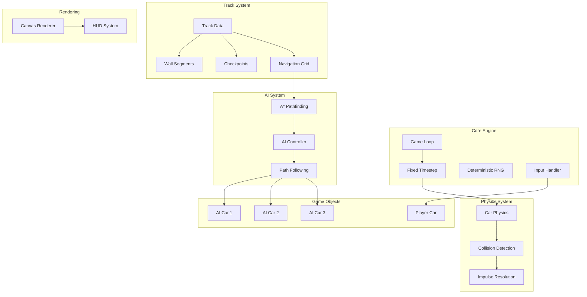
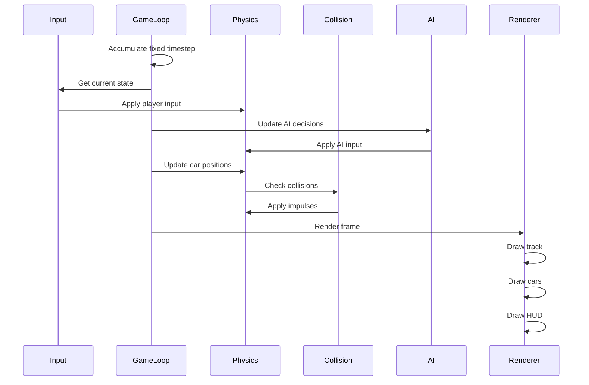

# Top-Down 2D Racing Prototype - Architecture Plan

## Overview

A JavaScript-based top-down 2D racing game featuring:
- Player-controlled car with realistic physics
- 3 AI opponents using A* pathfinding
- Complex circuit track with walls
- Lap detection and timing system
- Collision response with impulse resolution
- HUD displaying race information

## Technical Constraints

- **Deterministic RNG**: Seeded random number generator for reproducible behavior
- **Fixed Timestep**: Consistent physics simulation regardless of frame rate
- **No External Physics Engines**: All physics implemented from scratch
- **HTML5 Canvas**: Rendering system

---

## System Architecture



---

## File Structure

```
/
├── index.html          # Main HTML file with canvas
├── styles.css          # Basic styling
├── js/
│   ├── main.js         # Entry point and initialization
│   ├── config.js       # Game constants and configuration
│   ├── core/
│   │   ├── gameLoop.js     # Fixed timestep game loop
│   │   ├── rng.js          # Deterministic random number generator
│   │   └── input.js        # Keyboard input handling
│   ├── physics/
│   │   ├── vector2.js      # 2D vector math
│   │   ├── carPhysics.js   # Car movement physics
│   │   ├── collision.js    # Collision detection
│   │   └── impulse.js      # Impulse resolution
│   ├── track/
│   │   ├── track.js        # Track definition
│   │   ├── walls.js        # Wall collision data
│   │   └── checkpoints.js  # Checkpoint/lap detection
│   ├── ai/
│   │   ├── astar.js        # A* pathfinding algorithm
│   │   ├── navGrid.js      # Navigation grid for pathfinding
│   │   └── aiController.js # AI car control logic
│   ├── entities/
│   │   ├── car.js          # Base car class
│   │   ├── playerCar.js    # Player-controlled car
│   │   └── aiCar.js        # AI-controlled car
│   └── rendering/
│       ├── renderer.js     # Canvas rendering
│       └── hud.js          # HUD display
```

---

## Detailed Component Design

### 1. Core Engine

#### 1.1 Game Loop with Fixed Timestep

```javascript
// Pseudocode for fixed timestep implementation
const FIXED_DT = 1/60;  // 60 updates per second
let accumulator = 0;
let previousTime = 0;

function gameLoop(currentTime) {
    const deltaTime = currentTime - previousTime;
    previousTime = currentTime;
    accumulator += deltaTime;
    
    while (accumulator >= FIXED_DT) {
        update(FIXED_DT);
        accumulator -= FIXED_DT;
    }
    
    render(accumulator / FIXED_DT);  // Interpolation for smooth rendering
    requestAnimationFrame(gameLoop);
}
```

#### 1.2 Deterministic RNG

```javascript
// Seeded PRNG using mulberry32 algorithm
class DeterministicRNG {
    constructor(seed) {
        this.state = seed;
    }
    
    next() {
        let t = this.state += 0x6D2B79F5;
        t = Math.imul(t ^ t >>> 15, t | 1);
        t ^= t + Math.imul(t ^ t >>> 7, t | 61);
        return ((t ^ t >>> 14) >>> 0) / 4294967296;
    }
}
```

#### 1.3 Input Handler

- Track keyboard state: up, down, left, right arrows
- Provide input state to player car each frame

### 2. Physics System

#### 2.1 Vector2 Class

Essential 2D vector operations:
- Addition, subtraction, multiplication, division
- Dot product, cross product
- Length, normalization
- Rotation

#### 2.2 Car Physics Model

```
Car Properties:
- position: Vector2
- velocity: Vector2
- angle: float (radians)
- angularVelocity: float
- acceleration: float
- maxSpeed: float
- turnRate: float
- friction: float

Physics Update:
1. Apply acceleration from input
2. Apply steering based on angle
3. Apply friction/drag
4. Update position based on velocity
5. Handle collisions
```

#### 2.3 Collision Detection

**Car-to-Car**: Circle-circle collision
- Each car has a collision radius
- Check distance between centers
- If distance < sum of radii, collision detected

**Car-to-Wall**: Line-circle collision
- Wall segments are line segments
- Check if circle intersects line segment
- Calculate closest point on segment to circle center

#### 2.4 Impulse Resolution

```
Collision Response:
1. Calculate collision normal
2. Calculate relative velocity
3. Calculate impulse magnitude
4. Apply impulse to both objects
5. Separate overlapping objects

For wall collisions:
1. Reflect velocity along wall normal
2. Apply restitution coefficient
3. Push car out of wall
```

### 3. Track System

#### 3.1 Track Definition

Complex circuit track defined by:
- Outer boundary polygon
- Inner boundary polygon
- Start/finish line position
- Checkpoint positions

#### 3.2 Wall Segments

- Generate wall segments from track boundaries
- Each segment has start and end points
- Used for collision detection

#### 3.3 Checkpoints

- Series of checkpoints around the track
- Used for lap detection and AI pathfinding
- Player must pass through all checkpoints in order

### 4. AI System

#### 4.1 Navigation Grid

- Grid overlay on track
- Each cell marked as drivable or blocked
- Used for A* pathfinding

#### 4.2 A* Pathfinding

```
A* Algorithm:
1. Create open and closed sets
2. Start from current position node
3. For each neighbor:
   - Calculate g cost (distance from start)
   - Calculate h cost (heuristic to goal)
   - f = g + h
4. Select node with lowest f
5. Repeat until goal reached
6. Reconstruct path
```

#### 4.3 AI Controller

```
AI Behavior:
1. Get next waypoint/target from path
2. Calculate steering angle to target
3. Apply throttle based on:
   - Distance to next turn
   - Current speed
   - Obstacles ahead
4. Recalculate path periodically
5. Handle collision avoidance
```

### 5. Game Entities

#### 5.1 Base Car Class

```javascript
class Car {
    constructor(x, y, angle) {
        this.position = new Vector2(x, y);
        this.velocity = new Vector2(0, 0);
        this.angle = angle;
        this.angularVelocity = 0;
        this.lap = 0;
        this.checkpoint = 0;
        this.finished = false;
    }
    
    update(dt, input) { }
    render(ctx) { }
}
```

#### 5.2 Player Car

- Receives input from keyboard
- Updates physics based on input
- Tracks lap progress

#### 5.3 AI Car

- Receives target from AI controller
- Steers toward target
- Manages speed based on track conditions

### 6. Rendering System

#### 6.1 Canvas Renderer

- Clear canvas each frame
- Draw track background and walls
- Draw all cars
- Draw HUD overlay

#### 6.2 HUD Display

```
HUD Elements:
- Current Lap: X / Total
- Race Time: MM:SS.ms
- Position: 1st, 2nd, 3rd, 4th
- Speed indicator (optional)
- Minimap (optional)
```

---

## Game Constants

```javascript
const CONFIG = {
    // Physics
    FIXED_TIMESTEP: 1/60,
    CAR_ACCELERATION: 300,
    CAR_BRAKE_FORCE: 400,
    CAR_MAX_SPEED: 400,
    CAR_TURN_RATE: 3.5,
    CAR_FRICTION: 0.98,
    CAR_ANGULAR_FRICTION: 0.95,
    
    // Collision
    CAR_RADIUS: 15,
    WALL_RESTITUTION: 0.5,
    CAR_RESTITUTION: 0.7,
    
    // Track
    TRACK_WIDTH: 120,
    CHECKPOINT_COUNT: 8,
    TOTAL_LAPS: 3,
    
    // AI
    AI_UPDATE_INTERVAL: 0.1,
    PATH_SMOOTHNESS: 2,
    
    // RNG
    RNG_SEED: 12345
};
```

---

## Data Flow Diagram



---

## Implementation Order

1. **Core Engine** - Foundation for everything else
2. **Vector2 Math** - Required by physics
3. **Car Physics** - Basic movement
4. **Track System** - Define the racing surface
5. **Collision Detection** - Car-to-car and car-to-wall
6. **Impulse Resolution** - Realistic collision response
7. **Navigation Grid** - For AI pathfinding
8. **A* Pathfinding** - AI navigation
9. **AI Controller** - AI decision making
10. **Lap Detection** - Track progress
11. **HUD** - Display game state
12. **Polish** - Fine-tune physics and AI

---

## Testing Strategy

1. **Unit Tests** (if time permits):
   - Vector2 operations
   - RNG determinism
   - Collision detection

2. **Integration Tests**:
   - Car physics with collision
   - AI pathfinding and following
   - Lap detection accuracy

3. **Manual Testing**:
   - Game feel and responsiveness
   - AI competitiveness
   - Collision behavior

---

## Performance Considerations

- **Spatial Partitioning**: For collision detection with many objects
- **Path Caching**: AI can cache paths until obstacles move
- **Object Pooling**: Reuse collision detection objects
- **Canvas Optimization**: Minimize draw calls, use layers if needed

---

## Future Enhancements (Out of Scope)

- Particle effects for tire smoke/dust
- Sound effects
- Multiple track layouts
- Power-ups
- Multiplayer support
