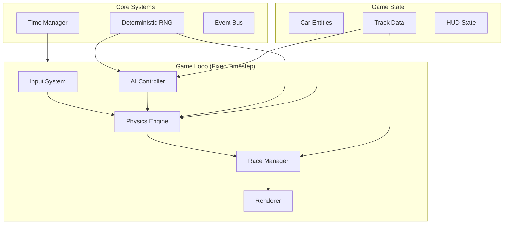
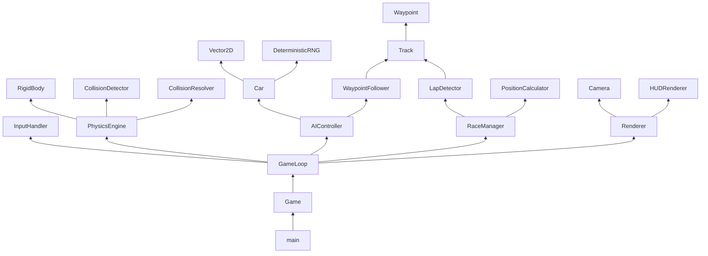

# Top-Down 2D Racing Game - Design Document

## 1. Overview

A top-down 2D arcade racing game prototype built in vanilla JavaScript with custom physics, AI opponents, and deterministic gameplay.

### Core Requirements Summary
- Player-controlled car with arcade-style physics
- 3 AI opponents using waypoint navigation
- Lap detection and race progression
- Circle-circle collision detection with impulse resolution
- HUD displaying race information
- Deterministic RNG for reproducible gameplay
- Fixed timestep game loop (no external physics engines)

---

## 2. System Architecture

### 2.1 High-Level Architecture Diagram



### 2.2 Module Breakdown

| Module | Responsibility | Key Components |
|--------|---------------|----------------|
| **Core** | Foundation utilities | RNG, Vector2D, TimeManager, EventBus |
| **Physics** | Simulation and collision | PhysicsEngine, RigidBody, CollisionDetector |
| **Entities** | Game objects | Car, Track, Waypoint |
| **AI** | Opponent behavior | AIController, WaypointFollower |
| **Race** | Race logic | RaceManager, LapDetector, PositionCalculator |
| **Input** | User controls | InputHandler, ControlMapping |
| **Render** | Visual output | Renderer, Camera, HUDRenderer |
| **Game** | Orchestration | Game, GameLoop |

---

## 3. Data Structures

### 3.1 Vector2D
Basic 2D vector for positions, velocities, and forces.

```javascript
// Vector2D
{
    x: number,
    y: number
}

// Operations: add, sub, mul, div, dot, cross, magnitude, normalize, distance, rotate
```

### 3.2 Car (Entity)
Represents a race car with physics properties.

```javascript
{
    // Identity
    id: string,                    // Unique identifier
    isPlayer: boolean,             // Player vs AI flag
    
    // Transform
    position: Vector2D,            // World position (center of car)
    rotation: number,              // Angle in radians (0 = facing right)
    
    // Physics - Linear
    velocity: Vector2D,            // Current velocity
    mass: number,                  // Mass for impulse calculations
    radius: number,                // Collision circle radius
    
    // Physics - Angular
    angularVelocity: number,       // Rotation speed
    
    // Car-specific physics
    speed: number,                 // Current forward speed
    heading: Vector2D,             // Forward direction vector
    
    // Control inputs (updated each frame)
    input: {
        throttle: number,          // 0.0 to 1.0
        brake: number,             // 0.0 to 1.0
        steering: number           // -1.0 (left) to 1.0 (right)
    },
    
    // Car configuration (constants)
    config: {
        maxSpeed: number,          // Maximum forward speed
        maxReverseSpeed: number,   // Maximum reverse speed
        acceleration: number,      // Acceleration rate
        braking: number,           // Braking deceleration
        friction: number,          // Ground friction coefficient
        turnSpeed: number,         // Steering sensitivity
        grip: number               // Lateral friction for drifting
    },
    
    // Race state
    raceState: {
        currentLap: number,
        lapStartTime: number,
        bestLapTime: number,
        totalTime: number,
        currentWaypoint: number,   // Index of next waypoint to hit
        distanceToNextWaypoint: number
    }
}
```

### 3.3 Track
Defines the racing circuit.

```javascript
{
    // Track boundaries (for collision)
    boundaries: [
        {
            type: 'wall' | 'curb',
            position: Vector2D,
            radius: number            // For circular barriers
        }
    ],
    
    // Waypoints for AI navigation and lap detection
    waypoints: [
        {
            index: number,
            position: Vector2D,
            width: number,           // Valid track width at this point
            isCheckpoint: boolean    // True for start/finish and sector points
        }
    ],
    
    // Start positions
    startPositions: [
        {
            position: Vector2D,
            rotation: number
        }
    ],
    
    // Track metadata
    metadata: {
        name: string,
        lapCount: number,            // Laps required to finish
        sectorCount: number
    }
}
```

### 3.4 Collision
Collision detection and response data.

```javascript
// Collision Contact
{
    bodyA: Car,                    // First colliding body
    bodyB: Car | Wall,             // Second colliding body
    normal: Vector2D,              // Collision normal (points from A to B)
    penetration: number,           // Overlap depth
    contactPoint: Vector2D         // Point of contact
}

// Wall/Barrier (static collision object)
{
    position: Vector2D,
    radius: number,
    restitution: number,           // Bounciness (0-1)
    isSolid: boolean
}
```

### 3.5 Race State
Global race management state.

```javascript
{
    status: 'waiting' | 'countdown' | 'racing' | 'finished',
    startTime: number,
    currentTime: number,
    countdownValue: number,
    
    // Car ordering
    positions: [                   // Array of car IDs in position order
        { carId: string, position: number }
    ],
    
    // Results
    results: [
        {
            carId: string,
            finishTime: number,
            finalPosition: number
        }
    ]
}
```

---

## 4. Physics System Design

### 4.1 Car Dynamics (Arcade Physics)

The car uses a simplified arcade physics model rather than realistic vehicle dynamics:

#### Movement Model
```
1. Calculate desired speed based on throttle/brake inputs
2. Apply acceleration/deceleration to current speed
3. Apply ground friction
4. Calculate heading based on steering input and current speed
5. Update velocity = heading * speed
6. Update position += velocity * dt
7. Update rotation based on steering and speed
```

#### Physics Equations
```javascript
// Speed update
if (throttle > 0) {
    speed += acceleration * throttle * dt;
} else if (brake > 0) {
    speed -= braking * brake * dt;
}

// Natural deceleration (friction)
speed *= (1 - friction * dt);

// Clamp to max speeds
speed = clamp(speed, -maxReverseSpeed, maxSpeed);

// Steering (effective at speed)
let turnAmount = steering * turnSpeed * (speed / maxSpeed) * dt;
rotation += turnAmount;

// Update heading vector
heading = Vector2D.fromAngle(rotation);

// Calculate velocity
velocity = heading * speed;

// Apply lateral friction (prevents infinite sliding)
let lateralVelocity = velocity - (heading * speed);
velocity -= lateralVelocity * grip * dt;
```

### 4.2 Collision Detection

#### Broad Phase
- Spatial partitioning not needed for small car counts (4 cars)
- O(n²) pairwise checks acceptable

#### Narrow Phase - Circle-Circle
```javascript
function checkCircleCollision(a, b) {
    let diff = b.position - a.position;
    let distance = diff.magnitude();
    let combinedRadius = a.radius + b.radius;
    
    if (distance < combinedRadius) {
        return {
            normal: diff.normalize(),
            penetration: combinedRadius - distance,
            contactPoint: a.position + (diff * (a.radius / combinedRadius))
        };
    }
    return null;
}
```

#### Circle-Wall Collision
Same as circle-circle but wall has infinite mass (no velocity change).

### 4.3 Impulse Resolution

Using standard physics impulse resolution for elastic collisions:

```javascript
function resolveCollision(contact) {
    let a = contact.bodyA;
    let b = contact.bodyB;
    let normal = contact.normal;
    
    // Relative velocity
    let relativeVel = b.velocity - a.velocity;
    let velAlongNormal = relativeVel.dot(normal);
    
    // Don't resolve if separating
    if (velAlongNormal > 0) return;
    
    // Restitution (bounciness)
    let restitution = 0.5; // Arcade-style bounce
    
    // Impulse scalar
    let impulseScalar = -(1 + restitution) * velAlongNormal;
    impulseScalar /= (1/a.mass + 1/b.mass);
    
    // Apply impulse
    let impulse = normal * impulseScalar;
    a.velocity -= impulse * (1/a.mass);
    b.velocity += impulse * (1/b.mass);
    
    // Positional correction (prevent sinking)
    let percent = 0.2; // Penetration percentage to correct
    let slop = 0.01;   // Threshold to ignore
    let correction = normal * (max(penetration - slop, 0) / (1/a.mass + 1/b.mass)) * percent;
    a.position -= correction * (1/a.mass);
    b.position += correction * (1/b.mass);
}
```

### 4.4 Physics Engine Interface

```javascript
class PhysicsEngine {
    // Configuration
    setTimestep(dt);               // Fixed timestep (e.g., 1/60)
    setIterations(count);          // Solver iterations for stability
    
    // Registration
    addBody(body);                 // Add car/wall to simulation
    removeBody(body);              // Remove from simulation
    
    // Simulation step
    step(inputs);                  // Advance physics by one timestep
    
    // Queries
    getBodies();                   // Get all physics bodies
    raycast(start, end);           // Optional: raycast for AI sensors
}
```

---

## 5. AI Waypoint Following System

### 5.1 Algorithm Overview

The AI uses a simple but effective waypoint following algorithm:

```
1. Each AI car tracks its current target waypoint index
2. Calculate vector from car to target waypoint
3. Calculate desired heading (angle to waypoint)
4. Determine steering input to align with desired heading
5. Adjust speed based on waypoint distance and turn sharpness
6. When within waypoint threshold, advance to next waypoint
7. If waypoint missed (passed it), find nearest waypoint ahead
```

### 5.2 Steering Behavior

```javascript
function calculateAIInput(car, track) {
    let targetWaypoint = track.waypoints[car.raceState.currentWaypoint];
    let toWaypoint = targetWaypoint.position - car.position;
    let distanceToWaypoint = toWaypoint.magnitude();
    
    // Desired angle to waypoint
    let desiredAngle = Math.atan2(toWaypoint.y, toWaypoint.x);
    let angleDiff = normalizeAngle(desiredAngle - car.rotation);
    
    // Steering: proportional to angle difference
    let steering = clamp(angleDiff / Math.PI, -1, 1);
    
    // Speed control: slow down for sharp turns
    let nextWaypoint = track.waypoints[(car.raceState.currentWaypoint + 1) % track.waypoints.length];
    let turnSharpness = calculateTurnSharpness(targetWaypoint, nextWaypoint);
    let targetSpeed = car.config.maxSpeed * (1 - turnSharpness * 0.5);
    
    // Throttle/brake based on current vs target speed
    let speedDiff = targetSpeed - car.speed;
    let throttle = speedDiff > 0 ? clamp(speedDiff / 10, 0, 1) : 0;
    let brake = speedDiff < 0 ? clamp(-speedDiff / 10, 0, 1) : 0;
    
    // Waypoint advancement check
    if (distanceToWaypoint < targetWaypoint.width * 0.5) {
        car.raceState.currentWaypoint = (car.raceState.currentWaypoint + 1) % track.waypoints.length;
    }
    
    return { throttle, brake, steering };
}
```

### 5.3 AI Difficulty Variations

```javascript
// AI configuration per opponent
{
    skillLevel: 'easy' | 'medium' | 'hard',
    maxSpeedMultiplier: 0.8 | 0.9 | 1.0,  // % of player max speed
    reactionDelay: 0.2 | 0.1 | 0.0,        // Seconds of input delay
    steeringSmoothing: 0.8 | 0.9 | 1.0,    // How quickly steering changes
    brakingDistance: 50 | 40 | 30          // Distance to start braking for turns
}
```

### 5.4 AI Controller Interface

```javascript
class AIController {
    constructor(car, track, difficulty);
    
    // Called each physics step
    update(dt);
    
    // Internal
    calculateSteering();
    calculateThrottle();
    checkWaypointProgress();
    avoidOtherCars();              // Optional: simple avoidance
}
```

---

## 6. Lap Detection System

### 6.1 Checkpoint System

Lap detection uses a checkpoint/waypoint validation system:

```javascript
class LapDetector {
    // Waypoints are ordered around the track
    // Car must pass waypoints in sequence to complete a valid lap
    
    validateWaypointProgress(car, waypointIndex) {
        let expectedWaypoint = car.raceState.currentWaypoint;
        
        // Check if car hit the expected next waypoint
        if (waypointIndex === expectedWaypoint) {
            car.raceState.currentWaypoint = (waypointIndex + 1) % totalWaypoints;
            
            // Check if completed lap (passed start/finish)
            if (waypointIndex === 0 && car.raceState.currentLap > 0) {
                this.completeLap(car);
            }
            
            return true;
        }
        
        // Check if car skipped waypoints (cut track)
        // Allow small skips (missed one waypoint) but flag large cuts
        let waypointDiff = (waypointIndex - expectedWaypoint + totalWaypoints) % totalWaypoints;
        if (waypointDiff > 1 && waypointDiff < totalWaypoints / 2) {
            // Possible track cut - invalidate lap or apply penalty
            this.flagTrackCut(car);
        }
        
        return false;
    }
    
    completeLap(car) {
        let lapTime = currentTime - car.raceState.lapStartTime;
        car.raceState.bestLapTime = Math.min(car.raceState.bestLapTime, lapTime);
        car.raceState.lapStartTime = currentTime;
        car.raceState.currentLap++;
        
        // Emit event for HUD/race manager
        EventBus.emit('lapCompleted', { carId: car.id, lapTime });
    }
}
```

### 6.2 Position Calculation

```javascript
class PositionCalculator {
    calculatePositions(cars) {
        return cars.map(car => {
            // Score: completed laps + waypoint progress fraction
            let waypointProgress = car.raceState.currentWaypoint / totalWaypoints;
            let score = car.raceState.currentLap + waypointProgress;
            
            // Tiebreaker: distance to next waypoint (closer = ahead)
            let distanceToNext = car.raceState.distanceToNextWaypoint;
            
            return { car, score, distanceToNext };
        }).sort((a, b) => {
            if (a.score !== b.score) return b.score - a.score;
            return a.distanceToNext - b.distanceToNext;
        });
    }
}
```

---

## 7. Game Loop with Fixed Timestep

### 7.1 Fixed Timestep Implementation

Based on Glenn Fiedler's "Fix Your Timestep" article:

```javascript
class GameLoop {
    constructor() {
        this.dt = 1/60;            // Fixed physics timestep (60 FPS)
        this.maxFrameTime = 0.25;   // Prevent spiral of death
        this.accumulator = 0;
        this.lastTime = 0;
    }
    
    run(timestamp) {
        // Calculate frame time
        let frameTime = (timestamp - this.lastTime) / 1000;
        this.lastTime = timestamp;
        
        // Clamp to prevent spiral of death
        if (frameTime > this.maxFrameTime) {
            frameTime = this.maxFrameTime;
        }
        
        // Accumulate time
        this.accumulator += frameTime;
        
        // Process fixed timesteps
        while (this.accumulator >= this.dt) {
            this.update(this.dt);     // Fixed physics/logic update
            this.accumulator -= this.dt;
        }
        
        // Interpolation factor for smooth rendering
        let alpha = this.accumulator / this.dt;
        
        // Render with interpolation
        this.render(alpha);
        
        requestAnimationFrame((t) => this.run(t));
    }
    
    update(dt) {
        // 1. Process input
        InputHandler.update();
        
        // 2. Update AI (determines car inputs)
        AIController.updateAll(dt);
        
        // 3. Physics step (uses car inputs)
        PhysicsEngine.step(dt);
        
        // 4. Collision detection and resolution
        CollisionDetector.detectAndResolve();
        
        // 5. Lap detection
        LapDetector.update();
        
        // 6. Race state updates
        RaceManager.update(dt);
        
        // 7. Update HUD state
        HUD.update();
    }
    
    render(alpha) {
        // Interpolate positions for smooth visual movement
        // position = previousPosition * (1 - alpha) + currentPosition * alpha
        Renderer.render(alpha);
    }
}
```

### 7.2 State Interpolation

For smooth rendering between physics steps:

```javascript
class Interpolator {
    constructor() {
        this.previousStates = new Map();
        this.currentStates = new Map();
    }
    
    saveState(entity) {
        this.previousStates.set(entity.id, this.currentStates.get(entity.id));
        this.currentStates.set(entity.id, {
            position: entity.position.clone(),
            rotation: entity.rotation
        });
    }
    
    getInterpolatedPosition(entityId, alpha) {
        let prev = this.previousStates.get(entityId);
        let curr = this.currentStates.get(entityId);
        
        if (!prev) return curr.position;
        
        return Vector2D.lerp(prev.position, curr.position, alpha);
    }
}
```

---

## 8. Deterministic RNG System

### 8.1 Requirements

- Reproducible sequences with same seed
- No floating point inconsistencies
- Deterministic across all systems (AI decisions, minor physics variations)

### 8.2 Implementation

Using a simple Linear Congruential Generator (LCG):

```javascript
class DeterministicRNG {
    constructor(seed = 12345) {
        this.seed = seed;
        this.initialSeed = seed;
    }
    
    // LCG parameters (Numerical Recipes)
    static A = 1664525;
    static C = 1013904223;
    static M = 4294967296; // 2^32
    
    // Generate next integer
    nextInt() {
        this.seed = (DeterministicRNG.A * this.seed + DeterministicRNG.C) % DeterministicRNG.M;
        return this.seed;
    }
    
    // Generate float in [0, 1)
    nextFloat() {
        return this.nextInt() / DeterministicRNG.M;
    }
    
    // Generate float in [min, max)
    range(min, max) {
        return min + this.nextFloat() * (max - min);
    }
    
    // Random integer in [min, max]
    rangeInt(min, max) {
        return Math.floor(this.range(min, max + 1));
    }
    
    // Reset to initial seed
    reset() {
        this.seed = this.initialSeed;
    }
    
    // Set new seed
    setSeed(seed) {
        this.initialSeed = seed;
        this.seed = seed;
    }
}
```

### 8.3 Usage Patterns

```javascript
// Global RNG instance
const GameRNG = new DeterministicRNG();

// AI uses RNG for slight variations
function addAIRandomness(input) {
    // Small random perturbation to steering
    let noise = GameRNG.range(-0.1, 0.1);
    input.steering += noise;
    return input;
}

// Race start positions can be randomized but deterministic
function generateStartPositions(seed) {
    GameRNG.setSeed(seed);
    // ... randomize grid positions
}
```

---

## 9. HUD Layout and Update Strategy

### 9.1 HUD Layout Design

```
+--------------------------------------------------+
|  LAP: 2/3          TIME: 1:23.45        POS: 2/4 |
|                                                  |
|                                                  |
|                                                  |
|                                                  |
|                                                  |
|                                                  |
|                                                  |
|                                                  |
|                                                  |
|                                                  |
|                                                  |
|  SPEED: 145 km/h                                 |
|  [===========>        ]  BOOST                    |
+--------------------------------------------------+
```

### 9.2 HUD Components

```javascript
class HUDState {
    constructor() {
        this.lap = { current: 0, total: 3 };
        this.time = { current: 0, lap: 0, best: Infinity };
        this.position = { current: 1, total: 4 };
        this.speed = 0;
        this.raceStatus = 'waiting'; // waiting, countdown, racing, finished
        this.countdown = 3;
        this.lapTimes = [];          // Array of completed lap times
    }
}

class HUDRenderer {
    constructor(canvas);
    
    render(hudState, screenWidth, screenHeight) {
        this.renderLapInfo(hudState.lap, x, y);
        this.renderTimer(hudState.time, x, y);
        this.renderPosition(hudState.position, x, y);
        this.renderSpeedometer(hudState.speed, x, y);
        this.renderCountdown(hudState.countdown, centerX, centerY);
        this.renderResults(hudState.results, centerX, centerY);
    }
    
    // Individual component renderers
    renderLapInfo(lap, x, y);
    renderTimer(time, x, y);
    renderPosition(position, x, y);
    renderSpeedometer(speed, x, y);
    renderCountdown(value, x, y);
    renderResults(results, x, y);
}
```

### 9.3 Update Strategy

```javascript
class HUD {
    constructor(playerCar, raceManager) {
        this.state = new HUDState();
        this.playerCar = playerCar;
        this.raceManager = raceManager;
    }
    
    update() {
        // Update from player car state
        this.state.lap.current = this.playerCar.raceState.currentLap;
        this.state.time.lap = this.raceManager.currentTime - this.playerCar.raceState.lapStartTime;
        this.state.time.current = this.raceManager.currentTime;
        this.state.time.best = this.playerCar.raceState.bestLapTime;
        this.state.speed = Math.abs(this.playerCar.speed);
        
        // Update from race manager
        this.state.position = this.raceManager.getPlayerPosition();
        this.state.raceStatus = this.raceManager.status;
        this.state.countdown = this.raceManager.countdownValue;
    }
}
```

---

## 10. File Structure and Module Organization

### 10.1 Directory Structure

```
/src
  /core
    Vector2D.js           # 2D vector math
    DeterministicRNG.js   # Seeded random number generator
    EventBus.js           # Pub/sub event system
    TimeManager.js        # Time utilities
    
  /physics
    PhysicsEngine.js      # Main physics coordinator
    RigidBody.js          # Physics body base class
    CollisionDetector.js  # Collision detection algorithms
    CollisionResolver.js  # Impulse resolution
    
  /entities
    Car.js                # Car entity and physics
    Track.js              # Track data and waypoints
    Waypoint.js           # Waypoint entity
    
  /ai
    AIController.js       # Main AI coordinator
    WaypointFollower.js   # Path following logic
    
  /race
    RaceManager.js        # Race state and flow control
    LapDetector.js        # Lap validation and counting
    PositionCalculator.js # Race position calculation
    
  /input
    InputHandler.js       # Keyboard/gamepad input
    ControlMapping.js     # Input to action mapping
    
  /render
    Renderer.js           # Main rendering coordinator
    Camera.js             # Viewport/camera control
    HUDRenderer.js        # HUD rendering
    
  /game
    Game.js               # Game state and initialization
    GameLoop.js           # Fixed timestep loop
    
  /config
    CarConfig.js          # Car physics constants
    TrackData.js          # Track definitions
    GameConfig.js         # Global game settings
    
  main.js                 # Entry point

/index.html               # HTML container
/styles.css               # Basic styles
```

### 10.2 Module Dependencies



---

## 11. Public APIs and Interfaces

### 11.1 Core Module APIs

```javascript
// Vector2D
class Vector2D {
    constructor(x, y);
    add(v);
    sub(v);
    mul(s);
    div(s);
    dot(v);
    magnitude();
    normalize();
    distance(v);
    rotate(angle);
    clone();
    static lerp(a, b, t);
    static fromAngle(angle);
}

// DeterministicRNG
class DeterministicRNG {
    constructor(seed);
    nextInt();
    nextFloat();
    range(min, max);
    rangeInt(min, max);
    setSeed(seed);
    reset();
}

// EventBus
const EventBus = {
    on(event, callback);
    off(event, callback);
    emit(event, data);
    once(event, callback);
};
```

### 11.2 Physics Module APIs

```javascript
// PhysicsEngine
class PhysicsEngine {
    constructor();
    setTimestep(dt);
    addBody(body);
    removeBody(body);
    step(dt);
    getBodies();
}

// RigidBody (base for Car)
class RigidBody {
    constructor(config);
    applyForce(force);
    applyImpulse(impulse);
    integrate(dt);
}

// CollisionDetector
class CollisionDetector {
    static checkCircleCircle(a, b);
    static checkCircleWall(circle, wall);
    static detectAll(bodies);
}

// CollisionResolver
class CollisionResolver {
    static resolve(contact);
    static resolveAll(contacts);
}
```

### 11.3 Entity Module APIs

```javascript
// Car
class Car extends RigidBody {
    constructor(id, isPlayer, config);
    setInput(throttle, brake, steering);
    updatePhysics(dt);
    getLapState();
    reset(position, rotation);
}

// Track
class Track {
    constructor(data);
    getWaypoint(index);
    getStartPosition(index);
    getTotalWaypoints();
    validateWaypointSequence(current, next);
}

// Waypoint
class Waypoint {
    constructor(index, position, width, isCheckpoint);
    containsPoint(point);
    getDistanceTo(point);
}
```

### 11.4 AI Module APIs

```javascript
// AIController
class AIController {
    constructor(car, track, difficulty);
    update(dt);
    setDifficulty(difficulty);
    enable();
    disable();
}

// WaypointFollower
class WaypointFollower {
    constructor(car, track);
    calculateInput();
    getTargetWaypoint();
    advanceWaypoint();
}
```

### 11.5 Race Module APIs

```javascript
// RaceManager
class RaceManager {
    constructor(track, cars, totalLaps);
    start();
    update(dt);
    getPositions();
    getPlayerPosition();
    isFinished();
    getResults();
    reset();
}

// LapDetector
class LapDetector {
    constructor(track);
    registerCar(car);
    update();
    validateProgress(car, waypointIndex);
}

// PositionCalculator
class PositionCalculator {
    static calculate(cars, track);
}
```

### 11.6 Input Module APIs

```javascript
// InputHandler
class InputHandler {
    constructor();
    update();
    isPressed(action);
    getAxis(action);
    mapKey(key, action);
    mapButton(button, action);
}

// ControlMapping (default mappings)
const DefaultControls = {
    THROTTLE: 'ArrowUp',
    BRAKE: 'ArrowDown',
    STEER_LEFT: 'ArrowLeft',
    STEER_RIGHT: 'ArrowRight'
};
```

### 11.7 Render Module APIs

```javascript
// Renderer
class Renderer {
    constructor(canvas);
    setCamera(camera);
    addRenderable(renderable);
    removeRenderable(renderable);
    render(alpha);
    clear();
}

// Camera
class Camera {
    constructor(width, height);
    follow(target);
    setPosition(position);
    getViewMatrix();
    worldToScreen(worldPos);
    screenToWorld(screenPos);
}

// HUDRenderer
class HUDRenderer {
    constructor(canvas);
    render(hudState);
    resize(width, height);
}
```

### 11.8 Game Module APIs

```javascript
// Game
class Game {
    constructor(canvas, config);
    init();
    start();
    pause();
    resume();
    stop();
    reset();
    setSeed(seed);
}

// GameLoop
class GameLoop {
    constructor(updateCallback, renderCallback);
    start();
    stop();
    setTimestep(dt);
    isRunning();
}
```

---

## 12. Configuration Constants

### 12.1 Car Physics Defaults

```javascript
const DEFAULT_CAR_CONFIG = {
    mass: 1000,                    // kg
    radius: 15,                    // pixels (collision)
    maxSpeed: 300,                 // pixels/second
    maxReverseSpeed: 100,          // pixels/second
    acceleration: 200,             // pixels/second²
    braking: 300,                  // pixels/second²
    friction: 2.0,                 // coefficient
    turnSpeed: 3.0,                // radians/second at max speed
    grip: 5.0                      // lateral friction
};
```

### 12.2 Game Settings

```javascript
const GAME_CONFIG = {
    // Timing
    FIXED_TIMESTEP: 1/60,          // 60 FPS physics
    MAX_FRAME_TIME: 0.25,          // Prevent spiral of death
    
    // Race
    TOTAL_LAPS: 3,
    COUNTDOWN_SECONDS: 3,
    AI_COUNT: 3,
    
    // Physics
    RESTITUTION: 0.5,              // Bounciness
    POSITION_ITERATIONS: 3,        // Solver iterations
    
    // AI
    AI_DIFFICULTIES: ['easy', 'medium', 'hard'],
    WAYPOINT_THRESHOLD: 0.5,       // Multiplier of waypoint width
    
    // Rendering
    CANVAS_WIDTH: 1024,
    CANVAS_HEIGHT: 768,
    ENABLE_INTERPOLATION: true
};
```

---

## 13. Event System

### 13.1 Game Events

```javascript
// Race events
'race:countdown'      // { value: number }
'race:start'
'race:lapCompleted'   // { carId, lapTime }
'race:finished'       // { results }

// Car events
'car:collision'       // { carId, otherId, impact }
'car:checkpoint'      // { carId, waypointIndex }

// Input events
'input:throttle'      // { value }
'input:brake'         // { value }
'input:steering'      // { value }
```

---

## 14. Implementation Notes

### 14.1 Determinism Considerations

1. **Use integer math where possible** - Avoid floating point inconsistencies
2. **Fixed iteration counts** - Always run physics for fixed number of steps
3. **Ordered iteration** - Process cars in consistent order (by ID)
4. **No frame-dependent logic** - All game logic must use `dt`, not frame count
5. **Seeded RNG** - All randomness through DeterministicRNG

### 14.2 Performance Targets

- Physics: 60 updates/second
- Render: 60 FPS with interpolation
- Support: 4 cars + track collisions
- Memory: Minimal allocations during gameplay (object pooling)

### 14.3 Browser Compatibility

- Modern browsers with ES6+ support
- Canvas 2D rendering context
- requestAnimationFrame
- Keyboard events

---

## 15. Future Extensions (Out of Scope)

- A* pathfinding for AI (currently waypoint following)
- Particle effects (exhaust, skid marks)
- Sound effects
- Multiple tracks
- Power-ups/items
- Network multiplayer
- Replay system (deterministic foundation supports this)
