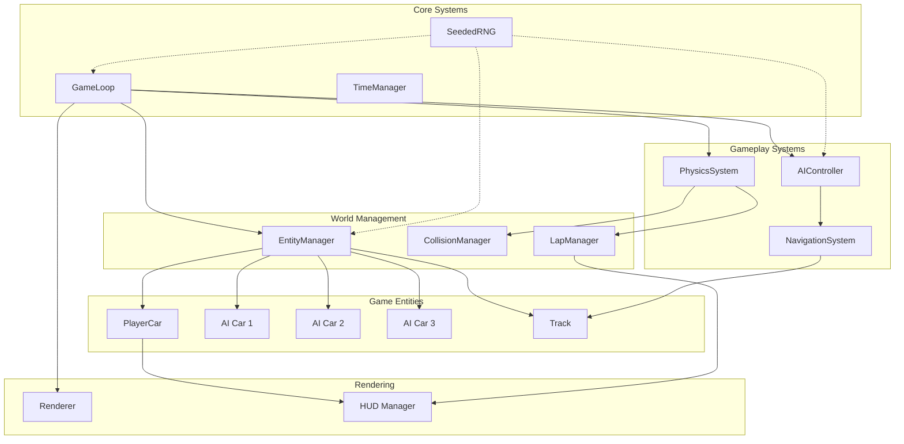
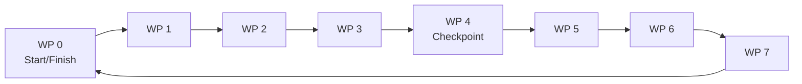
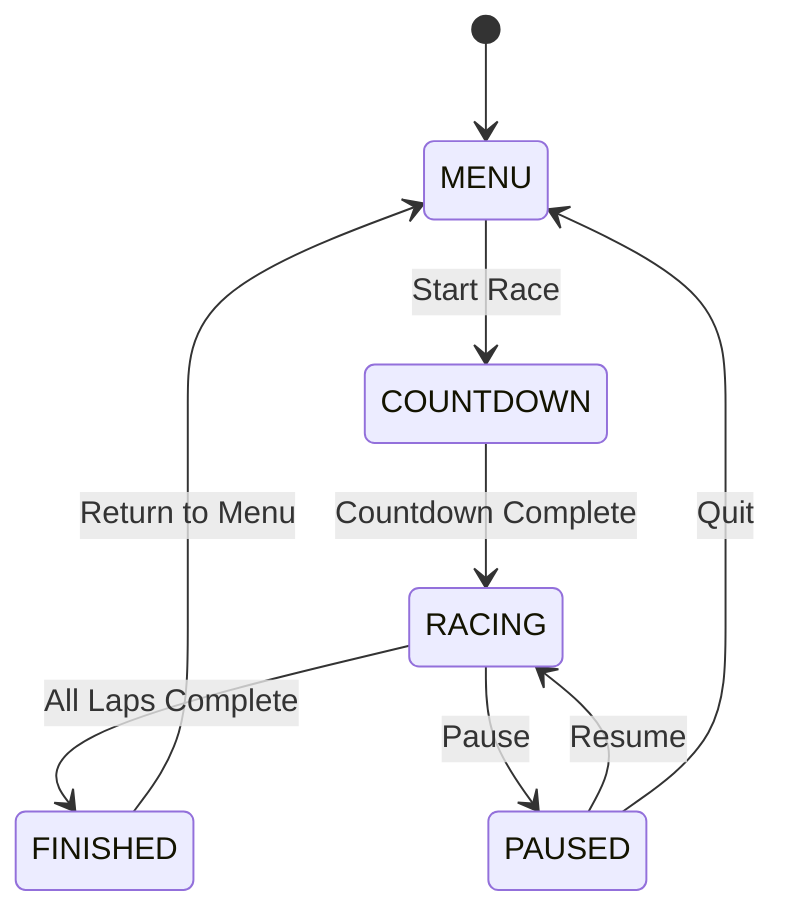
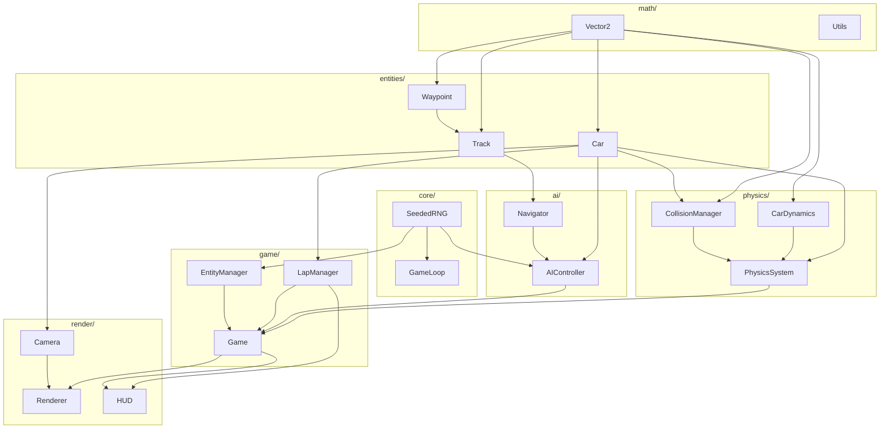

# Top-Down 2D Racing Game - Architecture & Design Document

## Table of Contents
1. [Architecture Overview](#1-architecture-overview)
2. [Data Structures](#2-data-structures)
3. [Physics Design](#3-physics-design)
4. [AI Navigation](#4-ai-navigation)
5. [Game Loop](#5-game-loop)
6. [Deterministic RNG](#6-deterministic-rng)
7. [File Structure](#7-file-structure)

---

## 1. Architecture Overview

### Component Diagram



### Module Interactions

| Module | Responsibility | Dependencies |
|--------|---------------|--------------|
| `GameLoop` | Fixed timestep orchestration, state updates | All systems |
| `SeededRNG` | Deterministic random number generation | None |
| `EntityManager` | Spawn/despawn entities, lifecycle management | SeededRNG |
| `PhysicsSystem` | Velocity integration, force application | CollisionManager |
| `CollisionManager` | AABB/OOBB detection, impulse resolution | Entity positions |
| `AIController` | Decision making for AI cars | NavigationSystem |
| `NavigationSystem` | Waypoint following, pathfinding | Track data |
| `LapManager` | Lap counting, timing, position calculation | Car positions |
| `Renderer` | Canvas rendering, camera follow | All entities |
| `HUD` | UI overlay, lap/time/position display | Game state |

---

## 2. Data Structures

### 2.1 Core Classes

#### Vector2
```javascript
class Vector2 {
    constructor(x = 0, y = 0) {
        this.x = x;
        this.y = y;
    }
    
    // Operations
    add(v) { return new Vector2(this.x + v.x, this.y + v.y); }
    sub(v) { return new Vector2(this.x - v.x, this.y - v.y); }
    mul(s) { return new Vector2(this.x * s, this.y * s); }
    div(s) { return new Vector2(this.x / s, this.y / s); }
    dot(v) { return this.x * v.x + this.y * v.y; }
    cross(v) { return this.x * v.y - this.y * v.x; }
    length() { return Math.sqrt(this.x * this.x + this.y * this.y); }
    normalize() { 
        const len = this.length();
        return len > 0 ? this.div(len) : new Vector2(0, 0);
    }
    rotate(angle) {
        const cos = Math.cos(angle);
        const sin = Math.sin(angle);
        return new Vector2(
            this.x * cos - this.y * sin,
            this.x * sin + this.y * cos
        );
    }
}
```

#### Transform
```javascript
class Transform {
    constructor(position = new Vector2(), rotation = 0) {
        this.position = position;  // World position (x, y)
        this.rotation = rotation;  // Rotation in radians
    }
    
    // Get forward vector
    getForward() {
        return new Vector2(Math.cos(this.rotation), Math.sin(this.rotation));
    }
    
    // Get right vector (perpendicular to forward)
    getRight() {
        return new Vector2(-Math.sin(this.rotation), Math.cos(this.rotation));
    }
}
```

#### Car
```javascript
class Car {
    constructor(id, isPlayer = false, startPosition = new Vector2()) {
        // Identity
        this.id = id;
        this.isPlayer = isPlayer;
        
        // Transform
        this.transform = new Transform(startPosition, 0);
        
        // Physics state
        this.velocity = new Vector2(0, 0);
        this.angularVelocity = 0;
        this.speed = 0;  // Forward speed (signed)
        
        // Input state
        this.throttle = 0;   // 0 to 1
        this.brake = 0;      // 0 to 1
        this.steering = 0;   // -1 to 1 (left to right)
        
        // Car specs
        this.specs = {
            maxSpeed: 300,           // pixels/second
            maxReverseSpeed: 100,    // pixels/second
            acceleration: 200,       // pixels/second^2
            braking: 400,            // pixels/second^2
            maxSteeringAngle: Math.PI / 4,  // 45 degrees
            wheelbase: 30,           // distance between axles (pixels)
            mass: 1000,              // kg
            friction: 0.98,          // lateral friction coefficient
            drag: 0.995,             // air resistance
            width: 20,               // collision width
            height: 36               // collision height
        };
        
        // Race state
        this.lap = 0;
        this.checkpointIndex = 0;
        this.raceTime = 0;
        this.bestLapTime = Infinity;
        this.currentLapStartTime = 0;
        
        // AI state (only used if !isPlayer)
        this.aiState = {
            currentWaypoint: 0,
            targetWaypoint: 1,
            reactionTimer: 0,
            overtaking: false,
            skillLevel: 1.0  // 0.8 to 1.2
        };
    }
    
    // Get axis-aligned bounding box for broad-phase collision
    getAABB() {
        const halfW = this.specs.width / 2;
        const halfH = this.specs.height / 2;
        return {
            minX: this.transform.position.x - halfW,
            maxX: this.transform.position.x + halfW,
            minY: this.transform.position.y - halfH,
            maxY: this.transform.position.y + halfH
        };
    }
    
    // Get oriented bounding box corners for narrow-phase collision
    getOBB() {
        const halfW = this.specs.width / 2;
        const halfH = this.specs.height / 2;
        const corners = [
            new Vector2(-halfW, -halfH),
            new Vector2(halfW, -halfH),
            new Vector2(halfW, halfH),
            new Vector2(-halfW, halfH)
        ];
        
        return corners.map(c => c.rotate(this.transform.rotation).add(this.transform.position));
    }
}
```

#### Waypoint
```javascript
class Waypoint {
    constructor(index, position, width = 100) {
        this.index = index;           // Sequential index along track
        this.position = position;     // Center position
        this.width = width;           // Track width at this point
        this.isCheckpoint = false;    // True for lap boundary waypoints
        this.neighbors = [];          // Connected waypoints (for branching)
        this.distanceToFinish = 0;    // Pre-calculated for position sorting
    }
    
    // Check if a point is within the waypoint's influence radius
    contains(point, tolerance = 1.2) {
        const dist = point.sub(this.position).length();
        return dist < (this.width * tolerance) / 2;
    }
}
```

#### Track
```javascript
class Track {
    constructor(name) {
        this.name = name;
        this.waypoints = [];          // Array of Waypoint
        this.checkpoints = [];        // Indices of checkpoint waypoints
        this.startPositions = [];     // Array of Vector2 for car spawns
        this.startRotations = [];     // Array of rotation angles
        this.bounds = {               // Track boundaries for culling
            minX: 0, maxX: 0,
            minY: 0, maxY: 0
        };
        this.totalLength = 0;         // Total track length in pixels
    }
    
    // Build from waypoint data
    buildFromData(waypointData) {
        // Parse waypoint data and calculate distances
    }
    
    // Get next waypoint index (with wraparound)
    getNextWaypointIndex(currentIndex) {
        return (currentIndex + 1) % this.waypoints.length;
    }
    
    // Get previous waypoint index
    getPrevWaypointIndex(currentIndex) {
        return (currentIndex - 1 + this.waypoints.length) % this.waypoints.length;
    }
    
    // Calculate distance along track between two waypoint indices
    getDistanceBetween(fromIndex, toIndex) {
        let distance = 0;
        let idx = fromIndex;
        while (idx !== toIndex) {
            const next = this.getNextWaypointIndex(idx);
            distance += this.waypoints[idx].position.sub(this.waypoints[next].position).length();
            idx = next;
        }
        return distance;
    }
}
```

#### CollisionPair
```javascript
class CollisionPair {
    constructor(entityA, entityB) {
        this.entityA = entityA;
        this.entityB = entityB;
        this.penetration = 0;
        this.normal = new Vector2();  // From A to B
        this.contactPoint = new Vector2();
    }
}
```

---

## 3. Physics Design

### 3.1 Car Dynamics Model

The car physics uses a simplified bicycle model with separate handling for longitudinal (forward/backward) and lateral (sideways) forces.

#### Longitudinal Forces

```
F_longitudinal = F_engine + F_braking + F_drag

Where:
F_engine = throttle * maxAcceleration * mass
F_braking = -brake * maxBraking * mass * sign(velocity)
F_drag = -dragCoefficient * velocity^2 * sign(velocity)
```

Implementation:
```javascript
updateLongitudinal(car, dt) {
    // Engine force
    const engineForce = car.throttle * car.specs.acceleration * car.specs.mass;
    
    // Braking force (can brake while moving forward or backward)
    let brakeForce = 0;
    if (car.brake > 0) {
        const brakeDir = car.speed > 0 ? -1 : 1;
        brakeForce = car.brake * car.specs.braking * car.specs.mass * brakeDir;
    }
    
    // Rolling resistance / drag
    const dragForce = -0.5 * 0.3 * 1.225 * 2.0 * car.speed * Math.abs(car.speed);
    
    // Net longitudinal force
    const netForce = engineForce + brakeForce + dragForce;
    const acceleration = netForce / car.specs.mass;
    
    // Update speed
    car.speed += acceleration * dt;
    
    // Apply speed limits
    if (car.speed > car.specs.maxSpeed) car.speed = car.specs.maxSpeed;
    if (car.speed < -car.specs.maxReverseSpeed) car.speed = -car.specs.maxReverseSpeed;
    
    // Natural deceleration when no input
    if (car.throttle === 0 && car.brake === 0) {
        car.speed *= car.specs.drag;
    }
    
    // Stop completely at very low speeds
    if (Math.abs(car.speed) < 1) car.speed = 0;
}
```

#### Lateral Forces & Steering

Using the bicycle model with Ackermann steering geometry:

```
steeringAngle = steeringInput * maxSteeringAngle

turnRadius = wheelbase / tan(steeringAngle)
angularVelocity = speed / turnRadius

// For small angles: angularVelocity ≈ (speed * steeringAngle) / wheelbase
```

Implementation:
```javascript
updateLateral(car, dt) {
    // Calculate steering angle
    const steeringAngle = car.steering * car.specs.maxSteeringAngle;
    
    // Calculate turning rate based on speed
    // At low speeds, reduce turning effectiveness
    const speedFactor = Math.min(Math.abs(car.speed) / 50, 1);
    const turnRate = (car.speed * Math.tan(steeringAngle)) / car.specs.wheelbase;
    
    // Update rotation
    car.transform.rotation += turnRate * dt;
    
    // Normalize rotation to [-PI, PI]
    while (car.transform.rotation > Math.PI) car.transform.rotation -= 2 * Math.PI;
    while (car.transform.rotation < -Math.PI) car.transform.rotation += 2 * Math.PI;
    
    // Calculate velocity from speed and heading
    const forward = car.transform.getForward();
    car.velocity.x = forward.x * car.speed;
    car.velocity.y = forward.y * car.speed;
    
    // Apply lateral friction (prevents infinite sliding)
    // This simulates tire grip - the car prefers to move in its forward direction
    const right = car.transform.getRight();
    const lateralVelocity = car.velocity.dot(right);
    const frictionForce = -lateralVelocity * car.specs.friction;
    
    car.velocity.x += right.x * frictionForce * dt;
    car.velocity.y += right.y * frictionForce * dt;
}
```

#### Position Integration

```javascript
integratePosition(car, dt) {
    car.transform.position.x += car.velocity.x * dt;
    car.transform.position.y += car.velocity.y * dt;
}
```

### 3.2 Collision Detection

#### Broad Phase: AABB Sweep & Prune

```javascript
broadPhase(entities) {
    const pairs = [];
    
    // Sort by minX
    const sorted = entities.slice().sort((a, b) => 
        a.getAABB().minX - b.getAABB().minX
    );
    
    // Check overlapping intervals
    for (let i = 0; i < sorted.length; i++) {
        const a = sorted[i];
        const aAABB = a.getAABB();
        
        for (let j = i + 1; j < sorted.length; j++) {
            const b = sorted[j];
            const bAABB = b.getAABB();
            
            // Early exit if no X overlap
            if (bAABB.minX > aAABB.maxX) break;
            
            // Check Y overlap
            if (aAABB.maxY >= bAABB.minY && aAABB.minY <= bAABB.maxY) {
                pairs.push(new CollisionPair(a, b));
            }
        }
    }
    
    return pairs;
}
```

#### Narrow Phase: Separating Axis Theorem (SAT) for OBB

```javascript
narrowPhase(pair) {
    const cornersA = pair.entityA.getOBB();
    const cornersB = pair.entityB.getOBB();
    
    // Get axes to test (edge normals of both boxes)
    const axes = [];
    
    // Add edge normals from A
    for (let i = 0; i < 4; i++) {
        const edge = cornersA[(i + 1) % 4].sub(cornersA[i]);
        axes.push(new Vector2(-edge.y, edge.x).normalize());
    }
    
    // Add edge normals from B
    for (let i = 0; i < 4; i++) {
        const edge = cornersB[(i + 1) % 4].sub(cornersB[i]);
        axes.push(new Vector2(-edge.y, edge.x).normalize());
    }
    
    let minPenetration = Infinity;
    let collisionNormal = new Vector2();
    
    // Test each axis
    for (const axis of axes) {
        const projA = projectOntoAxis(cornersA, axis);
        const projB = projectOntoAxis(cornersB, axis);
        
        // Check for separation
        if (projA.max < projB.min || projB.max < projA.min) {
            return null; // No collision
        }
        
        // Calculate penetration depth
        const penetration = Math.min(projA.max - projB.min, projB.max - projA.min);
        
        if (penetration < minPenetration) {
            minPenetration = penetration;
            collisionNormal = axis;
        }
    }
    
    // Ensure normal points from A to B
    const centerA = getCentroid(cornersA);
    const centerB = getCentroid(cornersB);
    const dir = centerB.sub(centerA);
    if (dir.dot(collisionNormal) < 0) {
        collisionNormal = collisionNormal.mul(-1);
    }
    
    pair.penetration = minPenetration;
    pair.normal = collisionNormal;
    pair.contactPoint = getContactPoint(cornersA, cornersB, collisionNormal);
    
    return pair;
}

function projectOntoAxis(corners, axis) {
    let min = Infinity, max = -Infinity;
    for (const corner of corners) {
        const proj = corner.dot(axis);
        min = Math.min(min, proj);
        max = Math.max(max, proj);
    }
    return { min, max };
}
```

### 3.3 Impulse Resolution

Using conservation of momentum and restitution for collision response:

```
j = -(1 + e) * v_rel · n / (1/mA + 1/mB)

Where:
j = impulse magnitude
e = restitution coefficient (0 = inelastic, 1 = elastic)
v_rel = relative velocity
n = collision normal
mA, mB = masses
```

Implementation:
```javascript
resolveCollision(pair) {
    const { entityA, entityB, normal, penetration } = pair;
    
    // Relative velocity
    const relativeVel = entityB.velocity.sub(entityA.velocity);
    const velAlongNormal = relativeVel.dot(normal);
    
    // Don't resolve if velocities are separating
    if (velAlongNormal > 0) return;
    
    // Restitution (bounciness) - cars should be fairly inelastic
    const restitution = 0.2;
    
    // Calculate impulse scalar
    let j = -(1 + restitution) * velAlongNormal;
    j /= (1 / entityA.specs.mass + 1 / entityB.specs.mass);
    
    // Apply impulse
    const impulse = normal.mul(j);
    entityA.velocity = entityA.velocity.sub(impulse.div(entityA.specs.mass));
    entityB.velocity = entityB.velocity.add(impulse.div(entityB.specs.mass));
    
    // Positional correction to prevent sinking
    const percent = 0.8;  // Penetration percentage to correct
    const slop = 0.01;    // Penetration allowance
    const correction = normal.mul(Math.max(penetration - slop, 0) / 
                                   (1 / entityA.specs.mass + 1 / entityB.specs.mass) * percent);
    
    entityA.transform.position = entityA.transform.position.sub(correction.div(entityA.specs.mass));
    entityB.transform.position = entityB.transform.position.add(correction.div(entityB.specs.mass));
    
    // Apply rotational effect (simplified)
    // Push cars slightly apart perpendicular to collision to simulate spin
    const tangent = new Vector2(-normal.y, normal.x);
    const relTangentVel = relativeVel.dot(tangent);
    const spinImpulse = tangent.mul(relTangentVel * 0.1);
    
    entityA.velocity = entityA.velocity.sub(spinImpulse);
    entityB.velocity = entityB.velocity.add(spinImpulse);
}
```

---

## 4. AI Navigation

### 4.1 Waypoint System

The track is defined as a sequence of waypoints that form a closed loop. Each waypoint contains:
- Position (center of track)
- Width (track width at that point)
- Checkpoint flag (for lap detection)



### 4.2 Path Following Algorithm

Each AI car follows these steps:

1. **Find closest waypoint** - Search for nearest waypoint to current position
2. **Determine target waypoint** - Look ahead N waypoints (based on speed)
3. **Calculate steering** - Steer toward target waypoint
4. **Adjust speed** - Slow down for sharp turns, speed up on straights

```javascript
class AIController {
    update(car, track, allCars, dt) {
        // Find current waypoint
        const currentWP = this.findClosestWaypoint(car, track);
        car.aiState.currentWaypoint = currentWP.index;
        
        // Determine look-ahead distance based on speed
        const lookAheadDistance = 50 + car.speed * 0.3;
        const targetWP = this.getLookAheadWaypoint(car, track, lookAheadDistance);
        car.aiState.targetWaypoint = targetWP.index;
        
        // Calculate desired steering
        const toTarget = targetWP.position.sub(car.transform.position);
        const desiredAngle = Math.atan2(toTarget.y, toTarget.x);
        const angleDiff = this.normalizeAngle(desiredAngle - car.transform.rotation);
        
        // Apply steering with some "skill" variation
        const skillError = (1 - car.aiState.skillLevel) * 0.3;
        const noise = (Math.random() - 0.5) * skillError;
        car.steering = Math.max(-1, Math.min(1, angleDiff / car.specs.maxSteeringAngle + noise));
        
        // Speed control
        const distanceToTurn = this.estimateTurnSharpness(car, track);
        const optimalSpeed = this.calculateOptimalSpeed(distanceToTurn, car.specs);
        
        if (car.speed < optimalSpeed * car.aiState.skillLevel) {
            car.throttle = 0.5 + 0.5 * car.aiState.skillLevel;
            car.brake = 0;
        } else {
            car.throttle = 0;
            car.brake = Math.min(1, (car.speed - optimalSpeed) / 50);
        }
        
        // Simple obstacle avoidance
        this.avoidObstacles(car, allCars);
    }
    
    findClosestWaypoint(car, track) {
        let closest = null;
        let minDist = Infinity;
        
        for (const wp of track.waypoints) {
            const dist = car.transform.position.sub(wp.position).length();
            if (dist < minDist) {
                minDist = dist;
                closest = wp;
            }
        }
        
        return closest;
    }
    
    getLookAheadWaypoint(car, track, distance) {
        let currentIdx = car.aiState.currentWaypoint;
        let accumulatedDist = 0;
        
        while (accumulatedDist < distance) {
            const nextIdx = track.getNextWaypointIndex(currentIdx);
            const segmentDist = track.waypoints[currentIdx].position
                .sub(track.waypoints[nextIdx].position).length();
            
            accumulatedDist += segmentDist;
            currentIdx = nextIdx;
        }
        
        return track.waypoints[currentIdx];
    }
    
    estimateTurnSharpness(car, track) {
        // Look at upcoming waypoints to estimate curve severity
        const currentIdx = car.aiState.currentWaypoint;
        const p0 = track.waypoints[currentIdx].position;
        const p1 = track.waypoints[track.getNextWaypointIndex(currentIdx)].position;
        const p2 = track.waypoints[track.getNextWaypointIndex(track.getNextWaypointIndex(currentIdx))].position;
        
        // Calculate angle between segments
        const v1 = p1.sub(p0).normalize();
        const v2 = p2.sub(p1).normalize();
        const turnAngle = Math.acos(Math.max(-1, Math.min(1, v1.dot(v2))));
        
        return turnAngle;
    }
    
    calculateOptimalSpeed(turnAngle, specs) {
        // Sharper turns require lower speeds
        // Using simplified centripetal force: v = sqrt(r * a_max)
        const maxLateralAccel = specs.acceleration * 0.7;
        const turnRadius = specs.wheelbase / Math.tan(specs.maxSteeringAngle);
        const maxCornerSpeed = Math.sqrt(turnRadius * maxLateralAccel);
        
        // Reduce speed based on turn sharpness
        return maxCornerSpeed / (1 + turnAngle * 2);
    }
    
    avoidObstacles(car, allCars) {
        const viewDistance = 60;
        const viewAngle = Math.PI / 3;
        
        for (const other of allCars) {
            if (other === car) continue;
            
            const toOther = other.transform.position.sub(car.transform.position);
            const dist = toOther.length();
            
            if (dist < viewDistance) {
                const angle = Math.atan2(toOther.y, toOther.x) - car.transform.rotation;
                const normalizedAngle = this.normalizeAngle(angle);
                
                if (Math.abs(normalizedAngle) < viewAngle) {
                    // Obstacle detected - steer away
                    const steerDir = normalizedAngle > 0 ? -1 : 1;
                    car.steering += steerDir * 0.5;
                    car.brake = Math.max(car.brake, 0.3);
                }
            }
        }
    }
    
    normalizeAngle(angle) {
        while (angle > Math.PI) angle -= 2 * Math.PI;
        while (angle < -Math.PI) angle += 2 * Math.PI;
        return angle;
    }
}
```

### 4.3 Difficulty Levels

| Skill Level | Max Speed % | Reaction Time | Steering Error | Description |
|-------------|-------------|---------------|----------------|-------------|
| 0.8 | 85% | 200ms | ±15% | Easy - slower, less precise |
| 1.0 | 100% | 100ms | ±5% | Normal - balanced |
| 1.2 | 110% | 50ms | ±2% | Hard - faster, more precise |

---

## 5. Game Loop

### 5.1 Fixed Timestep Implementation

The game loop uses a fixed timestep for physics updates to ensure deterministic behavior across different frame rates.

```
Accumulator Pattern:
-------------------
1. Calculate elapsed time since last frame
2. Add to accumulator
3. While accumulator >= FIXED_DT:
     - Update physics (FIXED_DT)
     - Decrement accumulator
4. Render with interpolation
```

Implementation:
```javascript
class GameLoop {
    constructor(updateCallback, renderCallback) {
        this.updateCallback = updateCallback;
        this.renderCallback = renderCallback;
        
        this.FIXED_TIMESTEP = 1 / 60;  // 60 Hz physics
        this.MAX_ACCUMULATOR = 0.25;    // Prevent spiral of death
        
        this.accumulator = 0;
        this.lastTime = 0;
        this.running = false;
        this.frameId = null;
    }
    
    start() {
        this.running = true;
        this.lastTime = performance.now() / 1000;
        this.loop();
    }
    
    stop() {
        this.running = false;
        if (this.frameId) {
            cancelAnimationFrame(this.frameId);
        }
    }
    
    loop() {
        if (!this.running) return;
        
        const currentTime = performance.now() / 1000;
        const frameTime = currentTime - this.lastTime;
        this.lastTime = currentTime;
        
        // Prevent excessive timesteps (e.g., after tab switch)
        this.accumulator += Math.min(frameTime, this.MAX_ACCUMULATOR);
        
        // Fixed timestep updates
        while (this.accumulator >= this.FIXED_TIMESTEP) {
            this.updateCallback(this.FIXED_TIMESTEP);
            this.accumulator -= this.FIXED_TIMESTEP;
        }
        
        // Render with interpolation factor
        const alpha = this.accumulator / this.FIXED_TIMESTEP;
        this.renderCallback(alpha);
        
        this.frameId = requestAnimationFrame(() => this.loop());
    }
}
```

### 5.2 State Interpolation for Rendering

To smooth visual movement between physics ticks:

```javascript
class InterpolatedTransform {
    constructor() {
        this.previous = new Transform();
        this.current = new Transform();
    }
    
    // Called at end of each physics tick
    saveState(transform) {
        this.previous.position.x = this.current.position.x;
        this.previous.position.y = this.current.position.y;
        this.previous.rotation = this.current.rotation;
        
        this.current.position.x = transform.position.x;
        this.current.position.y = transform.position.y;
        this.current.rotation = transform.rotation;
    }
    
    // Get interpolated position for rendering
    getRenderPosition(alpha) {
        return new Vector2(
            this.previous.position.x + (this.current.position.x - this.previous.position.x) * alpha,
            this.previous.position.y + (this.current.position.y - this.previous.position.y) * alpha
        );
    }
    
    // Get interpolated rotation (handle wraparound)
    getRenderRotation(alpha) {
        let prevRot = this.previous.rotation;
        let currRot = this.current.rotation;
        
        // Handle rotation wraparound
        if (currRot - prevRot > Math.PI) prevRot += 2 * Math.PI;
        if (prevRot - currRot > Math.PI) prevRot -= 2 * Math.PI;
        
        return prevRot + (currRot - prevRot) * alpha;
    }
}
```

### 5.3 Game States



---

## 6. Deterministic RNG

### 6.1 Seeded Random Number Generator

A deterministic RNG ensures that given the same seed, the game produces identical results. This is crucial for replayability and debugging.

Using the Mulberry32 algorithm (fast, good distribution, 32-bit state):

```javascript
class SeededRNG {
    constructor(seed = Date.now()) {
        this.initialSeed = seed;
        this.state = seed;
    }
    
    // Reset to initial seed
    reset() {
        this.state = this.initialSeed;
    }
    
    // Set new seed
    setSeed(seed) {
        this.initialSeed = seed;
        this.state = seed;
    }
    
    // Get current seed
    getSeed() {
        return this.initialSeed;
    }
    
    // Generate next random integer
    nextInt() {
        // Mulberry32 algorithm
        let z = this.state;
        z = (z ^ (z >>> 16)) >>> 0;
        z = (z * 0x21f0aaad) >>> 0;
        z = (z ^ (z >>> 15)) >>> 0;
        z = (z * 0x735a2d97) >>> 0;
        z = (z ^ (z >>> 15)) >>> 0;
        this.state = z;
        return z;
    }
    
    // Random float in [0, 1)
    random() {
        return this.nextInt() / 4294967296;  // 2^32
    }
    
    // Random float in [min, max)
    range(min, max) {
        return min + this.random() * (max - min);
    }
    
    // Random integer in [min, max]
    rangeInt(min, max) {
        return Math.floor(this.range(min, max + 1));
    }
    
    // Random boolean with given probability
    chance(probability) {
        return this.random() < probability;
    }
    
    // Pick random element from array
    pick(array) {
        return array[this.rangeInt(0, array.length - 1)];
    }
    
    // Shuffle array in-place (Fisher-Yates)
    shuffle(array) {
        for (let i = array.length - 1; i > 0; i--) {
            const j = this.rangeInt(0, i);
            [array[i], array[j]] = [array[j], array[i]];
        }
        return array;
    }
}
```

### 6.2 Usage Patterns

```javascript
// Global RNG instance
const globalRNG = new SeededRNG(12345);

// Use for AI variations
function createAICar(id, rng) {
    const car = new Car(id, false);
    car.aiState.skillLevel = rng.range(0.85, 1.15);
    car.aiState.reactionOffset = rng.range(-0.05, 0.05);
    return car;
}

// Use for starting grid variation
function generateStartingGrid(cars, track, rng) {
    const positions = [...track.startPositions];
    rng.shuffle(positions);
    
    cars.forEach((car, i) => {
        car.transform.position = positions[i];
        car.transform.rotation = track.startRotations[i] + rng.range(-0.02, 0.02);
    });
}

// Replay system
class ReplaySystem {
    constructor() {
        this.seed = null;
        this.inputs = [];  // Recorded player inputs per frame
    }
    
    startRecording() {
        this.seed = globalRNG.getSeed();
        this.inputs = [];
    }
    
    recordInput(frame, throttle, brake, steering) {
        this.inputs.push({ frame, throttle, brake, steering });
    }
    
    playReplay() {
        // Reset RNG to recorded seed
        globalRNG.setSeed(this.seed);
        
        // Replay will produce identical results
        return this.inputs;
    }
}
```

---

## 7. File Structure

### 7.1 Recommended Directory Layout

```
racing-game/
├── index.html              # Entry point
├── css/
│   └── styles.css          # Game styling
├── docs/
│   └── architecture.md     # This document
├── src/
│   ├── core/
│   │   ├── GameLoop.js     # Fixed timestep loop
│   │   ├── SeededRNG.js    # Deterministic RNG
│   │   └── EventBus.js     # Pub/sub for decoupled communication
│   │
│   ├── math/
│   │   ├── Vector2.js      # 2D vector operations
│   │   └── Utils.js        # Math utilities (clamp, lerp, etc.)
│   │
│   ├── physics/
│   │   ├── PhysicsSystem.js    # Main physics coordinator
│   │   ├── CollisionManager.js # Detection & resolution
│   │   └── CarDynamics.js      # Car physics calculations
│   │
│   ├── entities/
│   │   ├── Car.js          # Car entity class
│   │   ├── Track.js        # Track definition
│   │   └── Waypoint.js     # Waypoint data structure
│   │
│   ├── ai/
│   │   ├── AIController.js # Main AI logic
│   │   └── Navigator.js    # Pathfinding utilities
│   │
│   ├── game/
│   │   ├── Game.js         # Main game controller
│   │   ├── EntityManager.js # Entity lifecycle
│   │   ├── LapManager.js   # Lap timing & detection
│   │   └── RaceState.js    # Race state machine
│   │
│   ├── input/
│   │   ├── InputHandler.js # Keyboard/gamepad input
│   │   └── AIInput.js      # AI-generated input
│   │
│   ├── render/
│   │   ├── Renderer.js     # Canvas rendering
│   │   ├── Camera.js       # Camera follow logic
│   │   ├── HUD.js          # Heads-up display
│   │   └── AssetLoader.js  # Sprite/texture loading
│   │
│   └── data/
│       ├── tracks/
│       │   ├── oval.json
│       │   ├── circuit.json
│       │   └── figure8.json
│       └── cars/
│           ├── sport.json
│           └── truck.json
│
└── tests/
    ├── physics.test.js
    ├── collision.test.js
    └── rng.test.js
```

### 7.2 Module Dependencies



### 7.3 Key Files Summary

| File | Lines (est.) | Purpose |
|------|--------------|---------|
| `Vector2.js` | ~80 | Complete 2D vector math library |
| `Car.js` | ~120 | Car entity with physics state |
| `Track.js` | ~100 | Track loading and waypoint management |
| `PhysicsSystem.js` | ~150 | Orchestrates physics updates |
| `CollisionManager.js` | ~200 | SAT collision detection & response |
| `CarDynamics.js` | ~100 | Bicycle model implementation |
| `AIController.js` | ~180 | Steering, throttle, obstacle avoidance |
| `GameLoop.js` | ~80 | Fixed timestep with interpolation |
| `SeededRNG.js` | ~70 | Mulberry32 implementation |
| `LapManager.js` | ~100 | Checkpoint validation, timing |
| `Renderer.js` | ~150 | Canvas 2D rendering |
| `HUD.js` | ~100 | Lap counter, timer, position |

---

## Appendix A: Mathematical Reference

### A.1 Vector Operations

| Operation | Formula | JavaScript |
|-----------|---------|------------|
| Addition | `a + b = (ax+bx, ay+by)` | `a.add(b)` |
| Subtraction | `a - b = (ax-bx, ay-by)` | `a.sub(b)` |
| Scalar Mult | `s * a = (s*ax, s*ay)` | `a.mul(s)` |
| Dot Product | `a · b = ax*bx + ay*by` | `a.dot(b)` |
| Length | `\|a\| = sqrt(ax² + ay²)` | `a.length()` |
| Normalize | `â = a / \|a\|` | `a.normalize()` |
| Rotation | See below | `a.rotate(θ)` |

Rotation matrix:
```
[ cos(θ)  -sin(θ) ] [ x ]
[ sin(θ)   cos(θ) ] [ y ]
```

### A.2 Physics Constants

| Constant | Value | Description |
|----------|-------|-------------|
| `FIXED_TIMESTEP` | 1/60 s | Physics update interval |
| `MAX_ACCUMULATOR` | 0.25 s | Prevent spiral of death |
| `RESTITUTION` | 0.2 | Collision bounciness |
| `FRICTION` | 0.98 | Lateral tire grip |
| `AIR_DENSITY` | 1.225 kg/m³ | For drag calculation |

### A.3 Car Specs Reference

```javascript
const CAR_SPECS = {
    SPORT: {
        maxSpeed: 350,
        acceleration: 280,
        braking: 450,
        maxSteeringAngle: Math.PI / 3.5,
        wheelbase: 28,
        mass: 800,
        friction: 0.95,
        drag: 0.992
    },
    STANDARD: {
        maxSpeed: 300,
        acceleration: 200,
        braking: 400,
        maxSteeringAngle: Math.PI / 4,
        wheelbase: 30,
        mass: 1000,
        friction: 0.98,
        drag: 0.995
    },
    TRUCK: {
        maxSpeed: 250,
        acceleration: 150,
        braking: 350,
        maxSteeringAngle: Math.PI / 5,
        wheelbase: 40,
        mass: 1500,
        friction: 0.99,
        drag: 0.997
    }
};
```

---

## Appendix B: Sample Track Format

```json
{
    "name": "Oval Circuit",
    "waypoints": [
        { "x": 400, "y": 300, "width": 100, "checkpoint": true },
        { "x": 500, "y": 300, "width": 100 },
        { "x": 600, "y": 320, "width": 100 },
        { "x": 650, "y": 380, "width": 100 },
        { "x": 650, "y": 480, "width": 100 },
        { "x": 600, "y": 540, "width": 100 },
        { "x": 500, "y": 560, "width": 100 },
        { "x": 400, "y": 560, "width": 100 },
        { "x": 300, "y": 560, "width": 100 },
        { "x": 200, "y": 540, "width": 100 },
        { "x": 150, "y": 480, "width": 100 },
        { "x": 150, "y": 380, "width": 100 },
        { "x": 200, "y": 320, "width": 100 },
        { "x": 300, "y": 300, "width": 100 }
    ],
    "startPositions": [
        { "x": 380, "y": 310 },
        { "x": 380, "y": 330 },
        { "x": 380, "y": 350 },
        { "x": 380, "y": 370 }
    ],
    "startRotation": 0
}
```
