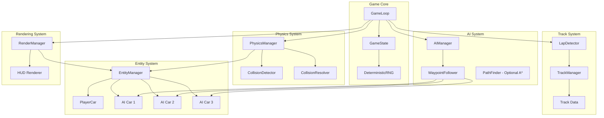
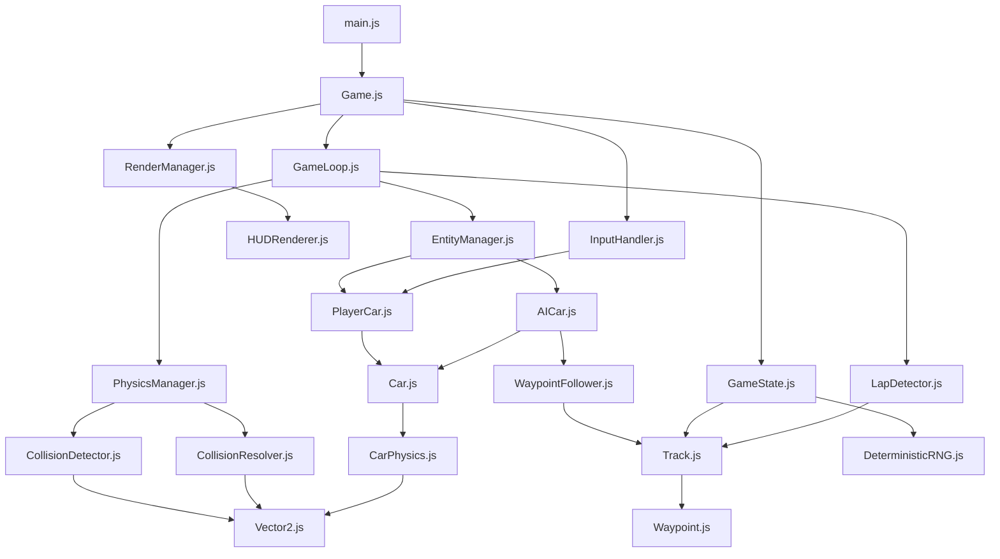

# Top-Down 2D Racing Game - Architecture Design Document

## Table of Contents
1. [Overview](#overview)
2. [System Architecture](#system-architecture)
3. [Data Structures](#data-structures)
4. [Physics System](#physics-system)
5. [AI System](#ai-system)
6. [Lap Detection](#lap-detection)
7. [Game Loop](#game-loop)
8. [Rendering System](#rendering-system)
9. [File Organization](#file-organization)
10. [Algorithms Reference](#algorithms-reference)

---

## Overview

### Project Description
A top-down 2D racing game built in vanilla JavaScript featuring:
- Physics-based car movement with acceleration, braking, and steering
- 3 AI opponents using waypoint-based navigation
- Lap detection and race position tracking
- Collision detection with impulse-based resolution
- Deterministic gameplay with seeded RNG
- Fixed timestep game loop for consistent simulation

### Technical Constraints
- No external physics engines (custom implementation required)
- Deterministic RNG with seed support for reproducible races
- Fixed timestep for consistent physics across different hardware
- Top-down 2D perspective with simple geometric shapes

---

## System Architecture

### High-Level Architecture Diagram



### Module Breakdown

| Module | Responsibility | Key Classes/Functions |
|--------|---------------|----------------------|
| **GameLoop** | Orchestrates update/render cycle, manages fixed timestep | `GameLoop`, `accumulator`, `step()` |
| **GameState** | Manages global game state, race progress, scoring | `GameState`, `RaceState` |
| **PhysicsManager** | Updates physics for all entities, handles collisions | `PhysicsManager`, `updatePhysics()` |
| **EntityManager** | Manages all game entities (cars, obstacles) | `EntityManager`, `add()`, `remove()`, `update()` |
| **Car** | Base car physics and movement | `Car`, `updatePhysics()`, `applyInput()` |
| **PlayerCar** | Player-controlled car with input handling | `PlayerCar`, `handleInput()` |
| **AICar** | AI-controlled car with waypoint following | `AICar`, `updateAI()`, `calculateSteering()` |
| **WaypointSystem** | Manages track waypoints for AI navigation | `WaypointSystem`, `getNextWaypoint()`, `getClosestWaypoint()` |
| **LapDetector** | Detects lap completion and validates progress | `LapDetector`, `checkLap()`, `validateCheckpoint()` |
| **CollisionSystem** | Detects and resolves collisions | `CollisionDetector`, `CollisionResolver` |
| **RenderManager** | Renders all game entities and UI | `RenderManager`, `render()`, `renderHUD()` |
| **DeterministicRNG** | Seeded random number generation | `DeterministicRNG`, `seed()`, `random()` |

---

## Data Structures

### Vector2
Basic 2D vector for positions, velocities, and forces.

```javascript
class Vector2 {
    constructor(x = 0, y = 0) {
        this.x = x;
        this.y = y;
    }
    
    // Core operations
    add(v) { return new Vector2(this.x + v.x, this.y + v.y); }
    subtract(v) { return new Vector2(this.x - v.x, this.y - v.y); }
    multiply(scalar) { return new Vector2(this.x * scalar, this.y * scalar); }
    divide(scalar) { return new Vector2(this.x / scalar, this.y / scalar); }
    
    // Vector math
    dot(v) { return this.x * v.x + this.y * v.y; }
    cross(v) { return this.x * v.y - this.y * v.x; }
    length() { return Math.sqrt(this.x * this.x + this.y * this.y); }
    lengthSquared() { return this.x * this.x + this.y * this.y; }
    normalize() { 
        const len = this.length();
        return len > 0 ? this.divide(len) : new Vector2(0, 0);
    }
    rotate(angle) {
        const cos = Math.cos(angle);
        const sin = Math.sin(angle);
        return new Vector2(
            this.x * cos - this.y * sin,
            this.x * sin + this.y * cos
        );
    }
    
    // Utility
    clone() { return new Vector2(this.x, this.y); }
    distanceTo(v) { return this.subtract(v).length(); }
    distanceSquaredTo(v) { return this.subtract(v).lengthSquared(); }
}
```

### Car Physics State

```javascript
class CarPhysics {
    constructor() {
        // Position and orientation
        this.position = new Vector2(0, 0);
        this.velocity = new Vector2(0, 0);
        this.heading = 0;           // Angle in radians (0 = facing right)
        this.angularVelocity = 0; // Rotation speed
        
        // Physics properties
        this.mass = 1000;         // kg
        this.invMass = 1 / this.mass;
        this.inertia = 500;       // kg*m^2 (rotational inertia)
        this.invInertia = 1 / this.inertia;
        
        // Car dimensions (for collision)
        this.width = 20;          // pixels
        this.height = 36;         // pixels
        this.halfWidth = this.width / 2;
        this.halfHeight = this.height / 2;
        
        // Movement constants
        this.maxSpeed = 300;      // pixels/second
        this.maxReverseSpeed = 80;
        this.acceleration = 200;  // pixels/second^2
        this.braking = 400;       // pixels/second^2
        this.friction = 0.98;     // velocity multiplier per frame
        this.turnSpeed = 2.5;     // radians/second
        this.grip = 0.9;          // lateral friction multiplier
        
        // Current state
        this.speed = 0;           // Current speed magnitude
        this.isAccelerating = false;
        this.isBraking = false;
        this.steering = 0;        // -1 (left) to 1 (right)
    }
}
```

### Car Entity

```javascript
class Car {
    constructor(id, isPlayer = false, startPosition = new Vector2(0, 0)) {
        this.id = id;
        this.isPlayer = isPlayer;
        this.physics = new CarPhysics();
        this.physics.position = startPosition.clone();
        
        // Visual properties
        this.color = isPlayer ? '#00FF00' : '#FF0000';
        
        // Race state
        this.lapCount = 0;
        this.raceTime = 0;
        this.currentCheckpoint = 0;
        this.checkpointsPassed = new Set();
        this.finished = false;
        this.finishTime = null;
        this.position = 0;        // Race position (1st, 2nd, etc.)
        
        // AI specific
        this.aiConfig = null;     // Set if isPlayer = false
        
        // Collision
        this.collisionCooldown = 0; // Frames until next collision response
    }
    
    // Get corners for collision detection (OBB)
    getCorners() {
        const cos = Math.cos(this.physics.heading);
        const sin = Math.sin(this.physics.heading);
        const hw = this.physics.halfWidth;
        const hh = this.physics.halfHeight;
        const pos = this.physics.position;
        
        return [
            new Vector2(pos.x + cos * hw - sin * hh, pos.y + sin * hw + cos * hh),
            new Vector2(pos.x - cos * hw - sin * hh, pos.y - sin * hw + cos * hh),
            new Vector2(pos.x - cos * hw + sin * hh, pos.y - sin * hw - cos * hh),
            new Vector2(pos.x + cos * hw + sin * hh, pos.y + sin * hw - cos * hh)
        ];
    }
    
    // Get forward vector
    getForwardVector() {
        return new Vector2(Math.cos(this.physics.heading), Math.sin(this.physics.heading));
    }
    
    // Get right vector (for lateral velocity calculations)
    getRightVector() {
        return new Vector2(-Math.sin(this.physics.heading), Math.cos(this.physics.heading));
    }
}
```

### Waypoint Structure

```javascript
class Waypoint {
    constructor(id, position, width = 100, isCheckpoint = false) {
        this.id = id;
        this.position = position.clone();
        this.width = width;           // Width of track at this point
        this.isCheckpoint = isCheckpoint;
        this.next = null;             // Reference to next waypoint
        this.prev = null;             // Reference to previous waypoint
        
        // For AI steering
        this.tangent = new Vector2(0, 0);  // Direction to next waypoint
        this.normal = new Vector2(0, 0);   // Perpendicular to tangent
    }
    
    // Calculate distance from point to waypoint line segment
    distanceToPoint(point) {
        // Project point onto line through waypoint perpendicular to tangent
        const toPoint = point.subtract(this.position);
        return Math.abs(toPoint.dot(this.normal));
    }
    
    // Check if point is within waypoint width
    containsPoint(point) {
        return this.distanceToPoint(point) <= this.width / 2;
    }
}
```

### Track Definition

```javascript
class Track {
    constructor(name) {
        this.name = name;
        this.waypoints = [];          // Array of Waypoint
        this.checkpoints = [];        // Indices of checkpoint waypoints
        this.startLine = null;        // Waypoint index of start/finish line
        this.totalLaps = 3;
        
        // Track bounds (for culling)
        this.bounds = {
            minX: 0, maxX: 0,
            minY: 0, maxY: 0
        };
        
        // Visual properties
        this.trackWidth = 80;         // Default track width
        this.trackColor = '#333333';
        this.grassColor = '#228B22';
        this.wallColor = '#888888';
    }
    
    // Build linked list and calculate tangents
    build() {
        const n = this.waypoints.length;
        for (let i = 0; i < n; i++) {
            const current = this.waypoints[i];
            const next = this.waypoints[(i + 1) % n];
            const prev = this.waypoints[(i - 1 + n) % n];
            
            current.next = next;
            current.prev = prev;
            
            // Calculate tangent (direction to next)
            current.tangent = next.position.subtract(current.position).normalize();
            current.normal = new Vector2(-current.tangent.y, current.tangent.x);
        }
        
        // Calculate bounds
        this.calculateBounds();
    }
    
    calculateBounds() {
        if (this.waypoints.length === 0) return;
        
        this.bounds.minX = this.bounds.maxX = this.waypoints[0].position.x;
        this.bounds.minY = this.bounds.maxY = this.waypoints[0].position.y;
        
        for (const wp of this.waypoints) {
            this.bounds.minX = Math.min(this.bounds.minX, wp.position.x);
            this.bounds.maxX = Math.max(this.bounds.maxX, wp.position.x);
            this.bounds.minY = Math.min(this.bounds.minY, wp.position.y);
            this.bounds.maxY = Math.max(this.bounds.maxY, wp.position.y);
        }
        
        // Add padding
        const padding = this.trackWidth;
        this.bounds.minX -= padding;
        this.bounds.maxX += padding;
        this.bounds.minY -= padding;
        this.bounds.maxY += padding;
    }
    
    // Get total track length
    getLength() {
        let length = 0;
        for (let i = 0; i < this.waypoints.length; i++) {
            const current = this.waypoints[i];
            const next = this.waypoints[(i + 1) % this.waypoints.length];
            length += current.position.distanceTo(next.position);
        }
        return length;
    }
}
```

### Game State

```javascript
class GameState {
    constructor(seed = Date.now()) {
        this.rng = new DeterministicRNG(seed);
        
        // Race state
        this.raceState = 'WAITING';   // WAITING, COUNTDOWN, RACING, FINISHED
        this.raceTime = 0;
        this.countdownTime = 3;
        
        // Entities
        this.player = null;
        this.aiCars = [];
        this.allCars = [];
        
        // Track
        this.track = null;
        
        // Camera
        this.camera = {
            position: new Vector2(0, 0),
            zoom: 1.0,
            target: null  // Car to follow
        };
        
        // Settings
        this.fixedTimestep = 1 / 60;  // 60 FPS physics
        this.maxSubsteps = 5;         // Prevent spiral of death
        
        // Statistics
        this.leaderboard = [];
    }
    
    // Get cars sorted by race position
    getLeaderboard() {
        return this.allCars
            .filter(car => car.finished)
            .sort((a, b) => a.finishTime - b.finishTime)
            .concat(
                this.allCars
                    .filter(car => !car.finished)
                    .sort((a, b) => {
                        // Sort by lap, then by distance along track
                        if (a.lapCount !== b.lapCount) return b.lapCount - a.lapCount;
                        return b.currentCheckpoint - a.currentCheckpoint;
                    })
            );
    }
}
```

### Deterministic RNG

```javascript
class DeterministicRNG {
    constructor(seed = 12345) {
        this.seed = seed;
        this.initialSeed = seed;
        this.state = seed;
    }
    
    // Linear Congruential Generator
    // Parameters from Numerical Recipes
    random() {
        this.state = (1664525 * this.state + 1013904223) % 4294967296;
        return this.state / 4294967296;
    }
    
    // Random integer in range [min, max)
    randomInt(min, max) {
        return Math.floor(this.random() * (max - min)) + min;
    }
    
    // Random float in range [min, max)
    randomFloat(min, max) {
        return this.random() * (max - min) + min;
    }
    
    // Reset to initial seed
    reset() {
        this.state = this.initialSeed;
    }
    
    // Set new seed
    setSeed(seed) {
        this.seed = seed;
        this.initialSeed = seed;
        this.state = seed;
    }
}
```

---

## Physics System

### Car Movement Physics

The car physics uses a simplified arcade model with the following characteristics:

1. **Longitudinal Forces** (forward/backward):
   - Acceleration applies force in heading direction
   - Braking applies opposite force
   - Natural friction/drag slows the car

2. **Lateral Forces** (side-to-side):
   - Grip limits lateral velocity
   - Drift occurs when lateral force exceeds grip

3. **Steering**:
   - Rotation based on speed (slower = tighter turning)
   - Speed-sensitive steering for better control

```javascript
class CarPhysicsController {
    static update(car, dt) {
        const physics = car.physics;
        
        // Calculate forward and right vectors
        const forward = new Vector2(Math.cos(physics.heading), Math.sin(physics.heading));
        const right = new Vector2(-Math.sin(physics.heading), Math.cos(physics.heading));
        
        // Decompose velocity into forward and lateral components
        const velForward = physics.velocity.dot(forward);
        const velLateral = physics.velocity.dot(right);
        
        // Apply acceleration/braking
        let accelInput = 0;
        if (physics.isAccelerating) accelInput = 1;
        else if (physics.isBraking) accelInput = -1;
        
        // Calculate longitudinal force
        let longitudinalForce = 0;
        if (accelInput > 0) {
            // Accelerating
            longitudinalForce = physics.acceleration * accelInput;
        } else if (accelInput < 0) {
            // Braking/reversing
            if (velForward > 0) {
                // Braking while moving forward
                longitudinalForce = physics.braking * accelInput;
            } else {
                // Reversing
                longitudinalForce = physics.acceleration * 0.5 * accelInput;
            }
        }
        
        // Apply drag/friction when no input
        if (accelInput === 0) {
            longitudinalForce = -velForward * 2; // Rolling resistance
        }
        
        // Update forward velocity
        const newVelForward = velForward + longitudinalForce * dt;
        
        // Clamp to max speeds
        let clampedVelForward = newVelForward;
        if (newVelForward > physics.maxSpeed) clampedVelForward = physics.maxSpeed;
        if (newVelForward < -physics.maxReverseSpeed) clampedVelForward = -physics.maxReverseSpeed;
        
        // Apply lateral grip (friction)
        const gripForce = -velLateral * physics.grip * 5; // Grip coefficient
        const newVelLateral = velLateral + gripForce * dt;
        
        // Reconstruct velocity from components
        physics.velocity = forward.multiply(clampedVelForward).add(right.multiply(newVelLateral));
        
        // Apply general friction/drag
        physics.velocity = physics.velocity.multiply(physics.friction);
        
        // Update position
        physics.position = physics.position.add(physics.velocity.multiply(dt));
        
        // Update rotation (steering)
        if (Math.abs(velForward) > 10) { // Can only steer when moving
            // Steering is speed-sensitive: slower = more responsive
            const speedFactor = Math.min(1, 100 / Math.abs(velForward));
            const turnAmount = physics.steering * physics.turnSpeed * speedFactor * dt;
            
            // Reverse steering when going backward
            const direction = velForward >= 0 ? 1 : -1;
            physics.heading += turnAmount * direction;
            
            // Normalize heading to [0, 2π)
            physics.heading = ((physics.heading % (2 * Math.PI)) + 2 * Math.PI) % (2 * Math.PI);
        }
        
        // Update speed magnitude
        physics.speed = physics.velocity.length();
    }
}
```

### Collision Detection

Using Separating Axis Theorem (SAT) for OBB (Oriented Bounding Box) collision detection.

```javascript
class CollisionDetector {
    // Check collision between two cars using SAT
    static checkCarCollision(carA, carB) {
        const cornersA = carA.getCorners();
        const cornersB = carB.getCorners();
        
        // Get axes to test (normals of both boxes)
        const axes = [];
        
        // Add normals from car A
        const edgeA0 = cornersA[1].subtract(cornersA[0]);
        axes.push(new Vector2(-edgeA0.y, edgeA0.x).normalize());
        const edgeA1 = cornersA[2].subtract(cornersA[1]);
        axes.push(new Vector2(-edgeA1.y, edgeA1.x).normalize());
        
        // Add normals from car B
        const edgeB0 = cornersB[1].subtract(cornersB[0]);
        axes.push(new Vector2(-edgeB0.y, edgeB0.x).normalize());
        const edgeB1 = cornersB[2].subtract(cornersB[1]);
        axes.push(new Vector2(-edgeB1.y, edgeB1.x).normalize());
        
        let minOverlap = Infinity;
        let collisionAxis = null;
        
        // Test each axis
        for (const axis of axes) {
            const projA = this.projectOntoAxis(cornersA, axis);
            const projB = this.projectOntoAxis(cornersB, axis);
            
            // Check for separation
            if (projA.max < projB.min || projB.max < projA.min) {
                return null; // No collision
            }
            
            // Calculate overlap
            const overlap = Math.min(projA.max, projB.max) - Math.max(projA.min, projB.min);
            if (overlap < minOverlap) {
                minOverlap = overlap;
                collisionAxis = axis;
            }
        }
        
        // Ensure collision axis points from A to B
        const centerA = carA.physics.position;
        const centerB = carB.physics.position;
        const direction = centerB.subtract(centerA);
        if (direction.dot(collisionAxis) < 0) {
            collisionAxis = collisionAxis.multiply(-1);
        }
        
        return {
            overlap: minOverlap,
            axis: collisionAxis,
            point: centerA.add(centerB).divide(2) // Approximate collision point
        };
    }
    
    // Project polygon onto axis
    static projectOntoAxis(corners, axis) {
        let min = corners[0].dot(axis);
        let max = min;
        
        for (let i = 1; i < corners.length; i++) {
            const proj = corners[i].dot(axis);
            if (proj < min) min = proj;
            if (proj > max) max = proj;
        }
        
        return { min, max };
    }
}
```

### Collision Response

Impulse-based collision resolution with restitution and friction.

```javascript
class CollisionResolver {
    static resolve(carA, carB, collision) {
        const physicsA = carA.physics;
        const physicsB = carB.physics;
        
        // Relative velocity
        const relativeVel = physicsB.velocity.subtract(physicsA.velocity);
        
        // Velocity along collision normal
        const velAlongNormal = relativeVel.dot(collision.axis);
        
        // Don't resolve if velocities are separating
        if (velAlongNormal > 0) return;
        
        // Restitution (bounciness)
        const restitution = 0.3; // Cars aren't very bouncy
        
        // Calculate impulse scalar
        let j = -(1 + restitution) * velAlongNormal;
        j /= physicsA.invMass + physicsB.invMass;
        
        // Apply impulse
        const impulse = collision.axis.multiply(j);
        physicsA.velocity = physicsA.velocity.subtract(impulse.multiply(physicsA.invMass));
        physicsB.velocity = physicsB.velocity.add(impulse.multiply(physicsB.invMass));
        
        // Apply friction (tangent impulse)
        const tangent = relativeVel.subtract(collision.axis.multiply(velAlongNormal)).normalize();
        if (tangent.length() > 0.001) {
            const friction = 0.4; // Friction coefficient
            let jt = -relativeVel.dot(tangent);
            jt /= physicsA.invMass + physicsB.invMass;
            
            // Clamp friction impulse
            if (Math.abs(jt) > j * friction) {
                jt = jt > 0 ? j * friction : -j * friction;
            }
            
            const frictionImpulse = tangent.multiply(jt);
            physicsA.velocity = physicsA.velocity.subtract(frictionImpulse.multiply(physicsA.invMass));
            physicsB.velocity = physicsB.velocity.add(frictionImpulse.multiply(physicsB.invMass));
        }
        
        // Positional correction (prevent sinking)
        const percent = 0.8; // Penetration percentage to correct
        const slop = 0.01;   // Penetration allowance
        const correction = collision.axis.multiply(
            Math.max(collision.overlap - slop, 0) / (physicsA.invMass + physicsB.invMass) * percent
        );
        
        physicsA.position = physicsA.position.subtract(correction.multiply(physicsA.invMass));
        physicsB.position = physicsB.position.add(correction.multiply(physicsB.invMass));
        
        // Set collision cooldown
        carA.collisionCooldown = 10;
        carB.collisionCooldown = 10;
    }
}
```

---

## AI System

### Waypoint Following Algorithm

The AI uses a simple but effective waypoint following system with steering behaviors.

```javascript
class WaypointFollower {
    constructor(car, track) {
        this.car = car;
        this.track = track;
        this.currentWaypointIndex = 0;
        this.targetWaypoint = null;
        
        // AI tuning parameters
        this.lookaheadDistance = 60;     // Distance to look ahead for steering
        this.brakeDistance = 120;          // Distance to start braking
        this.maxSteerAngle = Math.PI / 4; // Maximum steering angle
        this.cornerSpeedFactor = 0.7;     // Speed multiplier for corners
        
        // State
        this.stuckTimer = 0;
        this.lastPosition = new Vector2(0, 0);
    }
    
    update(dt) {
        if (!this.targetWaypoint) {
            this.findNearestWaypoint();
        }
        
        // Check if reached current waypoint
        if (this.hasReachedWaypoint()) {
            this.advanceToNextWaypoint();
        }
        
        // Calculate steering
        const steeringInput = this.calculateSteering();
        const throttleInput = this.calculateThrottle();
        
        // Apply to car
        this.car.physics.steering = steeringInput;
        this.car.physics.isAccelerating = throttleInput > 0;
        this.car.physics.isBraking = throttleInput < 0;
        
        // Check if stuck
        this.checkIfStuck();
    }
    
    findNearestWaypoint() {
        let nearestDist = Infinity;
        let nearestIndex = 0;
        
        for (let i = 0; i < this.track.waypoints.length; i++) {
            const wp = this.track.waypoints[i];
            const dist = this.car.physics.position.distanceSquaredTo(wp.position);
            if (dist < nearestDist) {
                nearestDist = dist;
                nearestIndex = i;
            }
        }
        
        this.currentWaypointIndex = nearestIndex;
        this.targetWaypoint = this.track.waypoints[nearestIndex];
    }
    
    hasReachedWaypoint() {
        const dist = this.car.physics.position.distanceTo(this.targetWaypoint.position);
        return dist < this.lookaheadDistance;
    }
    
    advanceToNextWaypoint() {
        this.currentWaypointIndex = (this.currentWaypointIndex + 1) % this.track.waypoints.length;
        this.targetWaypoint = this.track.waypoints[this.currentWaypointIndex];
        
        // Update car's checkpoint tracking
        if (this.targetWaypoint.isCheckpoint) {
            this.car.currentCheckpoint = this.currentWaypointIndex;
        }
    }
    
    calculateSteering() {
        const carPos = this.car.physics.position;
        const targetPos = this.targetWaypoint.position;
        
        // Calculate desired direction
        const toTarget = targetPos.subtract(carPos).normalize();
        
        // Get car's forward vector
        const forward = new Vector2(Math.cos(this.car.physics.heading), Math.sin(this.car.physics.heading));
        
        // Calculate angle to target
        let angle = Math.atan2(
            toTarget.y * forward.x - toTarget.x * forward.y,
            toTarget.x * forward.x + toTarget.y * forward.y
        );
        
        // Normalize angle to [-π, π]
        while (angle > Math.PI) angle -= 2 * Math.PI;
        while (angle < -Math.PI) angle += 2 * Math.PI;
        
        // Convert to steering input (-1 to 1)
        let steering = angle / this.maxSteerAngle;
        steering = Math.max(-1, Math.min(1, steering));
        
        // Add some noise based on AI skill
        if (this.car.aiConfig) {
            const error = (Math.random() - 0.5) * (1 - this.car.aiConfig.skill);
            steering += error;
        }
        
        return steering;
    }
    
    calculateThrottle() {
        const speed = this.car.physics.speed;
        const maxSpeed = this.car.physics.maxSpeed;
        
        // Look ahead for sharp turns
        const nextWaypoint = this.targetWaypoint.next;
        const turnAngle = this.calculateTurnAngle();
        
        // Slow down for sharp turns
        let targetSpeed = maxSpeed;
        if (turnAngle > Math.PI / 6) {
            targetSpeed *= this.cornerSpeedFactor;
        }
        if (turnAngle > Math.PI / 3) {
            targetSpeed *= 0.5;
        }
        
        // Distance to target
        const distToTarget = this.car.physics.position.distanceTo(this.targetWaypoint.position);
        
        // Brake if approaching turn too fast
        if (distToTarget < this.brakeDistance && speed > targetSpeed) {
            return -0.5; // Brake
        }
        
        // Accelerate if below target speed
        if (speed < targetSpeed * 0.9) {
            return 1; // Accelerate
        }
        
        // Coast
        return 0;
    }
    
    calculateTurnAngle() {
        const current = this.targetWaypoint;
        const next = current.next;
        
        const currentDir = current.tangent;
        const nextDir = next.tangent;
        
        // Calculate angle between directions
        let angle = Math.acos(currentDir.dot(nextDir));
        return angle;
    }
    
    checkIfStuck() {
        const moveDist = this.car.physics.position.distanceTo(this.lastPosition);
        
        if (moveDist < 1) {
            this.stuckTimer++;
            
            // If stuck for too long, reverse and try different angle
            if (this.stuckTimer > 60) { // 1 second at 60 FPS
                this.car.physics.isBraking = true;
                this.car.physics.steering = (this.stuckTimer % 20 < 10) ? 1 : -1;
            }
        } else {
            this.stuckTimer = 0;
        }
        
        this.lastPosition = this.car.physics.position.clone();
    }
}
```

### AI Car Configuration

```javascript
class AIConfig {
    constructor(skill = 0.8, aggression = 0.5) {
        this.skill = skill;           // 0-1, affects steering accuracy
        this.aggression = aggression; // 0-1, affects overtaking behavior
        
        // Derived parameters
        this.reactionTime = 0.1 + (1 - skill) * 0.2; // seconds
        this.optimalLineOffset = (Math.random() - 0.5) * 20 * (1 - skill);
        this.brakeThreshold = 0.7 + skill * 0.2;
    }
    
    // Factory methods for different AI personalities
    static createRookie() {
        return new AIConfig(0.6, 0.3);
    }
    
    static createAverage() {
        return new AIConfig(0.8, 0.5);
    }
    
    static createPro() {
        return new AIConfig(0.95, 0.8);
    }
}
```

---

## Lap Detection

### Checkpoint-Based Lap System

The lap detection uses a checkpoint system to prevent cheating (cutting corners).

```javascript
class LapDetector {
    constructor(track) {
        this.track = track;
        this.checkpointCount = track.checkpoints.length;
    }
    
    update(car) {
        // Find which checkpoint the car just passed
        const currentWaypoint = this.track.waypoints[car.currentCheckpoint];
        const nextWaypoint = currentWaypoint.next;
        
        // Check if car passed the next waypoint
        if (this.hasPassedWaypoint(car, currentWaypoint, nextWaypoint)) {
            car.currentCheckpoint = (car.currentCheckpoint + 1) % this.track.waypoints.length;
            car.checkpointsPassed.add(car.currentCheckpoint);
            
            // Check if crossed start/finish line
            if (car.currentCheckpoint === this.track.startLine) {
                this.checkLapCompletion(car);
            }
        }
        
        // Validate car is on track (anti-cheat)
        this.validateTrackPosition(car);
    }
    
    hasPassedWaypoint(car, from, to) {
        const pos = car.physics.position;
        
        // Vector from 'from' to car
        const toCar = pos.subtract(from.position);
        // Vector from 'from' to 'to'
        const toNext = to.position.subtract(from.position);
        
        // Check if car has moved past the waypoint line
        const dot = toCar.dot(toNext);
        const nextDistSq = toNext.lengthSquared();
        
        // Car has passed if projection is beyond the waypoint
        if (dot > nextDistSq * 0.5) {
            // Also check if within track width
            const closestPoint = this.closestPointOnSegment(pos, from.position, to.position);
            const distFromCenter = pos.distanceTo(closestPoint);
            return distFromCenter < this.track.trackWidth;
        }
        
        return false;
    }
    
    closestPointOnSegment(point, a, b) {
        const ab = b.subtract(a);
        const ap = point.subtract(a);
        const t = Math.max(0, Math.min(1, ap.dot(ab) / ab.lengthSquared()));
        return a.add(ab.multiply(t));
    }
    
    checkLapCompletion(car) {
        // Check if all checkpoints were hit
        const requiredCheckpoints = this.track.checkpoints.length;
        
        if (car.checkpointsPassed.size >= requiredCheckpoints) {
            car.lapCount++;
            car.checkpointsPassed.clear();
            
            // Check if race is complete
            if (car.lapCount >= this.track.totalLaps) {
                car.finished = true;
                car.finishTime = car.raceTime;
            }
        } else {
            // Missed checkpoints - invalid lap
            this.handleInvalidLap(car);
        }
    }
    
    handleInvalidLap(car) {
        // Reset checkpoints but don't count lap
        car.checkpointsPassed.clear();
        
        // Optional: Penalty for cutting
        car.physics.velocity = car.physics.velocity.multiply(0.5);
    }
    
    validateTrackPosition(car) {
        // Find closest point on track
        let closestDist = Infinity;
        
        for (let i = 0; i < this.track.waypoints.length; i++) {
            const current = this.track.waypoints[i];
            const next = current.next;
            const closest = this.closestPointOnSegment(car.physics.position, current.position, next.position);
            const dist = car.physics.position.distanceTo(closest);
            
            if (dist < closestDist) {
                closestDist = dist;
            }
        }
        
        // If too far from track, apply penalty
        const maxDistance = this.track.trackWidth * 1.5;
        if (closestDist > maxDistance) {
            // Slow down car significantly
            car.physics.velocity = car.physics.velocity.multiply(0.9);
        }
    }
    
    // Calculate progress along track (0 to 1)
    getTrackProgress(car) {
        const currentIndex = car.currentCheckpoint;
        const current = this.track.waypoints[currentIndex];
        const next = current.next;
        
        // Distance along current segment
        const segmentLength = current.position.distanceTo(next.position);
        const distFromCurrent = car.physics.position.distanceTo(current.position);
        const segmentProgress = Math.min(1, distFromCurrent / segmentLength);
        
        // Total progress
        const totalWaypoints = this.track.waypoints.length;
        return (currentIndex + segmentProgress) / totalWaypoints;
    }
}
```

---

## Game Loop

### Fixed Timestep Implementation

The game loop uses a fixed timestep for physics updates to ensure deterministic and consistent simulation across different hardware.

```javascript
class GameLoop {
    constructor(gameState, renderer) {
        this.gameState = gameState;
        this.renderer = renderer;
        
        // Timing
        this.fixedTimestep = 1 / 60;  // 60 physics updates per second
        this.maxSubsteps = 5;         // Prevent spiral of death
        this.accumulator = 0;
        
        // Frame tracking
        this.lastTime = 0;
        this.frameCount = 0;
        this.fps = 0;
        this.lastFpsTime = 0;
        
        // State
        this.isRunning = false;
        this.rafId = null;
    }
    
    start() {
        this.isRunning = true;
        this.lastTime = performance.now();
        this.loop();
    }
    
    stop() {
        this.isRunning = false;
        if (this.rafId) {
            cancelAnimationFrame(this.rafId);
        }
    }
    
    loop() {
        if (!this.isRunning) return;
        
        this.rafId = requestAnimationFrame(() => this.loop());
        
        const currentTime = performance.now();
        const frameTime = (currentTime - this.lastTime) / 1000; // Convert to seconds
        this.lastTime = currentTime;
        
        // Cap frame time to prevent spiral of death
        const maxFrameTime = this.fixedTimestep * this.maxSubsteps;
        const dt = Math.min(frameTime, maxFrameTime);
        
        // Accumulate time
        this.accumulator += dt;
        
        // Fixed timestep updates
        let substeps = 0;
        while (this.accumulator >= this.fixedTimestep && substeps < this.maxSubsteps) {
            this.update(this.fixedTimestep);
            this.accumulator -= this.fixedTimestep;
            substeps++;
        }
        
        // Calculate interpolation factor for smooth rendering
        const alpha = this.accumulator / this.fixedTimestep;
        
        // Render with interpolation
        this.render(alpha);
        
        // Update FPS counter
        this.updateFPS(currentTime);
    }
    
    update(dt) {
        const state = this.gameState;
        
        // Update race timer
        if (state.raceState === 'RACING') {
            state.raceTime += dt;
            
            // Update car race times
            for (const car of state.allCars) {
                if (!car.finished) {
                    car.raceTime += dt;
                }
            }
        }
        
        // Handle countdown
        if (state.raceState === 'COUNTDOWN') {
            state.countdownTime -= dt;
            if (state.countdownTime <= 0) {
                state.raceState = 'RACING';
                state.countdownTime = 0;
            }
        }
        
        // Update player input
        if (state.player) {
            this.updatePlayerInput(state.player);
        }
        
        // Update AI
        for (const aiCar of state.aiCars) {
            if (aiCar.aiController) {
                aiCar.aiController.update(dt);
            }
        }
        
        // Update physics for all cars
        for (const car of state.allCars) {
            CarPhysicsController.update(car, dt);
        }
        
        // Check collisions
        this.updateCollisions();
        
        // Update lap detection
        for (const car of state.allCars) {
            state.lapDetector.update(car);
        }
        
        // Update leaderboard
        state.leaderboard = state.getLeaderboard();
        
        // Update camera
        this.updateCamera();
        
        // Check race end
        this.checkRaceEnd();
    }
    
    updateCollisions() {
        const cars = this.gameState.allCars;
        
        // Check all pairs
        for (let i = 0; i < cars.length; i++) {
            for (let j = i + 1; j < cars.length; j++) {
                const carA = cars[i];
                const carB = cars[j];
                
                // Skip if either car is in cooldown
                if (carA.collisionCooldown > 0 || carB.collisionCooldown > 0) continue;
                
                const collision = CollisionDetector.checkCarCollision(carA, carB);
                if (collision) {
                    CollisionResolver.resolve(carA, carB, collision);
                }
            }
            
            // Decrement cooldown
            if (carA.collisionCooldown > 0) carA.collisionCooldown--;
        }
        if (cars.length > 0 && cars[cars.length - 1].collisionCooldown > 0) {
            cars[cars.length - 1].collisionCooldown--;
        }
    }
    
    updateCamera() {
        const camera = this.gameState.camera;
        const target = camera.target || this.gameState.player;
        
        if (target) {
            // Smooth camera follow
            const targetPos = target.physics.position;
            const lerpFactor = 0.1;
            
            camera.position.x += (targetPos.x - camera.position.x) * lerpFactor;
            camera.position.y += (targetPos.y - camera.position.y) * lerpFactor;
        }
    }
    
    checkRaceEnd() {
        const state = this.gameState;
        
        // Check if all cars finished
        const allFinished = state.allCars.every(car => car.finished);
        
        if (allFinished && state.raceState === 'RACING') {
            state.raceState = 'FINISHED';
        }
    }
    
    render(alpha) {
        this.renderer.render(this.gameState, alpha);
    }
    
    updateFPS(currentTime) {
        this.frameCount++;
        
        if (currentTime - this.lastFpsTime >= 1000) {
            this.fps = this.frameCount;
            this.frameCount = 0;
            this.lastFpsTime = currentTime;
        }
    }
    
    // Player input handling
    updatePlayerInput(player) {
        // This would integrate with your input system
        // Example:
        // player.physics.isAccelerating = Input.isKeyDown('ArrowUp');
        // player.physics.isBraking = Input.isKeyDown('ArrowDown');
        // player.physics.steering = 0;
        // if (Input.isKeyDown('ArrowLeft')) player.physics.steering = -1;
        // if (Input.isKeyDown('ArrowRight')) player.physics.steering = 1;
    }
}
```

---

## Rendering System

### Top-Down View Rendering

```javascript
class RenderManager {
    constructor(canvas) {
        this.canvas = canvas;
        this.ctx = canvas.getContext('2d');
        
        // View settings
        this.tileSize = 32;
        this.zoom = 1.0;
        
        // Offscreen canvas for track (optimization)
        this.trackCanvas = null;
        this.trackNeedsRedraw = true;
    }
    
    render(gameState, alpha) {
        const ctx = this.ctx;
        const canvas = this.canvas;
        
        // Clear canvas
        ctx.fillStyle = '#1a1a1a';
        ctx.fillRect(0, 0, canvas.width, canvas.height);
        
        // Save context for camera transform
        ctx.save();
        
        // Apply camera transform
        const camera = gameState.camera;
        ctx.translate(canvas.width / 2, canvas.height / 2);
        ctx.scale(camera.zoom, camera.zoom);
        ctx.translate(-camera.position.x, -camera.position.y);
        
        // Render track
        this.renderTrack(gameState.track);
        
        // Render cars with interpolation
        for (const car of gameState.allCars) {
            this.renderCar(car, alpha);
        }
        
        // Render waypoints (debug)
        // this.renderWaypoints(gameState.track);
        
        ctx.restore();
        
        // Render HUD (screen space)
        this.renderHUD(gameState);
    }
    
    renderTrack(track) {
        if (!track) return;
        
        const ctx = this.ctx;
        
        // Draw grass background
        ctx.fillStyle = track.grassColor;
        ctx.fillRect(
            track.bounds.minX,
            track.bounds.minY,
            track.bounds.maxX - track.bounds.minX,
            track.bounds.maxY - track.bounds.minY
        );
        
        // Draw track segments
        ctx.strokeStyle = track.trackColor;
        ctx.lineWidth = track.trackWidth;
        ctx.lineCap = 'round';
        ctx.lineJoin = 'round';
        
        ctx.beginPath();
        for (let i = 0; i < track.waypoints.length; i++) {
            const wp = track.waypoints[i];
            if (i === 0) {
                ctx.moveTo(wp.position.x, wp.position.y);
            } else {
                ctx.lineTo(wp.position.x, wp.position.y);
            }
        }
        // Close the loop
        if (track.waypoints.length > 0) {
            ctx.lineTo(track.waypoints[0].position.x, track.waypoints[0].position.y);
        }
        ctx.stroke();
        
        // Draw track borders
        ctx.strokeStyle = track.wallColor;
        ctx.lineWidth = 4;
        ctx.stroke();
        
        // Draw start/finish line
        if (track.startLine !== null) {
            const start = track.waypoints[track.startLine];
            const next = start.next;
            const mid = start.position.add(next.position).divide(2);
            const perp = new Vector2(-start.tangent.y, start.tangent.x);
            
            ctx.strokeStyle = '#FFFFFF';
            ctx.lineWidth = 4;
            ctx.setLineDash([10, 10]);
            ctx.beginPath();
            ctx.moveTo(
                mid.x - perp.x * track.trackWidth / 2,
                mid.y - perp.y * track.trackWidth / 2
            );
            ctx.lineTo(
                mid.x + perp.x * track.trackWidth / 2,
                mid.y + perp.y * track.trackWidth / 2
            );
            ctx.stroke();
            ctx.setLineDash([]);
        }
    }
    
    renderCar(car, alpha) {
        const ctx = this.ctx;
        const physics = car.physics;
        
        // Interpolate position for smooth rendering
        // (In a full implementation, store previous position and interpolate)
        const pos = physics.position;
        const heading = physics.heading;
        
        ctx.save();
        ctx.translate(pos.x, pos.y);
        ctx.rotate(heading);
        
        // Draw car body
        ctx.fillStyle = car.color;
        ctx.fillRect(
            -physics.halfWidth,
            -physics.halfHeight,
            physics.width,
            physics.height
        );
        
        // Draw car details
        ctx.fillStyle = '#000000';
        // Windshield
        ctx.fillRect(-8, -10, 16, 6);
        // Rear window
        ctx.fillRect(-8, 4, 16, 6);
        
        // Draw wheels
        ctx.fillStyle = '#333333';
        const wheelWidth = 4;
        const wheelHeight = 8;
        // Front wheels
        ctx.fillRect(physics.halfWidth - 2, -physics.halfHeight + 2, wheelWidth, wheelHeight);
        ctx.fillRect(physics.halfWidth - 2, physics.halfHeight - 10, wheelWidth, wheelHeight);
        // Rear wheels
        ctx.fillRect(-physics.halfWidth - 2, -physics.halfHeight + 2, wheelWidth, wheelHeight);
        ctx.fillRect(-physics.halfWidth - 2, physics.halfHeight - 10, wheelWidth, wheelHeight);
        
        // Draw direction indicator (for debugging)
        if (car.isPlayer) {
            ctx.strokeStyle = '#00FF00';
            ctx.lineWidth = 2;
            ctx.beginPath();
            ctx.moveTo(0, 0);
            ctx.lineTo(physics.halfWidth + 10, 0);
            ctx.stroke();
        }
        
        ctx.restore();
    }
    
    renderWaypoints(track) {
        const ctx = this.ctx;
        
        for (const wp of track.waypoints) {
            // Draw waypoint
            ctx.fillStyle = wp.isCheckpoint ? '#FFFF00' : '#FF00FF';
            ctx.beginPath();
            ctx.arc(wp.position.x, wp.position.y, 5, 0, Math.PI * 2);
            ctx.fill();
            
            // Draw waypoint ID
            ctx.fillStyle = '#FFFFFF';
            ctx.font = '10px Arial';
            ctx.fillText(wp.id.toString(), wp.position.x + 8, wp.position.y);
        }
    }
    
    renderHUD(gameState) {
        const ctx = this.ctx;
        const canvas = this.canvas;
        
        // HUD background
        ctx.fillStyle = 'rgba(0, 0, 0, 0.7)';
        ctx.fillRect(10, 10, 200, 120);
        
        ctx.fillStyle = '#FFFFFF';
        ctx.font = 'bold 16px Arial';
        
        // Lap count
        const player = gameState.player;
        if (player) {
            ctx.fillText(`Lap: ${player.lapCount + 1}/${gameState.track.totalLaps}`, 20, 35);
            
            // Race time
            const timeStr = this.formatTime(player.raceTime);
            ctx.fillText(`Time: ${timeStr}`, 20, 60);
            
            // Position
            const position = gameState.leaderboard.indexOf(player) + 1;
            const suffix = this.getPositionSuffix(position);
            ctx.fillText(`Position: ${position}${suffix}`, 20, 85);
            
            // Speed
            const speed = Math.round(player.physics.speed * 0.1); // Scale for display
            ctx.fillText(`Speed: ${speed} km/h`, 20, 110);
        }
        
        // Countdown
        if (gameState.raceState === 'COUNTDOWN') {
            const count = Math.ceil(gameState.countdownTime);
            ctx.save();
            ctx.translate(canvas.width / 2, canvas.height / 2);
            ctx.fillStyle = count === 1 ? '#00FF00' : '#FFFF00';
            ctx.font = 'bold 72px Arial';
            ctx.textAlign = 'center';
            ctx.fillText(count > 0 ? count.toString() : 'GO!', 0, 0);
            ctx.restore();
        }
        
        // Race finished
        if (gameState.raceState === 'FINISHED') {
            ctx.save();
            ctx.translate(canvas.width / 2, canvas.height / 2);
            ctx.fillStyle = '#00FF00';
            ctx.font = 'bold 48px Arial';
            ctx.textAlign = 'center';
            ctx.fillText('RACE FINISHED!', 0, -50);
            
            // Show final positions
            ctx.font = '24px Arial';
            for (let i = 0; i < Math.min(4, gameState.leaderboard.length); i++) {
                const car = gameState.leaderboard[i];
                const name = car.isPlayer ? 'Player' : `AI ${car.id}`;
                const time = this.formatTime(car.finishTime || car.raceTime);
                ctx.fillText(`${i + 1}. ${name} - ${time}`, 0, i * 30);
            }
            ctx.restore();
        }
        
        // FPS counter
        ctx.fillStyle = '#00FF00';
        ctx.font = '12px Arial';
        ctx.fillText(`FPS: ${this.fps || 60}`, canvas.width - 70, 20);
    }
    
    formatTime(seconds) {
        const mins = Math.floor(seconds / 60);
        const secs = Math.floor(seconds % 60);
        const ms = Math.floor((seconds % 1) * 100);
        return `${mins}:${secs.toString().padStart(2, '0')}.${ms.toString().padStart(2, '0')}`;
    }
    
    getPositionSuffix(position) {
        if (position === 1) return 'st';
        if (position === 2) return 'nd';
        if (position === 3) return 'rd';
        return 'th';
    }
}
```

---

## File Organization

### Directory Structure

```
project-root/
├── index.html              # Entry point
├── css/
│   └── styles.css          # Game styles
├── docs/
│   └── architecture.md     # This document
├── src/
│   ├── main.js             # Application entry point
│   ├── game/
│   │   ├── Game.js         # Main game class
│   │   ├── GameLoop.js     # Fixed timestep loop
│   │   └── GameState.js    # State management
│   ├── entities/
│   │   ├── Entity.js       # Base entity class
│   │   ├── Car.js          # Car entity
│   │   ├── PlayerCar.js    # Player-controlled car
│   │   └── AICar.js        # AI-controlled car
│   ├── physics/
│   │   ├── Vector2.js      # 2D vector math
│   │   ├── PhysicsManager.js
│   │   ├── CarPhysics.js   # Car movement physics
│   │   ├── CollisionDetector.js
│   │   └── CollisionResolver.js
│   ├── ai/
│   │   ├── WaypointFollower.js
│   │   └── AIConfig.js
│   ├── track/
│   │   ├── Track.js        # Track definition
│   │   ├── Waypoint.js     # Waypoint structure
│   │   └── LapDetector.js  # Lap completion detection
│   ├── rendering/
│   │   ├── RenderManager.js
│   │   └── HUDRenderer.js
│   ├── utils/
│   │   ├── DeterministicRNG.js
│   │   └── InputHandler.js
│   └── config/
│       └── GameConfig.js   # Game constants
└── assets/
    └── (optional sprites/sounds)
```

### Module Dependencies



### Class Hierarchy

```
Entity (base)
└── Car
    ├── PlayerCar
    └── AICar

Physics
├── Vector2 (utility)
├── CarPhysics (state)
└── CarPhysicsController (behavior)

Track
├── Track (container)
├── Waypoint (node)
└── LapDetector (validation)

AI
├── WaypointFollower (navigation)
└── AIConfig (tuning)

Collision
├── CollisionDetector (SAT)
└── CollisionResolver (impulse)

Core
├── Game (orchestrator)
├── GameLoop (timing)
├── GameState (data)
└── DeterministicRNG (utility)

Rendering
├── RenderManager (scene)
└── HUDRenderer (UI)
```

---

## Algorithms Reference

### 1. Separating Axis Theorem (SAT) for OBB Collision

**Purpose:** Detect collision between two oriented rectangles.

**Algorithm:**
1. Get all edge normals from both boxes as potential separating axes
2. For each axis:
   - Project both boxes onto the axis
   - If projections don't overlap, boxes are separated (no collision)
3. If all axes show overlap, collision detected
4. Minimum overlap depth gives collision normal

**Complexity:** O(n+m) where n, m are number of edges (constant for rectangles)

### 2. Impulse-Based Collision Response

**Purpose:** Resolve collision by applying impulses to separate bodies.

**Algorithm:**
1. Calculate relative velocity along collision normal
2. Compute impulse magnitude using restitution and mass
3. Apply impulse to both bodies (opposite directions)
4. Apply tangent impulse for friction
5. Perform positional correction to prevent sinking

**Key Formula:**
```
j = -(1 + e) * (v · n) / (1/m1 + 1/m2)
```
Where:
- j = impulse magnitude
- e = restitution (bounciness)
- v = relative velocity
- n = collision normal
- m1, m2 = masses

### 3. Waypoint Following with Steering Behaviors

**Purpose:** Guide AI cars along the track.

**Algorithm:**
1. Find nearest waypoint to initialize
2. Each frame:
   - Check if reached current waypoint (distance threshold)
   - If reached, advance to next waypoint
   - Calculate desired heading to target waypoint
   - Convert heading difference to steering input
   - Adjust throttle based on upcoming turn angle
3. Apply steering and throttle to car physics

**Steering Calculation:**
```
angle = atan2(cross(forward, toTarget), dot(forward, toTarget))
steering = clamp(angle / maxSteeringAngle, -1, 1)
```

### 4. Checkpoint-Based Lap Validation

**Purpose:** Prevent cheating by requiring all checkpoints.

**Algorithm:**
1. Track which checkpoints each car has passed
2. When car crosses start/finish line:
   - Verify all checkpoints were hit
   - If valid: increment lap count
   - If invalid: reset checkpoints, apply penalty
3. Clear checkpoint set after valid lap completion

**Anti-Cheat:**
- Checkpoints must be hit in order
- Car must be within track width when passing
- Cutting corners results in invalid lap

### 5. Fixed Timestep Game Loop

**Purpose:** Ensure consistent physics simulation regardless of frame rate.

**Algorithm:**
```
accumulator = 0
timestep = 1/60

loop:
    currentTime = getTime()
    frameTime = currentTime - lastTime
    lastTime = currentTime
    
    // Prevent spiral of death
    if frameTime > maxFrameTime:
        frameTime = maxFrameTime
    
    accumulator += frameTime
    
    while accumulator >= timestep:
        updatePhysics(timestep)
        accumulator -= timestep
    
    // Interpolation factor for smooth rendering
    alpha = accumulator / timestep
    render(alpha)
```

**Benefits:**
- Deterministic physics
- Consistent across different hardware
- Can handle variable render frame rates

### 6. Linear Congruential Generator (LCG) for RNG

**Purpose:** Deterministic random number generation with seed support.

**Algorithm:**
```
state = (a * state + c) % m
return state / m
```

**Parameters (Numerical Recipes):**
- a = 1664525 (multiplier)
- c = 1013904223 (increment)
- m = 2^32 (modulus)

**Properties:**
- Full period (cycles through all values before repeating)
- Fast computation
- Deterministic given same seed

---

## Implementation Notes

### Performance Considerations

1. **Spatial Partitioning:** For many entities, implement a quadtree or grid for broad-phase collision detection
2. **Track Caching:** Render static track elements to an offscreen canvas
3. **Object Pooling:** Reuse car objects instead of creating/destroying
4. **Early Exit:** In collision detection, exit early on first separating axis

### Determinism Checklist

- [ ] Use fixed timestep for all physics updates
- [ ] Use seeded RNG for any random decisions
- [ ] Avoid floating-point comparisons (use epsilon)
- [ ] Process entities in consistent order
- [ ] Don't use frame time in game logic (use fixed dt)
- [ ] Avoid JavaScript's Math.random()

### Extension Points

1. **A* Pathfinding:** Replace simple waypoint following with A* for obstacle avoidance
2. **Power-ups:** Add collectible items with temporary boosts
3. **Different Car Types:** Vary mass, acceleration, grip for different vehicles
4. **Track Editor:** Build tracks visually with waypoint placement
5. **Multiplayer:** Add network synchronization using deterministic lockstep

---

## Appendix: Sample Track Definition

```javascript
function createSampleTrack() {
    const track = new Track('Oval Circuit');
    
    // Define waypoints (oval shape)
    const waypoints = [
        new Vector2(400, 300),   // Start
        new Vector2(600, 300),   // Straight
        new Vector2(700, 350),   // Turn entry
        new Vector2(700, 450),   // Turn apex
        new Vector2(600, 500),   // Turn exit
        new Vector2(400, 500),   // Back straight
        new Vector2(300, 450),   // Turn entry
        new Vector2(300, 350),   // Turn apex
    ];
    
    // Add to track
    for (let i = 0; i < waypoints.length; i++) {
        const wp = new Waypoint(i, waypoints[i], 80, i % 2 === 0);
        track.waypoints.push(wp);
    }
    
    track.startLine = 0;
    track.checkpoints = [2, 4, 6];
    track.totalLaps = 3;
    
    track.build();
    return track;
}
```

---

*Document Version: 1.0*
*Last Updated: 2026-02-22*
