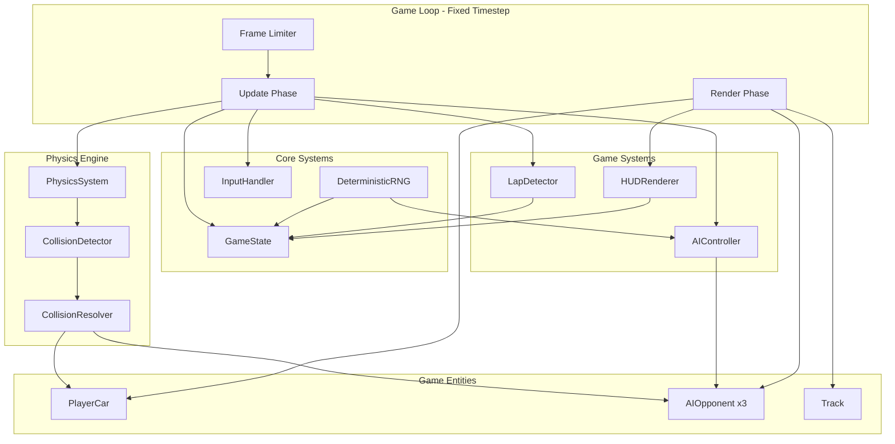
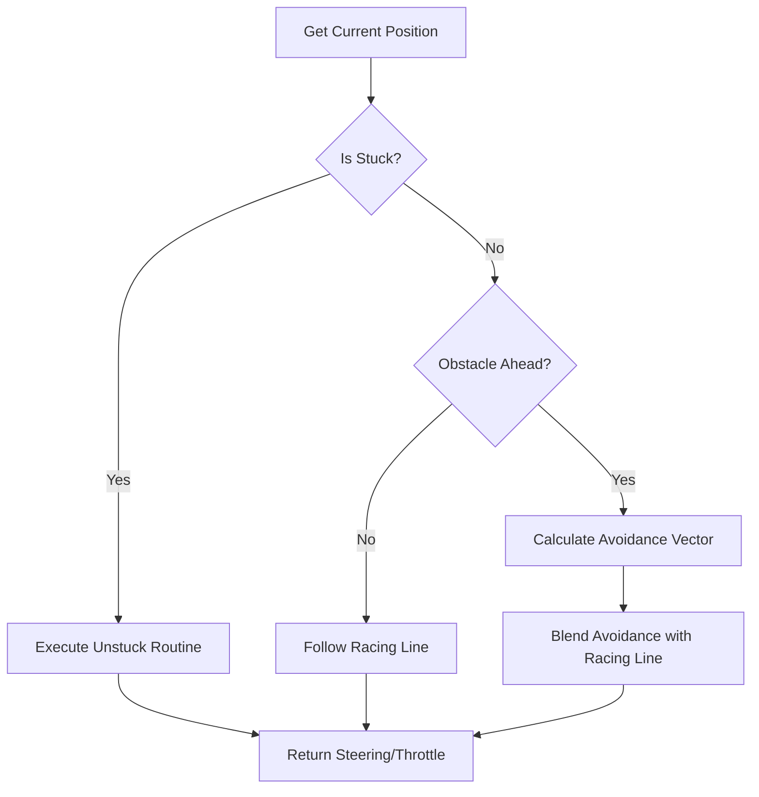
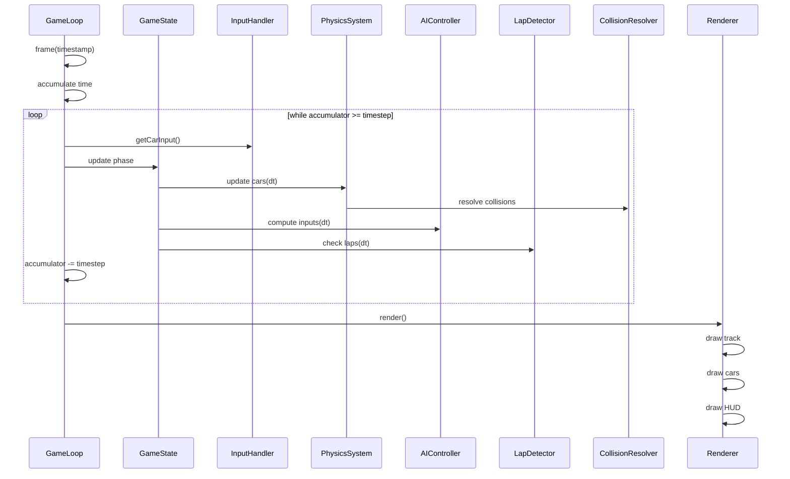
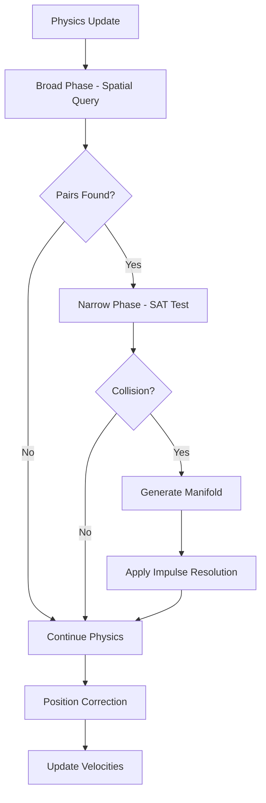
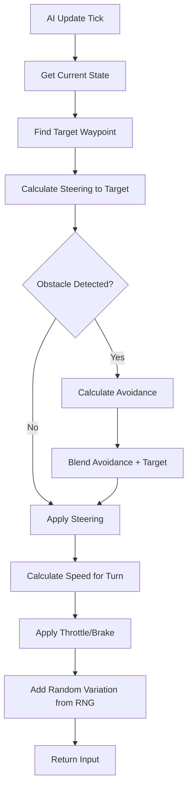

# Top-Down 2D Racing Game - Complete Architecture Design

## Table of Contents
1. [Overview](#overview)
2. [Core Architecture Diagram](#core-architecture-diagram)
3. [Class Specifications](#class-specifications)
4. [Component Details](#component-details)
5. [Algorithms](#algorithms)
6. [Data Flow](#data-flow)

---

## Overview

This document specifies a complete architecture for a top-down 2D racing game implemented in a single HTML file with embedded CSS/JavaScript. The design emphasizes deterministic simulation, clear separation of concerns, and pure JavaScript physics without external dependencies.

### Design Principles
- **Deterministic**: Same seed produces identical gameplay
- **Fixed Timestep**: Consistent physics across different frame rates
- **Object-Oriented**: Clear class boundaries and responsibilities
- **Single File**: All code embedded in one HTML document

---

## Core Architecture Diagram



---

## Class Specifications

### 1. Game State Management

#### GameState Class
```javascript
class GameState {
    // Properties
    racePhase: RacePhase           // READY, COUNTDOWN, RACING, FINISHED
    raceTime: number               // Total elapsed race time in seconds
    lapCounts: Map<CarId, number>  // Current lap for each car
    positions: Map<CarId, number>  // Race position ranking 1-4
    checkpoints: Map<CarId, Set<number>>  // Passed checkpoints per car
    finishTimes: Map<CarId, number>       // Final times for finished racers
    isPaused: boolean
    countdownValue: number         // 3, 2, 1, GO!
    
    // Methods
    reset(): void
    updateCarPosition(carId: CarId, checkpoint: number): void
    calculateRankings(): CarId[]
    isRaceComplete(): boolean
}

enum RacePhase {
    READY = 'READY',
    COUNTDOWN = 'COUNTDOWN',
    RACING = 'RACING',
    FINISHED = 'FINISHED'
}
```

#### GameConfig Interface
```javascript
const GameConfig = {
    FIXED_TIMESTEP: 1/60,          // 60 updates per second
    MAX_FRAME_TIME: 0.25,           // Prevent spiral of death
    TOTAL_LAPS: 3,
    TRACK_WIDTH: 120,               // Pixels
    CAR_WIDTH: 20,
    CAR_LENGTH: 40,
    SEED: 42                        // Default deterministic seed
}
```

---

### 2. Fixed Timestep Game Loop

#### GameLoop Class
```javascript
class GameLoop {
    // Properties
    accumulator: number
    currentTime: number
    game: Game
    
    // Methods
    start(): void
    stop(): void
    frame(timestamp: number): void
    update(dt: number): void
    render(): void
}
```

**Fixed Timestep Algorithm:**
```
accumulator += frameTime
while (accumulator >= FIXED_TIMESTEP) {
    update(FIXED_TIMESTEP)
    accumulator -= FIXED_TIMESTEP
}
render()
```

---

### 3. Car Physics System

#### Vector2 Class
```javascript
class Vector2 {
    x: number
    y: number
    
    add(v: Vector2): Vector2
    subtract(v: Vector2): Vector2
    multiply(scalar: number): Vector2
    dot(v: Vector2): number
    length(): number
    normalize(): Vector2
    rotate(angle: number): Vector2
    perpendicular(): Vector2
    clone(): Vector2
}
```

#### Car Base Class
```javascript
class Car {
    // Transform
    position: Vector2
    rotation: number              // Radians, 0 = facing up
    velocity: Vector2
    
    // Physics Properties
    acceleration: number          // Current acceleration input
    steering: number              // Current steering input -1 to 1
    angularVelocity: number
    
    // Car Constants
    maxSpeed: number              // 400 pixels/second
    accelerationRate: number      // 300 pixels/second²
    brakingRate: number           // 400 pixels/second²
    reverseMaxSpeed: number       // 150 pixels/second
    turnRate: number              // 3.5 radians/second at full speed
    friction: number              // 0.98 per frame
    angularFriction: number       // 0.95 per frame
    
    // Dimensions
    width: number                 // 20 pixels
    length: number                // 40 pixels
    
    // State
    isOnTrack: boolean
    lapProgress: LapProgress
    
    // Methods
    update(dt: number, input: CarInput): void
    applyAcceleration(dt: number, throttle: number): void
    applySteering(dt: number, direction: number): void
    applyFriction(): void
    getCorners(): Vector2[]       // 4 corners for collision
    getForwardVector(): Vector2
    getVelocityVector(): Vector2
    getBoundingBox(): BoundingBox
}

interface CarInput {
    throttle: number    // -1 to 1 (brake/reverse to accelerate)
    steering: number    // -1 to 1 (left to right)
}

interface LapProgress {
    currentLap: number
    lastCheckpoint: number
    checkpointsPassed: Set<number>
    lapStartTime: number
    bestLapTime: number | null
}
```

#### PlayerCar Class (extends Car)
```javascript
class PlayerCar extends Car {
    // Additional player-specific properties
    inputSource: InputHandler
    
    update(dt: number, inputHandler: InputHandler): void
}
```

#### AIOpponent Class (extends Car)
```javascript
class AIOpponent extends Car {
    // AI-specific properties
    controller: AIController
    difficulty: AIDifficulty
    
    update(dt: number, track: Track, rng: DeterministicRNG): void
}

enum AIDifficulty {
    EASY = 'EASY',     // Slower reaction, more errors
    MEDIUM = 'MEDIUM', // Balanced
    HARD = 'HARD'      // Optimal racing line
}
```

**Physics Update Algorithm:**
```
1. Store previous position for collision resolution
2. Calculate forward direction from rotation
3. Apply acceleration to velocity along forward vector
4. Apply steering as rotation change (speed-dependent)
5. Apply friction to both linear and angular velocity
6. Clamp velocity to max speed
7. Update position by velocity × dt
```

---

### 4. Track Representation

#### Track Class
```javascript
class Track {
    // Path Data
    centerPath: Vector2[]         // Center line waypoints
    innerBoundary: Vector2[]      // Inner wall vertices
    outerBoundary: Vector2[]      // Outer wall vertices
    
    // Checkpoints
    checkpoints: Checkpoint[]     // Lap detection zones
    finishLine: FinishLine
    
    // Spatial Optimization
    quadTree: QuadTree            // For collision queries
    
    // Properties
    width: number                 // Track width in pixels
    
    // Methods
    isOnTrack(position: Vector2): boolean
    getNearestWaypoint(position: Vector2): number
    getDistanceAlongTrack(position: Vector2): number
    getCheckpoint(id: number): Checkpoint
    queryCollisions(bbox: BoundingBox): CollisionCandidate[]
    render(ctx: CanvasRenderingContext2D): void
}
```

#### Checkpoint Class
```javascript
class Checkpoint {
    id: number
    start: Vector2               // Start of checkpoint line
    end: Vector2                 // End of checkpoint line
    normal: Vector2              // Direction facing forward
    bounds: BoundingBox          // For quick intersection tests
    
    // Methods
    crossed(previousPos: Vector2, currentPos: Vector2): boolean
    containsPoint(point: Vector2): boolean
}
```

#### FinishLine Class
```javascript
class FinishLine extends Checkpoint {
    isStart: boolean             // True for start/finish line
    lapTrigger: boolean          // Triggers lap completion
}
```

#### Track Boundary Representation
```
Track is defined by:
- Inner boundary polygon (clockwise vertices)
- Outer boundary polygon (clockwise vertices)
- Center line path (waypoints for AI navigation)

Point-in-polygon test determines if car is on track.
Segment intersection detects boundary collisions.
```

---

### 5. AI Opponent Behavior System

#### AIController Class
```javascript
class AIController {
    // State
    currentPath: Vector2[]
    targetWaypoint: number
    stuckTimer: number
    avoidanceVector: Vector2
    
    // Configuration
    lookAheadDistance: number    // 150-250 pixels
    stuckThreshold: number       // Seconds before unstuck routine
    avoidanceRadius: number      // Collision avoidance range
    
    // Methods
    computeInput(
        car: AIOpponent,
        track: Track,
        otherCars: Car[],
        rng: DeterministicRNG
    ): CarInput
    findPathToTarget(
        current: Vector2,
        target: Vector2,
        track: Track
    ): Vector2[]
    handleStuckSituation(rng: DeterministicRNG): CarInput
}
```

**AI Decision Flow:**


#### Waypoint Following Algorithm (Recommended)
```javascript
// Primary algorithm - Simpler and more suitable for racing
computeWaypointFollowing(car, track, otherCars, rng):
    1. Find nearest waypoint ahead on center path
    2. Calculate target position (look-ahead point)
    3. Check for nearby obstacles (other cars, walls)
    4. If obstacle detected, adjust target laterally
    5. Calculate desired steering angle to reach target
    6. Calculate desired speed based on upcoming turns
    7. Add small random variation using RNG for personality
    8. Return throttle and steering inputs
```

**Why Waypoint Following over A* for Racing:**
- A* is designed for pathfinding in dynamic obstacle environments
- Racing has a predetermined optimal path (center line)
- Real-time performance needs simple calculations
- Waypoint following with obstacle avoidance is more natural for racing
- A* could be used for recovery when off-track

#### A* Recovery Pathfinding (Optional Enhancement)
```javascript
// Used only when AI is significantly off-track
aStarRecovery(start, goal, track):
    openSet = [start]
    cameFrom = Map()
    gScore = Map() // cost from start
    fScore = Map() // estimated total cost
    
    while openSet not empty:
        current = node with lowest fScore
        if current near goal:
            return reconstructPath(cameFrom, current)
        
        for each neighbor in getNeighbors(current, track):
            tentativeG = gScore[current] + distance(current, neighbor)
            if tentativeG < gScore[neighbor]:
                cameFrom[neighbor] = current
                gScore[neighbor] = tentativeG
                fScore[neighbor] = gScore[neighbor] + heuristic(neighbor, goal)
                if neighbor not in openSet:
                    openSet.add(neighbor)
    
    return null // No path found
```

**Heuristic for Racing A*:**
```javascript
heuristic(pos, goal, track):
    // Use distance along track as heuristic
    trackDistance = track.getDistanceAlongTrack(pos)
    goalDistance = track.getDistanceAlongTrack(goal)
    return abs(goalDistance - trackDistance)
```

---

### 6. Lap Detection System

#### LapDetector Class
```javascript
class LapDetector {
    track: Track
    state: Map<CarId, LapState>
    
    // Methods
    update(car: Car, previousPosition: Vector2, currentPosition: Vector2): void
    checkCheckpointCrossing(car: Car, checkpoint: Checkpoint): boolean
    checkLapCompletion(car: Car): boolean
    getProgress(car: Car): number  // 0-1 percentage of lap
}

interface LapState {
    currentLap: number
    lastCheckpoint: number
    checkpointsPassed: Set<number>
    lapStartTime: number
    hasCrossedStart: boolean       // Must cross start to begin counting
}
```

**Checkpoint Crossing Algorithm:**
```
For each car, each frame:
1. Get previous and current position
2. For each checkpoint in order:
   - Use line segment intersection test
   - If crossed in correct direction (forward):
     - Mark checkpoint as passed
     - Update last checkpoint ID
3. If crossed finish line forward AND all checkpoints passed:
   - Increment lap count
   - Record lap time
   - Reset checkpoint set
   - Update race state
```

**Line Segment Intersection Test:**
```javascript
function lineIntersectsSegment(p1, p2, p3, p4):
    // p1-p2 is car trajectory, p3-p4 is checkpoint line
    d1 = direction(p3, p4, p1)
    d2 = direction(p3, p4, p2)
    d3 = direction(p1, p2, p3)
    d4 = direction(p1, p2, p4)
    
    if ((d1 > 0 && d2 < 0) || (d1 < 0 && d2 > 0)) &&
       ((d3 > 0 && d4 < 0) || (d3 < 0 && d4 > 0)):
        return true
    
    // Check colinear cases
    if onSegment(p3, p4, p1) or onSegment(p3, p4, p2) or
       onSegment(p1, p2, p3) or onSegment(p1, p2, p4):
        return true
    
    return false
```

---

### 7. Collision Detection and Response

#### CollisionDetector Class
```javascript
class CollisionDetector {
    // Methods
    checkCarTrackCollision(car: Car, track: Track): Collision | null
    checkCarCarCollision(car1: Car, car2: Car): Collision | null
    checkBoundingBoxCollision(bbox1: BoundingBox, bbox2: BoundingBox): boolean
    getCollisionManifold(car1: Car, car2: Car): Manifold
}

interface Collision {
    type: CollisionType
    entity1: Car | Track
    entity2: Car | Track
    contactPoint: Vector2
    normal: Vector2
    penetration: number
    timestamp: number
}

enum CollisionType {
    CAR_VS_CAR,
    CAR_VS_INNER_WALL,
    CAR_VS_OUTER_WALL,
    CAR_VS_OFF_TRACK
}

interface Manifold {
    normal: Vector2           // Collision normal
    penetration: number       // How deep the collision is
    contacts: Vector2[]       // Contact points
}
```

#### CollisionResolver Class
```javascript
class CollisionResolver {
    restitution: number       // Bounciness 0-1
    friction: number          // Surface friction
    
    // Methods
    resolveCarCarCollision(car1: Car, car2: Car, collision: Collision): void
    resolveCarWallCollision(car: Car, collision: Collision): void
    applyImpulse(car: Car, impulse: Vector2, contactPoint: Vector2): void
}
```

**Impulse-Based Collision Resolution Formulas:**

```
For Car-Car Collision:

Relative velocity: Vr = V1 - V2
Relative velocity along normal: Vn = Vr · n

If Vn > 0, objects separating, no collision response needed

Coefficient of restitution: e = 0.5 (some bounce)

Impulse magnitude: j = -(1 + e) * Vn / (1/m1 + 1/m2)

Apply impulses:
  Car1.velocity += (j / m1) * n
  Car2.velocity -= (j / m2) * n

Where m1, m2 are masses (can be equal = 1 for simplicity)
```

```
For Car-Wall Collision:

Reflect velocity about collision normal:
  V_out = V_in - 2 * (V_in · n) * n

Apply energy loss:
  V_out = V_out * restitution

Add slight bounce perpendicular to wall:
  V_out += n * penetration * 0.5
```

**Separating Axis Theorem for Car-Car Collision:**
```javascript
function getCarsManifold(car1, car2):
    // Get the 4 corners of each car as a rotated rectangle
    corners1 = car1.getCorners()
    corners2 = car2.getCorners()
    
    // Project onto potential separating axes (8 axes - 4 per rectangle)
    axes = [...getEdgeNormals(corners1), ...getEdgeNormals(corners2)]
    
    minOverlap = Infinity
    smallestAxis = null
    
    for each axis in axes:
        proj1 = projectOntoAxis(corners1, axis)
        proj2 = projectOntoAxis(corners2, axis)
        
        overlap = getOverlap(proj1, proj2)
        if overlap <= 0:
            return null // No collision
        
        if overlap < minOverlap:
            minOverlap = overlap
            smallestAxis = axis
    
    return {
        normal: smallestAxis,
        penetration: minOverlap
    }
```

---

### 8. HUD Rendering System

#### HUDRenderer Class
```javascript
class HUDRenderer {
    canvas: HTMLCanvasElement
    ctx: CanvasRenderingContext2D
    
    // Layout
    hudHeight: number          // Pixels at top of screen
    
    // Methods
    render(gameState: GameState, playerCar: Car): void
    renderLapCounter(currentLap: number, totalLaps: number): void
    renderRaceTime(time: number): void
    renderPosition(currentPos: number, totalCars: number): void
    renderSpeedometer(speed: number): void
    renderMinimap(track: Track, cars: Car[]): void
    renderCountdown(value: number): void
    renderFinishScreen(gameState: GameState): void
}
```

**HUD Layout:**
```
+----------------------------------------------------------+
|  LAP: 2/3    |  TIME: 1:23.45    |  POSITION: 2nd/4     |
+----------------------------------------------------------+
|                                                          |
|                    GAME VIEW                             |
|                                                          |
+----------------------------------------------------------+
|  SPEED: 285 km/h                                         |
+----------------------------------------------------------+
```

---

### 9. Input Handling System

#### InputHandler Class
```javascript
class InputHandler {
    // State
    keys: Map<string, boolean>
    justPressed: Map<string, boolean>
    justReleased: Map<string, boolean>
    
    // Key bindings
    bindings: KeyBindings
    
    // Methods
    initialize(): void
    isKeyDown(action: string): boolean
    isKeyJustPressed(action: string): boolean
    isKeyJustReleased(action: string): boolean
    getCarInput(): CarInput
    clear(): void  // Clear single-frame states
}

interface KeyBindings {
    accelerate: string[]    // ['KeyW', 'ArrowUp']
    brake: string[]          // ['KeyS', 'ArrowDown']
    steerLeft: string[]     // ['KeyA', 'ArrowLeft']
    steerRight: string[]    // ['KeyD', 'ArrowRight']
    pause: string[]         // ['Escape', 'KeyP']
    restart: string[]       // ['KeyR']
}
```

**Input Processing:**
```javascript
// Event listeners
document.addEventListener('keydown', (e) => {
    if (!this.keys.get(e.code)) {
        this.justPressed.set(e.code, true);
    }
    this.keys.set(e.code, true);
});

document.addEventListener('keyup', (e) => {
    this.keys.set(e.code, false);
    this.justReleased.set(e.code, true);
});

// Get car input
getCarInput(): CarInput {
    return {
        throttle: this.keys.get('accelerate') ? 1 : 
                  this.keys.get('brake') ? -1 : 0,
        steering: this.keys.get('steerLeft') ? -1 :
                  this.keys.get('steerRight') ? 1 : 0
    };
}
```

---

### 10. Deterministic RNG

#### DeterministicRNG Class
```javascript
class DeterministicRNG {
    seed: number
    state: number
    
    // Methods
    constructor(seed: number)
    next(): number              // Returns value in [0, 1)
    nextInt(min: number, max: number): number
    nextFloat(min: number, max: number): number
    shuffle<T>(array: T[]): T[]  // Fisher-Yates shuffle
    reset(): void               // Reset to initial seed
}

// Mulberry32 Algorithm (fast, good distribution, simple)
next(): number {
    let t = this.state += 0x6D2B79F5;
    t = Math.imul(t ^ t >>> 15, t | 1);
    t ^= t + Math.imul(t ^ t >>> 7, t | 61);
    return ((t ^ t >>> 14) >>> 0) / 4294967296;
}
```

**Usage in Game:**
- AI decision variation (steering adjustments, reaction timing)
- Initial car placement on grid
- Countdown timing variations
- Any visual effects (particle systems, if added)

---

## Component Interaction Patterns

### Main Game Flow


### Collision Handling Flow


### AI Decision Flow


---

## Data Structures Summary

### Core Data Types

```javascript
// Vector operations are fundamental
class Vector2 {
    x: number
    y: number
}

// Rectangle for bounding boxes
interface BoundingBox {
    x: number
    y: number
    width: number
    height: number
}

// Transform for entities
interface Transform {
    position: Vector2
    rotation: number
    scale: Vector2
}

// Car state snapshot for networking/replay
interface CarSnapshot {
    position: Vector2
    velocity: Vector2
    rotation: number
    timestamp: number
}

// Race result for end screen
interface RaceResult {
    carId: CarId
    position: number
    totalTime: number
    lapTimes: number[]
    bestLap: number
}
```

### QuadTree for Spatial Partitioning

```javascript
class QuadTree {
    boundary: BoundingBox
    capacity: number
    points: Car[]
    divided: boolean
    children: QuadTree[]  // NW, NE, SW, SE
    
    insert(car: Car): boolean
    query(range: BoundingBox): Car[]
    clear(): void
}
```

---

## File Structure (Single HTML)

```html
<!DOCTYPE html>
<html>
<head>
    <title>Top-Down Racing</title>
    <style>
        /* Embedded CSS */
    </style>
</head>
<body>
    <canvas id="gameCanvas"></canvas>
    <script>
        // ============ UTILITIES ============
        // Vector2, DeterministicRNG, Constants
        
        // ============ CORE SYSTEMS ============
        // GameState, GameLoop, InputHandler
        
        // ============ PHYSICS ============
        // CollisionDetector, CollisionResolver, PhysicsSystem
        
        // ============ ENTITIES ============
        // Car, PlayerCar, AIOpponent
        
        // ============ TRACK ============
        // Track, Checkpoint, LapDetector
        
        // ============ AI ============
        // AIController, Pathfinding
        
        // ============ RENDERING ============
        // TrackRenderer, CarRenderer, HUDRenderer
        
        // ============ MAIN ============
        // Game class, initialization
    </script>
</body>
</html>
```

---

## Implementation Notes

### Performance Considerations
1. Use object pooling for vectors to reduce GC pressure
2. QuadTree for broad-phase collision detection
3. Cache computed values (track normals, distances)
4. Use requestAnimationFrame for render timing
5. Fixed timestep allows consistent physics regardless of frame rate

### Determinism Requirements
1. All random calls use DeterministicRNG
2. No floating-point comparisons for equality (use epsilon)
3. Consistent update order for all entities
4. Store seed for reproducibility

### Debug Features (Development Only)
1. Toggle collision debug rendering
2. Show AI path/targets
3. Display checkpoints
4. Frame-by-frame stepping
5. Variable time scale

---

## Summary

This architecture provides a complete, deterministic racing game with:

- **Clean separation of concerns**: Each class has a single responsibility
- **Object-oriented design**: Inheritance for Car types, composition for systems
- **Pure JavaScript physics**: No external dependencies
- **Fixed timestep**: Consistent simulation across hardware
- **Modular structure**: Easy to extend or modify individual components

The design supports the core requirements while remaining simple enough to implement in a single HTML file with embedded JavaScript.