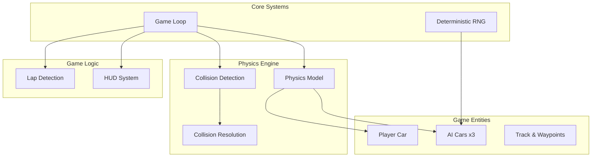

# Top-Down 2D Racing Game Architecture

## 1. System Overview

### Component Breakdown



### Core Components

| Component | Responsibility |
|-----------|----------------|
| Game Loop | Fixed timestep update/render cycle |
| Physics Engine | Velocity, acceleration, friction, steering |
| Collision System | AABB detection + impulse resolution |
| Car Controller | Player input handling and physics application |
| AI Controller | Waypoint following with deterministic behavior |
| Track Manager | Waypoint storage and lap validation |
| Lap Detector | Checkpoint-based lap counting |
| RNG | Seeded random number generation |

---

## 2. Data Structures

### 2.1 Vector2 (Position/Velocity)

```javascript
class Vector2 {
    constructor(x = 0, y = 0) {
        this.x = x;
        this.y = y;
    }
    
    add(other) { return new Vector2(this.x + other.x, this.y + other.y); }
    subtract(other) { return new Vector2(this.x - other.x, this.y - other.y); }
    multiply(scalar) { return new Vector2(this.x * scalar, this.y * scalar); }
    divide(scalar) { return new Vector2(this.x / scalar, this.y / scalar); }
    
    magnitude() { return Math.sqrt(this.x * this.x + this.y * this.y); }
    
    normalize() {
        const mag = this.magnitude();
        return mag > 0 ? this.divide(mag) : new Vector2(0, 0);
    }
    
    dot(other) { return this.x * other.x + this.y * other.y; }
    
    perpendicular() { return new Vector2(-this.y, this.x); } // Rotate 90 degrees
    
    clone() { return new Vector2(this.x, this.y); }
}
```

### 2.2 Car Entity

```javascript
class Car {
    constructor(config) {
        // Position and orientation
        this.position = new Vector2(config.startX, config.startY);
        this.velocity = new Vector2(0, 0);
        this.angle = config.startAngle || 0; // Radians, 0 = facing right
        
        // Physics properties
        this.maxSpeed = config.maxSpeed || 400;       // pixels per second
        this.acceleration = config.acceleration || 800; // pixels per second^2
        this.brakingForce = config.brakingForce || 1200; // pixels per second^2
        this.friction = config.friction || 0.96;      // velocity multiplier per frame
        this.maxSteerAngle = config.maxSteerAngle || Math.PI / 6; // 30 degrees in radians
        this.steerSpeed = config.steerSpeed || 5;     // radians per second
        
        // Dimensions for collision (AABB)
        this.width = config.width || 24;              // pixels
        this.height = config.height || 48;            // pixels
        
        // Lap tracking
        this.currentCheckpoint = -1;                  // Index of last passed checkpoint
        this.lapsCompleted = 0;
        this.checkpointsPassed = [];                  // Array of checkpoint indices for current lap
        
        // State
        this.isPlayer = config.isPlayer || false;
        this.id = config.id || 0;
        
        // Input state (for player)
        this.input = {
            accelerate: false,
            brake: false,
            steerLeft: false,
            steerRight: false
        };
    }
    
    // Get AABB bounds accounting for rotation
    getBounds() {
        const halfWidth = this.width / 2;
        const halfHeight = this.height / 2;
        
        // Calculate corners relative to center
        const cos = Math.cos(this.angle);
        const sin = Math.sin(this.angle);
        
        // Four corners rotated by car angle
        const corners = [
            new Vector2(-halfWidth, -halfHeight),
            new Vector2(halfWidth, -halfHeight),
            new Vector2(halfWidth, halfHeight),
            new Vector2(-halfWidth, halfHeight)
        ].map(corner => {
            // Rotate corner around center
            const rx = corner.x * cos - corner.y * sin;
            const ry = corner.x * sin + corner.y * cos;
            return this.position.add(new Vector2(rx, ry));
        });
        
        // Find min/max for AABB
        let minX = Infinity, minY = Infinity;
        let maxX = -Infinity, maxY = -Infinity;
        
        corners.forEach(c => {
            minX = Math.min(minX, c.x);
            minY = Math.min(minY, c.y);
            maxX = Math.max(maxX, c.x);
            maxY = Math.max(maxY, c.y);
        });
        
        return {
            left: minX,
            right: maxX,
            top: minY,
            bottom: maxY,
            center: this.position.clone(),
            corners: corners
        };
    }
}
```

### 2.3 Waypoint

```javascript
class Waypoint {
    constructor(x, y, index) {
        this.position = new Vector2(x, y);
        this.index = index;
        this.radius = 30; // Detection radius in pixels
    }
    
    distanceTo(otherWaypoint) {
        const dx = otherWaypoint.position.x - this.position.x;
        const dy = otherWaypoint.position.y - this.position.y;
        return Math.sqrt(dx * dx + dy * dy);
    }
}
```

### 2.4 Track

```javascript
class Track {
    constructor(waypoints) {
        this.waypoints = waypoints; // Array of Waypoint objects in order
        this.totalWaypoints = waypoints.length;
        
        // Pre-calculate distances between consecutive waypoints
        this.segmentDistances = [];
        for (let i = 0; i < waypoints.length; i++) {
            const nextIndex = (i + 1) % waypoints.length;
            const dist = waypoints[i].distanceTo(waypoints[nextIndex]);
            this.segmentDistances.push(dist);
        }
        
        // Total track length
        this.totalLength = this.segmentDistances.reduce((a, b) => a + b, 0);
    }
    
    getNextWaypointIndex(currentIndex) {
        return (currentIndex + 1) % this.waypoints.length;
    }
    
    getPreviousWaypointIndex(currentIndex) {
        const prev = currentIndex - 1;
        return prev < 0 ? this.totalWaypoints - 1 : prev;
    }
}
```

### 2.5 Collision Result

```javascript
class CollisionResult {
    constructor(carA, carB, overlapX, overlapY, normal) {
        this.carA = carA;
        this.carB = carB;
        this.overlapX = overlapX; // Overlap amount on X axis
        this.overlapY = overlapY; // Overlap amount on Y axis
        this.normal = normal;     // Vector2 pointing from A to B (normalized)
    }
}
```

---

## 3. Physics Model Specifications

### 3.1 Core Physics Constants

| Constant | Value | Description |
|----------|-------|-------------|
| `MAX_SPEED` | 400 px/s | Maximum forward velocity |
| `ACCELERATION` | 800 px/s² | Forward acceleration rate |
| `BRAKING_FORCE` | 1200 px/s² | Deceleration when braking |
| `FRICTION` | 0.96 | Velocity multiplier per frame (simulates drag) |
| `MAX_STEER_ANGLE` | π/6 rad (30°) | Maximum steering angle from forward |
| `STEER_SPEED` | 5 rad/s | How quickly steering can change |
| `LATERAL_FRICTION` | 0.8 | Reduces sideways sliding |

### 3.2 Velocity Update Formula

```javascript
updatePhysics(dt, input) {
    // dt is delta time in seconds
    
    // Calculate desired forward direction based on car angle
    const forward = new Vector2(Math.cos(this.angle), Math.sin(this.angle));
    
    // Apply acceleration or braking
    let speedChange = 0;
    
    if (input.accelerate) {
        speedChange += this.acceleration * dt;
    }
    
    if (input.brake) {
        speedChange -= this.brakingForce * dt;
    }
    
    // Current forward velocity component
    const currentForwardSpeed = this.velocity.dot(forward);
    
    // Update forward velocity
    let newForwardSpeed = currentForwardSpeed + speedChange;
    
    // Clamp to max speed (forward only, allow negative for reverse)
    if (newForwardSpeed > this.maxSpeed) {
        newForwardSpeed = this.maxSpeed;
    }
    
    // Calculate lateral velocity (sideways movement)
    const right = forward.perpendicular();
    const currentLateralSpeed = this.velocity.dot(right);
    
    // Apply lateral friction to reduce sliding
    const newLateralSpeed = currentLateralSpeed * this.lateralFriction;
    
    // Reconstruct velocity vector
    const newForwardVector = forward.multiply(newForwardSpeed);
    const newLateralVector = right.multiply(newLateralSpeed);
    this.velocity = newForwardVector.add(newLateralVector);
    
    // Apply general friction/drag
    this.velocity = this.velocity.multiply(this.friction);
}
```

### 3.3 Steering Model

```javascript
updateSteering(dt, input) {
    let steerDirection = 0;
    
    if (input.steerLeft) {
        steerDirection = -1;
    } else if (input.steerRight) {
        steerDirection = 1;
    }
    
    // Only allow steering when moving (more realistic)
    const speed = this.velocity.magnitude();
    const minSteerSpeed = 10; // Minimum speed to enable steering
    
    if (speed > minSteerSpeed) {
        // Steering effectiveness scales with speed
        const steerEffectiveness = Math.min(speed / 200, 1);
        
        // Update angle based on input and current velocity direction
        const targetAngleChange = steerDirection * this.maxSteerAngle;
        const actualAngleChange = targetAngleChange * steerEffectiveness * this.steerSpeed * dt;
        
        this.angle += actualAngleChange;
    }
    
    // Normalize angle to [0, 2π)
    while (this.angle < 0) this.angle += Math.PI * 2;
    while (this.angle >= Math.PI * 2) this.angle -= Math.PI * 2;
}
```

### 3.4 Position Update

```javascript
updatePosition(dt) {
    // Simple Euler integration
    this.position = this.position.add(this.velocity.multiply(dt));
}
```

---

## 4. Collision Detection and Resolution

### 4.1 AABB Collision Detection

Using rotated bounding boxes (OBB - Oriented Bounding Box) for more accurate car collisions:

```javascript
class CollisionDetector {
    // Separating Axis Theorem for OBB collision
    static checkOBBCollision(carA, carB) {
        const boundsA = carA.getBounds();
        const boundsB = carB.getBounds();
        
        // Axes to test (normals of both rectangles)
        const axes = [
            new Vector2(Math.cos(carA.angle), Math.sin(carA.angle)),
            new Vector2(-Math.sin(carA.angle), Math.cos(carA.angle)),
            new Vector2(Math.cos(carB.angle), Math.sin(carB.angle)),
            new Vector2(-Math.sin(carB.angle), Math.cos(carB.angle))
        ];
        
        for (const axis of axes) {
            // Project both boxes onto axis
            const projA = this.projectOntoAxis(boundsA.corners, axis);
            const projB = this.projectOntoAxis(boundsB.corners, axis);
            
            // Check for separation
            if (projA.max < projB.min || projB.max < projA.min) {
                return null; // No collision - found separating axis
            }
        }
        
        // Collision detected - calculate overlap and normal
        return this.calculateCollisionDetails(carA, carB);
    }
    
    static projectOntoAxis(corners, axis) {
        let min = Infinity;
        let max = -Infinity;
        
        for (const corner of corners) {
            const projection = corner.dot(axis);
            min = Math.min(min, projection);
            max = Math.max(max, projection);
        }
        
        return { min, max };
    }
    
    static calculateCollisionDetails(carA, carB) {
        // Simple approach: use vector between centers as normal
        const delta = carB.position.subtract(carA.position);
        const normal = delta.normalize();
        
        // Calculate overlap along the normal
        const boundsA = carA.getBounds();
        const boundsB = carB.getBounds();
        
        // Project corners onto collision normal to find penetration depth
        const projA = this.projectOntoAxis(boundsA.corners, normal);
        const projB = this.projectOntoAxis(boundsB.corners, normal);
        
        const overlap = Math.min(projA.max - projB.min, projB.max - projA.min);
        
        return new CollisionResult(carA, carB, overlap, 0, normal);
    }
}
```

### 4.2 Impulse-Based Collision Resolution

Using elastic collision physics with mass-based impulse:

```javascript
class CollisionResolver {
    static resolveCollision(collision) {
        const carA = collision.carA;
        const carB = collision.carB;
        
        // Mass is proportional to size (simplified)
        const massA = carA.width * carA.height;
        const massB = carB.width * carB.height;
        
        // Relative velocity
        const relativeVelocity = carA.velocity.subtract(carB.velocity);
        
        // Velocity along collision normal
        const velocityAlongNormal = relativeVelocity.dot(collision.normal);
        
        // Don't resolve if velocities are separating
        if (velocityAlongNormal > 0) {
            return;
        }
        
        // Coefficient of restitution (bounciness): 0 = no bounce, 1 = perfect elastic
        const restitution = 0.5;
        
        // Calculate impulse scalar
        let j = -(1 + restitution) * velocityAlongNormal;
        j /= (1 / massA + 1 / massB);
        
        // Apply impulse
        const impulse = collision.normal.multiply(j);
        
        carA.velocity = carA.velocity.add(impulse.divide(massA));
        carB.velocity = carB.velocity.subtract(impulse.divide(massB));
        
        // Separate cars to prevent sticking (position correction)
        const percentOverlap = 0.8; // How much of overlap to correct
        const slop = 0.1; // Small threshold to avoid jitter
        
        const correctionMagnitude = Math.max(collision.overlap - slop, 0) / 
                                     (1/massA + 1/massB) * percentOverlap;
        
        const correction = collision.normal.multiply(correctionMagnitude);
        
        carA.position = carA.position.subtract(correction.divide(massA));
        carB.position = carB.position.add(correction.divide(massB));
    }
}
```

---

## 5. Lap Detection System

### 5.1 Checkpoint-Based Lap Counting

Using a checkpoint system to prevent cheating (must pass checkpoints in order):

```javascript
class LapDetector {
    constructor(track) {
        this.track = track;
        this.checkpointsPerLap = track.waypoints.length;
    }
    
    update(car, dt) {
        // Check if car has reached the next checkpoint
        const nextCheckpointIndex = this.track.getNextWaypointIndex(car.currentCheckpoint);
        const nextCheckpoint = this.track.waypoints[nextCheckpointIndex];
        
        const distanceToCheckpoint = car.position.distanceTo(nextCheckpoint.position);
        
        if (distanceToCheckpoint < nextCheckpoint.radius) {
            // Checkpoint passed!
            car.checkpointsPassed.push(nextCheckpointIndex);
            car.currentCheckpoint = nextCheckpointIndex;
            
            // Check for lap completion
            if (car.checkpointsPassed.length >= this.checkpointsPerLap) {
                this.onLapComplete(car);
            }
        }
    }
    
    onLapComplete(car) {
        car.lapsCompleted++;
        car.checkpointsPassed = [];
        // Reset to first checkpoint (index 0 is start/finish, so next is index 1)
        if (car.currentCheckpoint === this.track.totalWaypoints - 1) {
            car.currentCheckpoint = 0;
        }
    }
    
    getLapProgress(car) {
        // Returns progress from 0.0 to 1.0 for current lap
        const checkpointsPassed = car.checkpointsPassed.length;
        return checkpointsPassed / this.checkpointsPerLap;
    }
}
```

### 5.2 Lap Timing Data Structure

```javascript
class LapTimer {
    constructor() {
        this.lapTimes = []; // Array of lap times in milliseconds
        this.currentLapStartTime = null;
        this.bestLapTime = Infinity;
    }
    
    startLap(car) {
        if (this.currentLapStartTime === null) {
            this.currentLapStartTime = Date.now();
        }
    }
    
    completeLap(car) {
        const lapTime = Date.now() - this.currentLapStartTime;
        this.lapTimes.push(lapTime);
        
        if (lapTime < this.bestLapTime) {
            this.bestLapTime = lapTime;
        }
        
        this.currentLapStartTime = Date.now(); // Start next lap immediately
    }
    
    getCurrentLapTime() {
        if (this.currentLapStartTime === null) return 0;
        return Date.now() - this.currentLapStartTime;
    }
}
```

---

## 6. AI Waypoint Following System

### 6.1 AI Controller Design

```javascript
class AIController {
    constructor(car, track, rng) {
        this.car = car;
        this.track = track;
        this.rng = rng; // Deterministic RNG instance
        
        // Target waypoint index (starts at first waypoint after spawn)
        this.targetWaypointIndex = 0;
        
        // AI behavior parameters (can be randomized per car for variety)
        this.aggression = rng.range(0.7, 1.0);   // How hard to accelerate
        this.linePerfection = rng.range(0.8, 1.0); // How precisely to follow waypoints
        this.reactionDelay = rng.range(0.05, 0.15); // Seconds of "reaction time"
        
        // State for smooth steering
        this.currentSteerTarget = 0;
    }
    
    update(dt) {
        const targetWaypoint = this.track.waypoints[this.targetWaypointIndex];
        
        // Check if we've reached the current waypoint
        const distanceToTarget = this.car.position.distanceTo(targetWaypoint.position);
        
        if (distanceToTarget < targetWaypoint.radius * 0.7) {
            // Move to next waypoint
            this.targetWaypointIndex = this.track.getNextWaypointIndex(this.targetWaypointIndex);
        }
        
        // Calculate steering towards waypoint
        const directionToTarget = targetWaypoint.position.subtract(this.car.position);
        const angleToTarget = Math.atan2(directionToTarget.y, directionToTarget.x);
        
        // Smoothly interpolate current angle toward target angle
        this.smoothSteerTowards(angleToTarget, dt);
        
        // Apply acceleration based on track conditions
        this.applyAIAcceleration(dt, distanceToTarget, targetWaypoint);
    }
    
    smoothSteerTowards(targetAngle, dt) {
        // Normalize angles to [-π, π] range for comparison
        let angleDiff = targetAngle - this.car.angle;
        
        // Wrap to [-π, π]
        while (angleDiff > Math.PI) angleDiff -= Math.PI * 2;
        while (angleDiff < -Math.PI) angleDiff += Math.PI * 2;
        
        // Determine steering input based on angle difference
        const steerThreshold = this.car.maxSteerAngle * 0.5;
        
        if (Math.abs(angleDiff) > steerThreshold) {
            if (angleDiff > 0) {
                this.car.input.steerRight = true;
                this.car.input.steerLeft = false;
            } else {
                this.car.input.steerLeft = true;
                this.car.input.steerRight = false;
            }
        } else {
            // Straighten out when close to target angle
            this.car.input.steerLeft = false;
            this.car.input.steerRight = false;
        }
    }
    
    applyAIAcceleration(dt, distanceToTarget, targetWaypoint) {
        // Always accelerate unless approaching a tight turn
        const nextWaypointIndex = this.track.getNextWaypointIndex(this.targetWaypointIndex);
        const nextWaypoint = this.track.waypoints[nextWaypointIndex];
        
        // Calculate turn angle at current waypoint
        const vectorToNext = nextWaypoint.position.subtract(targetWaypoint.position);
        const angleAtTurn = Math.atan2(vectorToNext.y, vectorToNext.x) - 
                           Math.atan2(targetWaypoint.position.y - this.car.position.y, 
                                     targetWaypoint.position.x - this.car.position.x);
        
        // Slow down for sharp turns
        const turnSharpness = Math.abs(angleAtTurn);
        const slowDownThreshold = Math.PI / 3; // 60 degrees
        
        if (turnSharpness > slowDownThreshold && distanceToTarget < 150) {
            // Brake for sharp turn
            this.car.input.accelerate = false;
            this.car.input.brake = true;
        } else {
            // Accelerate normally with aggression factor
            this.car.input.accelerate = true;
            this.car.input.brake = false;
            
            // Scale acceleration by aggression
            const effectiveAcceleration = this.car.acceleration * this.aggression;
            this.car.acceleration = effectiveAcceleration;
        }
    }
}
```

---

## 7. Fixed Timestep Game Loop

### 7.1 Game Loop Implementation

Fixed timestep ensures deterministic physics regardless of frame rate:

```javascript
class GameLoop {
    constructor(updateFunction, renderFunction) {
        this.update = updateFunction;
        this.render = renderFunction;
        
        // Physics runs at fixed 60 Hz
        this.fixedDeltaTime = 1 / 60; // seconds
        
        // Accumulator for time between frames
        this.timeAccumulator = 0;
        
        // Last frame timestamp
        this.lastTime = performance.now();
        
        // Maximum steps to prevent spiral of death
        this.maxSteps = 5;
    }
    
    start() {
        this.gameLoop(performance.now());
    }
    
    gameLoop(currentTime) {
        requestAnimationFrame((time) => this.gameLoop(time));
        
        // Calculate delta time in seconds
        const deltaTime = (currentTime - this.lastTime) / 1000;
        this.lastTime = currentTime;
        
        // Cap delta time to prevent spiral of death
        if (deltaTime > 0.25) {
            return; // Skip frame if too much time passed
        }
        
        // Add to accumulator
        this.timeAccumulator += deltaTime;
        
        // Update physics at fixed timestep
        let steps = 0;
        while (this.timeAccumulator >= this.fixedDeltaTime && steps < this.maxSteps) {
            this.update(this.fixedDeltaTime);
            this.timeAccumulator -= this.fixedDeltaTime;
            steps++;
        }
        
        // Render with interpolation for smooth visuals
        const interpolationFraction = this.timeAccumulator / this.fixedDeltaTime;
        this.render(interpolationFraction);
    }
}
```

### 7.2 Main Game Class Structure

```javascript
class RacingGame {
    constructor() {
        // Initialize deterministic RNG with seed
        this.rng = new SeededRNG(12345);
        
        // Create track with waypoints
        this.track = this.createTrack();
        
        // Create cars
        this.playerCar = new Car({ /* player config */ });
        this.aiCars = [
            new AIController(new Car({ /* ai1 config */ }), this.track, this.rng),
            new AIController(new Car({ /* ai2 config */ }), this.track, this.rng),
            new AIController(new Car({ /* ai3 config */ }), this.track, this.rng)
        ];
        
        // Initialize systems
        this.collisionDetector = new CollisionDetector();
        this.collisionResolver = new CollisionResolver();
        this.lapDetector = new LapDetector(this.track);
        this.hud = new HUD();
        
        // Game state
        this.isRunning = false;
        this.startTime = null;
    }
    
    update(dt) {
        // Update player car
        this.updateCarPhysics(this.playerCar, dt);
        
        // Update AI cars
        for (const ai of this.aiCars) {
            ai.update(dt);
            this.updateCarPhysics(ai.car, dt);
        }
        
        // Check collisions between all pairs
        const allCars = [this.playerCar, ...this.aiCars.map(ai => ai.car)];
        for (let i = 0; i < allCars.length; i++) {
            for (let j = i + 1; j < allCars.length; j++) {
                const collision = this.collisionDetector.checkOBBCollision(
                    allCars[i], allCars[j]
                );
                if (collision) {
                    this.collisionResolver.resolveCollision(collision);
                }
            }
        }
        
        // Update lap detection for all cars
        for (const car of allCars) {
            this.lapDetector.update(car, dt);
        }
    }
    
    updateCarPhysics(car, dt) {
        car.updateSteering(dt, car.input);
        car.updatePhysics(dt, car.input);
        car.updatePosition(dt);
        
        // Reset input after physics (for AI cars that set it directly)
        if (!car.isPlayer) {
            car.input.accelerate = false;
            car.input.brake = false;
            car.input.steerLeft = false;
            car.input.steerRight = false;
        }
    }
    
    render(interpolationFraction) {
        // Clear canvas, draw track, cars, HUD
        // Use interpolationFraction for smooth rendering between physics steps
    }
}
```

---

## 8. Deterministic RNG Implementation

### 8.1 Seeded Random Number Generator

Using Mulberry32 algorithm for good distribution with small footprint:

```javascript
class SeededRNG {
    constructor(seed) {
        // Convert seed to a number if it's a string
        if (typeof seed === 'string') {
            let hash = 0;
            for (let i = 0; i < seed.length; i++) {
                const char = seed.charCodeAt(i);
                hash = ((hash << 5) - hash) + char;
                hash = hash & hash; // Convert to 32-bit integer
            }
            this.state = Math.abs(hash);
        } else {
            this.state = seed >>> 0; // Ensure unsigned 32-bit
        }
    }
    
    // Mulberry32 PRNG - returns value in [0, 1)
    next() {
        let t = this.state += 0x6D2B79F5;
        t = Math.imul(t ^ (t >>> 15), t | 1);
        t ^= t + Math.imul(t ^ (t >>> 7), t | 61);
        return ((t ^ (t >>> 14)) >>> 0) / 4294967296;
    }
    
    // Returns random integer in [min, max] inclusive
    rangeInt(min, max) {
        return Math.floor(this.next() * (max - min + 1)) + min;
    }
    
    // Returns random float in [min, max]
    range(min, max) {
        return this.next() * (max - min) + min;
    }
    
    // Returns true with given probability (0 to 1)
    chance(probability) {
        return this.next() < probability;
    }
    
    // Shuffle array in place using Fisher-Yates
    shuffle(array) {
        for (let i = array.length - 1; i > 0; i--) {
            const j = Math.floor(this.next() * (i + 1));
            [array[i], array[j]] = [array[j], array[i]];
        }
        return array;
    }
}
```

---

## 9. HUD System

### 9.1 HUD Data Structure and Rendering

```javascript
class HUD {
    constructor(canvas) {
        this.canvas = canvas;
        this.context = canvas.getContext('2d');
        
        // Car timers for lap timing
        this.timers = new Map();
    }
    
    initializeTimers(cars) {
        cars.forEach(car => {
            this.timers.set(car.id, new LapTimer());
        });
    }
    
    update(cars, dt) {
        // Update position rankings based on checkpoint progress and lap count
        this.rankings = this.calculateRankings(cars);
        
        // Update timer display data
        cars.forEach(car => {
            const timer = this.timers.get(car.id);
            if (timer && car.isPlayer) {
                this.currentLapTime = timer.getCurrentLapTime();
                this.bestLapTime = timer.bestLapTime;
            }
        });
    }
    
    calculateRankings(cars) {
        // Sort by laps completed, then by checkpoint progress
        return cars.map((car, index) => ({
            car: car,
            position: index + 1,
            laps: car.lapsCompleted,
            checkpointsPassed: car.checkpointsPassed.length
        })).sort((a, b) => {
            if (b.laps !== a.laps) return b.laps - a.laps;
            return b.checkpointsPassed - a.checkpointsPassed;
        });
    }
    
    render() {
        this.context.font = '20px monospace';
        this.context.fillStyle = 'white';
        
        // Position indicator (top-left)
        const playerRanking = this.rankings.find(r => r.car.isPlayer);
        if (playerRanking) {
            this.context.fillText(`Position: ${playerRanking.position}/4`, 10, 30);
        }
        
        // Lap counter (top-center)
        const playerCar = this.rankings.find(r => r.car.isPlayer)?.car;
        if (playerCar) {
            this.context.fillText(
                `Lap: ${playerCar.lapsCompleted + 1}/${this.totalLaps}`, 
                this.canvas.width / 2 - 50, 30
            );
        }
        
        // Current lap time (top-right)
        if (this.currentLapTime !== undefined) {
            const formatted = this.formatTime(this.currentLapTime);
            this.context.fillText(`Current: ${formatted}`, this.canvas.width - 150, 30);
        }
        
        // Best lap time (below current)
        if (this.bestLapTime !== Infinity) {
            const formatted = this.formatTime(this.bestLapTime);
            this.context.fillText(`Best: ${formatted}`, this.canvas.width - 150, 60);
        }
        
        // Mini leaderboard on the side
        this.renderLeaderboard();
    }
    
    formatTime(milliseconds) {
        const minutes = Math.floor(milliseconds / 60000);
        const seconds = Math.floor((milliseconds % 60000) / 1000);
        const centiseconds = Math.floor((milliseconds % 1000) / 10);
        
        return `${minutes.toString().padStart(2, '0')}:${seconds.toString().padStart(2, '0')}.${centiseconds.toString().padStart(2, '0')}`;
    }
    
    renderLeaderboard() {
        this.context.font = '14px monospace';
        
        this.rankings.forEach((ranking, index) => {
            const y = 100 + index * 30;
            const color = ranking.car.isPlayer ? '#0f0' : '#fff';
            
            this.context.fillStyle = color;
            this.context.fillText(
                `${index + 1}. ${ranking.car.isPlayer ? 'YOU' : `AI${ranking.car.id}`} - Lap ${ranking.laps + 1}`,
                10, y
            );
        });
    }
}
```

---

## 10. File Structure Recommendations

```
project/
├── index.html              # Main HTML file with canvas element
├── main.js                 # Entry point - initializes game and starts loop
│
├── src/
│   ├── core/
│   │   ├── gameLoop.js     # Fixed timestep game loop implementation
│   │   ├── vector2.js      # Vector2 math class
│   │   └── rng.js          # SeededRNG class for deterministic randomness
│   │
│   ├── entities/
│   │   ├── car.js          # Car entity with physics properties
│   │   ├── waypoint.js     # Waypoint class
│   │   └── track.js        # Track management and waypoint ordering
│   │
│   ├── physics/
│   │   ├── collisionDetector.js  # OBB collision detection using SAT
│   │   ├── collisionResolver.js  # Impulse-based resolution
│   │   └── physicsConstants.js   # Physics configuration values
│   │
│   ├── controllers/
│   │   ├── playerController.js   # Player input handling
│   │   └── aiController.js       # AI waypoint following logic
│   │
│   ├── systems/
│   │   ├── lapDetector.js        # Checkpoint-based lap counting
│   │   ├── lapTimer.js           # Lap timing functionality
│   │   └── hud.js                # Heads-up display rendering
│   │
│   └── game/
│       └── racingGame.js         # Main game class orchestrating all systems
│
├── assets/
│   ├── tracks/
│   │   └── defaultTrack.json     # Waypoint data for default track
│   └── sprites/
│       └── car.png               # Car sprite (optional, can use rectangles)
│
└── tests/
    ├── vector2.test.js           # Unit tests for Vector2 math
    ├── rng.test.js              # Tests for RNG determinism
    └── collision.test.js        # Collision detection tests
```

---

## 11. Implementation Order

For Code mode, implement in this order:

1. **Foundation** (Week 1)
   - [`Vector2`](src/core/vector2.js:0) class with all math operations
   - [`SeededRNG`](src/core/rng.js:0) with Mulberry32 algorithm
   - Fixed timestep [`GameLoop`](src/core/gameLoop.js:0)

2. **Core Entities** (Week 2)
   - [`Waypoint`](src/entities/waypoint.js:0) and [`Track`](src/entities/track.js:0) classes
   - [`Car`](src/entities/car.js:0) entity with physics properties

3. **Physics System** (Week 3)
   - Car movement physics (acceleration, steering, friction)
   - OBB collision detection using SAT
   - Impulse-based collision resolution

4. **Game Logic** (Week 4)
   - [`LapDetector`](src/systems/lapDetector.js:0) with checkpoint system
   - [`AIController`](src/controllers/aiController.js:0) waypoint following
   - [`PlayerController`](src/controllers/playerController.js:0) input handling

5. **Presentation** (Week 5)
   - [`HUD`](src/systems/hud.js:0) rendering with lap/time/position
   - Canvas rendering for track, cars, and UI

6. **Integration & Polish** (Week 6)
   - [`RacingGame`](src/game/racingGame.js:0) main class integration
   - Bug fixes and tuning of physics parameters
   - Unit tests for critical systems

---

## 12. Key Formulas Summary

| Formula | Description |
|---------|-------------|
| `velocity = velocity + acceleration * dt` | Velocity update from acceleration |
| `position = position + velocity * dt` | Position integration (Euler) |
| `newAngle = angle + steerDirection * steerSpeed * dt` | Steering angle change |
| `j = -(1 + e) * v_rel · n / (1/m₁ + 1/m₂)` | Impulse scalar for collision |
| `v₁' = v₁ + j·n/m₁` | Post-collision velocity for car 1 |
| `v₂' = v₂ - j·n/m₂` | Post-collision velocity for car 2 |

---

## 13. Configuration Constants Reference

```javascript
// Physics constants (src/physics/physicsConstants.js)
const PHYSICS_CONFIG = {
    // Car movement
    MAX_SPEED: 400,           // pixels per second
    ACCELERATION: 800,        // pixels per second²
    BRAKING_FORCE: 1200,      // pixels per second²
    
    // Friction coefficients
    FRICTION: 0.96,           // velocity multiplier per frame
    LATERAL_FRICTION: 0.8,    // reduces sideways sliding
    
    // Steering
    MAX_STEER_ANGLE: Math.PI / 6,  // 30 degrees in radians
    STEER_SPEED: 5,               // radians per second
    MIN_STEER_SPEED: 10,          // minimum speed to enable steering
    
    // Collision
    RESTITUTION: 0.5,             // bounciness (0-1)
    POSITION_CORRECTION: 0.8,     // percentage of overlap to correct
    POSITION_SLOP: 0.1,           // threshold for position correction
    
    // Game loop
    FIXED_DELTA_TIME: 1/60,       // 60 Hz physics update
    MAX_STEPS: 5,                 // max updates per frame (anti-spiral)
    
    // Car dimensions
    CAR_WIDTH: 24,                // pixels
    CAR_HEIGHT: 48,               // pixels
    
    // Waypoint detection
    WAYPOINT_RADIUS: 30           // pixels
};
```
