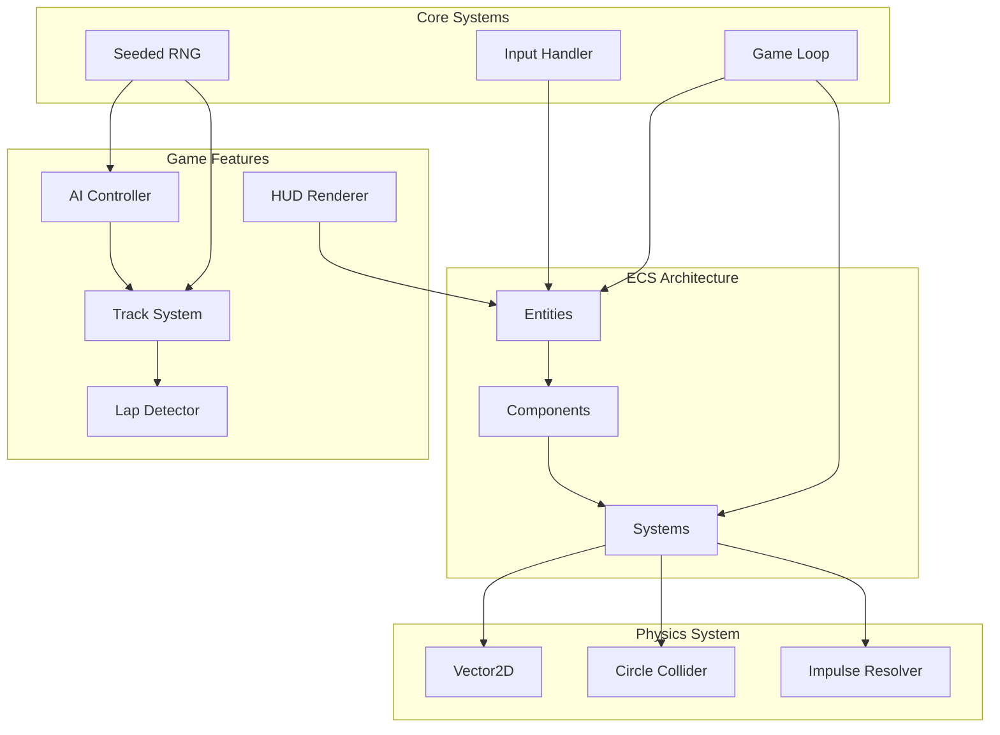

# Top-Down 2D Racing Game - Architecture Document

## 1. System Architecture Overview

### 1.1 High-Level Architecture

This document describes the architecture for a top-down 2D arcade racing game prototype built in JavaScript. The game features a player-controlled car, 3 AI opponents, waypoint-based track navigation, lap detection, collision physics, and a HUD overlay.

### 1.2 Component Diagram



### 1.3 Architecture Principles

- **Fixed Timestep Game Loop**: Ensures deterministic physics simulation at 60 FPS (16.67ms per frame)
- **Entity-Component-System (ECS)**: Modular architecture for extensibility
- **Deterministic RNG**: Mulberry32 algorithm for reproducible gameplay
- **No External Dependencies**: All physics and game logic implemented from scratch

---

## 2. Game Loop with Fixed Timestep

### 2.1 Design Overview

The game loop uses a fixed timestep approach to ensure consistent physics simulation regardless of frame rate variations. This is critical for deterministic behavior and reproducible gameplay.

### 2.2 Timing Constants

```javascript
const FIXED_TIMESTEP = 16.67; // 60 FPS = 16.67ms per frame
const MAX_CATCHUP = 5; // Maximum frames to catch up (prevents spiral of death)
```

### 2.3 Game Loop Algorithm

```
1. Record initial time
2. Loop while game is running:
   a. Calculate elapsed time since last frame
   b. Accumulate elapsed time into a timer
   c. While timer >= FIXED_TIMESTEP:
      - Update physics and game logic at fixed timestep
      - Subtract FIXED_TIMESTEP from timer
      - Increment frame counter
      - If frame counter > MAX_CATCHUP, break (prevent spiral of death)
   d. Calculate interpolation alpha (timer / FIXED_TIMESTEP)
   e. Render with interpolation for smooth visuals
   f. Record current time as last time
```

### 2.4 Class Structure

```javascript
class GameLoop {
    constructor(game) {
        this.game = game;
        this.lastTime = 0;
        this.accumulator = 0;
        this.fixedTimestep = FIXED_TIMESTEP;
        this.isRunning = false;
    }

    start() {
        this.lastTime = performance.now();
        this.isRunning = true;
        this.loop();
    }

    loop() {
        if (!this.isRunning) return;

        const currentTime = performance.now();
        const deltaTime = currentTime - this.lastTime;
        this.lastTime = currentTime;

        // Accumulate time
        this.accumulator += deltaTime;

        // Fixed timestep updates (physics, game logic)
        let catchupCount = 0;
        while (this.accumulator >= this.fixedTimestep && catchupCount < MAX_CATCHUP) {
            this.game.update(this.fixedTimestep);
            this.accumulator -= this.fixedTimestep;
            catchupCount++;
        }

        // Interpolation for rendering
        const interpolationAlpha = this.accumulator / this.fixedTimestep;
        this.game.render(interpolationAlpha);

        requestAnimationFrame(() => this.loop());
    }

    stop() {
        this.isRunning = false;
    }
}
```

---

## 3. Entity-Component-System Architecture

### 3.1 Architecture Overview

The ECS pattern separates data (components) from behavior (systems), with entities serving as identifiers that aggregate components. This provides modularity and makes it easy to add new features.

### 3.2 Entity System

```javascript
class Entity {
    constructor(id) {
        this.id = id;
        this.components = new Map();
        this.isActive = true;
    }

    addComponent(component) {
        this.components.set(component.type, component);
    }

    getComponent(type) {
        return this.components.get(type);
    }

    hasComponent(type) {
        return this.components.has(type);
    }

    removeComponent(type) {
        this.components.delete(type);
    }

    destroy() {
        this.isActive = false;
    }
}

class EntityManager {
    constructor() {
        this.entities = new Map();
        this.nextId = 0;
        this.entityPool = [];
    }

    create() {
        let entity;
        if (this.entityPool.length > 0) {
            entity = this.entityPool.pop();
            entity.isActive = true;
            entity.components.clear();
        } else {
            entity = new Entity(this.nextId++);
        }
        this.entities.set(entity.id, entity);
        return entity;
    }

    get(id) {
        return this.entities.get(id);
    }

    destroy(entity) {
        entity.destroy();
        this.entityPool.push(entity);
    }

    getActiveEntities() {
        return Array.from(this.entities.values()).filter(e => e.isActive);
    }

    getEntitiesWithComponent(type) {
        return this.getActiveEntities().filter(e => e.hasComponent(type));
    }
}
```

### 3.3 Component Definitions

Components are plain data objects with no behavior:

```javascript
// Transform Component - Position, rotation, and scale
class TransformComponent {
    constructor(x = 0, y = 0, rotation = 0, scale = 1) {
        this.type = 'Transform';
        this.position = new Vector2(x, y);
        this.rotation = rotation; // Radians
        this.scale = scale;
        
        // For interpolation
        this.previousPosition = new Vector2(x, y);
        this.previousRotation = rotation;
    }
}

// Velocity Component - Linear and angular velocity
class VelocityComponent {
    constructor(velocity = null, angularVelocity = 0) {
        this.type = 'Velocity';
        this.velocity = velocity || new Vector2(0, 0);
        this.angularVelocity = angularVelocity;
    }
}

// Collider Component - Circle collider for physics
class ColliderComponent {
    constructor(radius = 1, layers = 1) {
        this.type = 'Collider';
        this.radius = radius;
        this.layers = layers; // Bitmask for collision layers
        this.isTrigger = false;
    }
}

// Rigidbody Component - Physics properties
class RigidbodyComponent {
    constructor(mass = 1, friction = 0.01, maxSpeed = 10) {
        this.type = 'Rigidbody';
        this.mass = mass;
        this.friction = friction;
        this.maxSpeed = maxSpeed;
        this.isKinematic = false;
    }
}

// Car Component - Car-specific properties
class CarComponent {
    constructor(
        acceleration = 0.5,
        brakingForce = 0.8,
        turnSpeed = 0.05,
        maxSpeed = 15
    ) {
        this.type = 'Car';
        this.acceleration = acceleration;
        this.brakingForce = brakingForce;
        this.turnSpeed = turnSpeed;
        this.maxSpeed = maxSpeed;
        this.currentSpeed = 0;
    }
}

// Player Component - Marks entity as player-controlled
class PlayerComponent {
    constructor(playerId = 0) {
        this.type = 'Player';
        this.playerId = playerId;
        this.position = 0; // Race position (1st, 2nd, etc.)
        this.currentLap = 0;
        this.bestLapTime = Infinity;
        this.totalTime = 0;
        this.hasFinished = false;
    }
}

// AI Component - Marks entity as AI-controlled
class AIComponent {
    constructor(waypointIndex = 0, difficulty = 'medium') {
        this.type = 'AI';
        this.waypointIndex = 0;
        this.difficulty = difficulty; // 'easy', 'medium', 'hard'
        this.currentLap = 0;
        this.targetSpeed = 12;
        this.reactionTime = 0;
    }
}

// Renderer Component - Visual representation
class RendererComponent {
    constructor(color = '#ff0000', sprite = null) {
        this.type = 'Renderer';
        this.color = color;
        this.sprite = sprite;
        this.drawOrder = 0;
    }
}

// Checkpoint Component - For lap detection
class CheckpointComponent {
    constructor(checkpointId = 0) {
        this.type = 'Checkpoint';
        this.checkpointId = checkpointId;
    }
}
```

### 3.4 System Definitions

Systems contain the behavior and operate on entities with specific components:

```javascript
// Base System Class
class System {
    constructor() {
        this.requiredComponents = [];
    }

    update(deltaTime, entities) {
        // Override in subclass
    }

    getMatchingEntities(entityManager) {
        return entityManager.getActiveEntities().filter(entity => {
            return this.requiredComponents.every(type => 
                entity.hasComponent(type)
            );
        });
    }
}

// Physics System - Handles collision detection and resolution
class PhysicsSystem extends System {
    constructor() {
        super();
        this.requiredComponents = ['Transform', 'Collider', 'Rigidbody'];
    }

    update(deltaTime, entityManager) {
        const entities = this.getMatchingEntities(entityManager);
        
        // Update positions based on velocity
        for (const entity of entities) {
            const transform = entity.getComponent('Transform');
            const velocity = entity.getComponent('Velocity');
            const rigidbody = entity.getComponent('Rigidbody');
            
            if (rigidbody.isKinematic) continue;

            // Store previous position for interpolation
            transform.previousPosition.copy(transform.position);
            transform.previousRotation = transform.rotation;

            // Apply velocity
            transform.position.add(velocity.velocity.scale(deltaTime / 1000));
            transform.rotation += velocity.angularVelocity * (deltaTime / 1000);

            // Apply friction
            velocity.velocity.scale(1 - rigidbody.friction);

            // Clamp to max speed
            if (velocity.velocity.length() > rigidbody.maxSpeed) {
                velocity.velocity.normalize();
                velocity.velocity.scale(rigidbody.maxSpeed);
            }
        }

        // Detect and resolve collisions
        this.resolveCollisions(entities);
    }

    resolveCollisions(entities) {
        for (let i = 0; i < entities.length; i++) {
            for (let j = i + 1; j < entities.length; j++) {
                const entityA = entities[i];
                const entityB = entities[j];
                
                const colliderA = entityA.getComponent('Collider');
                const colliderB = entityB.getComponent('Collider');
                const transformA = entityA.getComponent('Transform');
                const transformB = entityB.getComponent('Transform');

                // Check collision layer masks
                if ((colliderA.layers & colliderB.layers) === 0) continue;

                // Circle-circle collision detection
                const collision = this.checkCircleCollision(
                    transformA.position, colliderA.radius,
                    transformB.position, colliderB.radius
                );

                if (collision) {
                    this.resolveCollision(entityA, entityB, collision);
                }
            }
        }
    }

    checkCircleCollision(posA, radiusA, posB, radiusB) {
        const distance = posA.distanceTo(posB);
        const minDistance = radiusA + radiusB;

        if (distance < minDistance && distance > 0) {
            const normal = posB.subtract(posA).normalize();
            const penetration = minDistance - distance;
            return { normal, penetration, distance };
        }
        return null;
    }

    resolveCollision(entityA, entityB, collision) {
        const rigidbodyA = entityA.getComponent('Rigidbody');
        const rigidbodyB = entityB.getComponent('Rigidbody');
        const velocityA = entityA.getComponent('Velocity');
        const velocityB = entityB.getComponent('Velocity');
        const transformA = entityA.getComponent('Transform');
        const transformB = entityB.getComponent('Transform');

        // Skip if both are kinematic
        if (rigidbodyA.isKinematic && rigidbodyB.isKinematic) return;

        // Separate circles to resolve penetration
        const totalMass = rigidbodyA.mass + rigidbodyB.mass;
        const separationA = collision.penetration * (rigidbodyB.mass / totalMass);
        const separationB = collision.penetration * (rigidbodyA.mass / totalMass);

        if (!rigidbodyA.isKinematic) {
            transformA.position.add(collision.normal.scale(separationA));
        }
        if (!rigidbodyB.isKinematic) {
            transformB.position.subtract(collision.normal.scale(separationB));
        }

        // Impulse-based collision response
        const relativeVelocity = velocityA.velocity.subtract(velocityB.velocity);
        const velocityAlongNormal = relativeVelocity.dot(collision.normal);

        // Don't resolve if velocities are separating
        if (velocityAlongNormal > 0) return;

        // Calculate impulse scalar
        let impulseScalar = -(1 + 0.5) * velocityAlongNormal; // 0.5 = restitution
        impulseScalar /= (1 / rigidbodyA.mass + 1 / rigidbodyB.mass);

        // Apply impulse
        const impulse = collision.normal.scale(impulseScalar);
        
        if (!rigidbodyA.isKinematic) {
            velocityA.velocity.add(impulse.scale(1 / rigidbodyA.mass));
        }
        if (!rigidbodyB.isKinematic) {
            velocityB.velocity.subtract(impulse.scale(1 / rigidbodyB.mass));
        }
    }
}

// Car Control System - Handles car movement
class CarControlSystem extends System {
    constructor() {
        super();
        this.requiredComponents = ['Transform', 'Velocity', 'Car'];
    }

    update(deltaTime, entityManager, input) {
        const entities = this.getMatchingEntities(entityManager);

        for (const entity of entities) {
            const transform = entity.getComponent('Transform');
            const velocity = entity.getComponent('Velocity');
            const car = entity.getComponent('Car');
            const player = entity.getComponent('Player');
            const ai = entity.getComponent('AI');

            if (player) {
                // Player control
                this.handlePlayerInput(car, velocity, transform, input);
            } else if (ai) {
                // AI control (handled by AISystem)
            }

            // Apply car physics
            this.applyCarPhysics(car, velocity, transform, deltaTime);
        }
    }

    handlePlayerInput(car, velocity, transform, input) {
        // Acceleration
        if (input.keys['ArrowUp'] || input.keys['w']) {
            car.currentSpeed += car.acceleration;
        }
        if (input.keys['ArrowDown'] || input.keys['s']) {
            car.currentSpeed -= car.brakingForce;
        }

        // Steering (only when moving)
        if (Math.abs(car.currentSpeed) > 0.1) {
            const turnDirection = car.currentSpeed > 0 ? 1 : -1;
            if (input.keys['ArrowLeft'] || input.keys['a']) {
                transform.rotation -= car.turnSpeed * turnDirection;
            }
            if (input.keys['ArrowRight'] || input.keys['d']) {
                transform.rotation += car.turnSpeed * turnDirection;
            }
        }

        // Clamp speed
        car.currentSpeed = Math.max(-car.maxSpeed / 2, Math.min(car.maxSpeed, car.currentSpeed));
    }

    applyCarPhysics(car, velocity, transform, deltaTime) {
        // Convert car speed to velocity vector based on rotation
        const forward = new Vector2(Math.cos(transform.rotation), Math.sin(transform.rotation));
        velocity.velocity.copy(forward.scale(car.currentSpeed));
    }
}

// AI System - Controls AI cars
class AISystem extends System {
    constructor(track) {
        super();
        this.requiredComponents = ['Transform', 'Velocity', 'AI', 'Car'];
        this.track = track;
    }

    update(deltaTime, entityManager) {
        const entities = this.getMatchingEntities(entityManager);

        for (const entity of entities) {
            const ai = entity.getComponent('AI');
            const car = entity.getComponent('Car');
            const transform = entity.getComponent('Transform');
            
            this.updateAI(entity, deltaTime);
        }
    }

    updateAI(entity, deltaTime) {
        const ai = entity.getComponent('AI');
        const car = entity.getComponent('Car');
        const transform = entity.getComponent('Transform');
        
        // Get current target waypoint
        const waypoint = this.track.getWaypoint(ai.waypointIndex);
        const nextWaypoint = this.track.getNextWaypoint(ai.waypointIndex);
        
        // Calculate direction to waypoint
        const direction = waypoint.position.subtract(transform.position);
        const distance = direction.length();
        direction.normalize();
        
        // Calculate target rotation
        const targetRotation = Math.atan2(direction.y, direction.x);
        
        // Smooth rotation towards target
        const angleDiff = this.normalizeAngle(targetRotation - transform.rotation);
        transform.rotation += angleDiff * 0.1;
        
        // Accelerate towards waypoint
        if (distance > 50) {
            car.currentSpeed += car.acceleration * 0.5;
        } else {
            // Slow down approaching waypoint
            car.currentSpeed *= 0.98;
        }
        
        // Check if reached waypoint
        if (distance < 30) {
            ai.waypointIndex = this.track.getNextWaypointIndex(ai.waypointIndex);
        }
        
        // Collision avoidance with other cars
        this.avoidCollisions(entity);
    }

    avoidCollisions(entity) {
        // Look ahead and steer away from nearby cars
        // Implementation details in section 6
    }

    normalizeAngle(angle) {
        while (angle > Math.PI) angle -= Math.PI * 2;
        while (angle < -Math.PI) angle += Math.PI * 2;
        return angle;
    }
}

// Lap Detection System
class LapDetectionSystem extends System {
    constructor(track) {
        super();
        this.requiredComponents = ['Transform', 'Player'];
        this.track = track;
    }

    update(deltaTime, entityManager) {
        const entities = this.getMatchingEntities(entityManager);
        
        for (const entity of entities) {
            const transform = entity.getComponent('Transform');
            const player = entity.getComponent('Player');
            
            // Check if passed checkpoint
            const checkpoint = this.track.getNearestCheckpoint(transform.position);
            
            if (checkpoint && !player.lastCheckpoint) {
                player.lastCheckpoint = checkpoint.id;
            } else if (checkpoint && checkpoint.id !== player.lastCheckpoint) {
                // Checkpoint progression detected
                if (checkpoint.id === 0 && player.lastCheckpoint === this.track.checkpoints.length - 1) {
                    // Completed lap
                    this.completeLap(entity, deltaTime);
                }
                player.lastCheckpoint = checkpoint.id;
            }
        }
    }

    completeLap(entity, deltaTime) {
        const player = entity.getComponent('Player');
        const lapTime = deltaTime; // Should track actual lap time
        
        player.currentLap++;
        
        if (lapTime < player.bestLapTime) {
            player.bestLapTime = lapTime;
        }
        
        player.totalTime += lapTime;
        player.lastCheckpoint = null;
    }
}

// Render System
class RenderSystem extends System {
    constructor(canvas) {
        super();
        this.requiredComponents = ['Transform', 'Renderer'];
        this.canvas = canvas;
        this.ctx = canvas.getContext('2d');
    }

    render(interpolationAlpha, entityManager) {
        const entities = this.getMatchingEntities(entityManager);
        
        // Sort by draw order
        entities.sort((a, b) => {
            const rendererA = a.getComponent('Renderer');
            const rendererB = b.getComponent('Renderer');
            return rendererA.drawOrder - rendererB.drawOrder;
        });

        for (const entity of entities) {
            const transform = entity.getComponent('Transform');
            const renderer = entity.getComponent('Renderer');
            
            this.renderEntity(transform, renderer, interpolationAlpha);
        }
    }

    renderEntity(transform, renderer, interpolationAlpha) {
        // Interpolate position for smooth rendering
        const interpolatedPosition = Vector2.lerp(
            transform.previousPosition,
            transform.position,
            interpolationAlpha
        );
        
        const interpolatedRotation = transform.previousRotation + 
            (transform.rotation - transform.previousRotation) * interpolationAlpha;

        this.ctx.save();
        this.ctx.translate(interpolatedPosition.x, interpolatedPosition.y);
        this.ctx.rotate(interpolatedRotation);
        
        // Draw car sprite or simple shape
        if (renderer.sprite) {
            renderer.sprite.draw(this.ctx);
        } else {
            this.drawCarShape(renderer.color);
        }
        
        this.ctx.restore();
    }

    drawCarShape(color) {
        // Simple car shape
        this.ctx.fillStyle = color;
        this.ctx.fillRect(-15, -10, 30, 20);
    }
}
```

---

## 4. Physics System Design

### 4.1 Vector2D Class

```javascript
class Vector2 {
    constructor(x = 0, y = 0) {
        this.x = x;
        this.y = y;
    }

    copy(vector) {
        this.x = vector.x;
        this.y = vector.y;
        return this;
    }

    add(vector) {
        this.x += vector.x;
        this.y += vector.y;
        return this;
    }

    subtract(vector) {
        this.x -= vector.x;
        this.y -= vector.y;
        return this;
    }

    multiply(scalar) {
        this.x *= scalar;
        this.y *= scalar;
        return this;
    }

    divide(scalar) {
        if (scalar !== 0) {
            this.x /= scalar;
            this.y /= scalar;
        }
        return this;
    }

    scale(scalar) {
        return new Vector2(this.x * scalar, this.y * scalar);
    }

    dot(vector) {
        return this.x * vector.x + this.y * vector.y;
    }

    cross(vector) {
        return this.x * vector.y - this.y * vector.x;
    }

    length() {
        return Math.sqrt(this.x * this.x + this.y * this.y);
    }

    lengthSquared() {
        return this.x * this.x + this.y * this.y;
    }

    normalize() {
        const len = this.length();
        if (len > 0) {
            this.divide(len);
        }
        return this;
    }

    normalized() {
        const len = this.length();
        if (len > 0) {
            return new Vector2(this.x / len, this.y / len);
        }
        return new Vector2(0, 0);
    }

    distanceTo(vector) {
        const dx = vector.x - this.x;
        const dy = vector.y - this.y;
        return Math.sqrt(dx * dx + dy * dy);
    }

    static lerp(a, b, t) {
        return new Vector2(
            a.x + (b.x - a.x) * t,
            a.y + (b.y - a.y) * t
        );
    }

    static zero() {
        return new Vector2(0, 0);
    }

    clone() {
        return new Vector2(this.x, this.y);
    }
}
```

### 4.2 Circle Collision Detection

```javascript
class CircleCollider {
    constructor(center, radius) {
        this.center = center;
        this.radius = radius;
    }

    // Check collision with another circle
    collidesWith(other) {
        const distance = this.center.distanceTo(other.center);
        return distance < this.radius + other.radius;
    }

    // Get collision information
    getCollisionInfo(other) {
        const distance = this.center.distanceTo(other.center);
        const minDistance = this.radius + other.radius;

        if (distance >= minDistance || distance === 0) {
            return null;
        }

        const normal = other.center.subtract(this.center).normalize();
        const penetration = minDistance - distance;

        return {
            normal: normal,
            penetration: penetration,
            contactPoint: this.center.add(normal.scale(this.radius))
        };
    }
}
```

### 4.3 Impulse-Based Collision Resolution

```javascript
class ImpulseResolver {
    constructor() {
        this.restitution = 0.5; // Bounciness (0 = no bounce, 1 = perfect bounce)
        this.friction = 0.3;
    }

    resolve(entityA, entityB, collisionInfo) {
        const rigidbodyA = entityA.getComponent('Rigidbody');
        const rigidbodyB = entityB.getComponent('Rigidbody');
        const velocityA = entityA.getComponent('Velocity');
        const velocityB = entityB.getComponent('Velocity');

        // Relative velocity
        const relativeVelocity = velocityA.velocity.subtract(velocityB.velocity);
        
        // Velocity along normal
        const velocityAlongNormal = relativeVelocity.dot(collisionInfo.normal);

        // Do not resolve if velocities are separating
        if (velocityAlongNormal > 0) {
            return;
        }

        // Calculate impulse scalar
        let impulseScalar = -(1 + this.restitution) * velocityAlongNormal;
        impulseScalar /= (1 / rigidbodyA.mass + 1 / rigidbodyB.mass);

        // Calculate friction impulse
        const tangent = relativeVelocity.subtract(
            collisionInfo.normal.scale(velocityAlongNormal)
        ).normalize();
        
        let frictionImpulse = -relativeVelocity.dot(tangent);
        frictionImpulse /= (1 / rigidbodyA.mass + 1 / rigidbodyB.mass);
        
        // Clamp friction impulse (Coulomb friction)
        const normalImpulse = impulseScalar;
        const maxFriction = normalImpulse * this.friction;
        frictionImpulse = Math.max(-maxFriction, Math.min(maxFriction, frictionImpulse));

        // Apply impulses
        const normalImpulseVector = collisionInfo.normal.scale(impulseScalar);
        const frictionImpulseVector = tangent.scale(frictionImpulse);
        const totalImpulse = normalImpulseVector.add(frictionImpulseVector);

        if (!rigidbodyA.isKinematic) {
            velocityA.velocity.add(totalImpulse.scale(1 / rigidbodyA.mass));
        }
        if (!rigidbodyB.isKinematic) {
            velocityB.velocity.subtract(totalImpulse.scale(1 / rigidbodyB.mass));
        }
    }
}
```

---

## 5. Track and Waypoint System Design

### 5.1 Track System

```javascript
class Track {
    constructor(waypoints, checkpoints) {
        this.waypoints = waypoints; // Array of {x, y} positions
        this.checkpoints = checkpoints; // Array of checkpoint objects
        this.startLine = null;
    }

    static fromDefinition(trackDefinition) {
        const waypoints = trackDefinition.waypoints.map(wp => 
            new Vector2(wp.x, wp.y)
        );
        const checkpoints = trackDefinition.checkpoints.map(cp => ({
            id: cp.id,
            position: new Vector2(cp.x, cp.y),
            triggerRadius: cp.radius || 50
        }));
        
        return new Track(waypoints, checkpoints);
    }

    getWaypoint(index) {
        return this.waypoints[index % this.waypoints.length];
    }

    getNextWaypointIndex(currentIndex) {
        return (currentIndex + 1) % this.waypoints.length;
    }

    getNextWaypoint(currentIndex) {
        return this.getWaypoint(this.getNextWaypointIndex(currentIndex));
    }

    getPreviousWaypointIndex(currentIndex) {
        return (currentIndex - 1 + this.waypoints.length) % this.waypoints.length;
    }

    getNearestCheckpoint(position) {
        let nearest = null;
        let nearestDistance = Infinity;

        for (const checkpoint of this.checkpoints) {
            const distance = position.distanceTo(checkpoint.position);
            if (distance < nearestDistance) {
                nearestDistance = distance;
                nearest = checkpoint;
            }
        }

        return nearest;
    }

    isWithinCheckpoint(position, checkpointId) {
        const checkpoint = this.checkpoints.find(cp => cp.id === checkpointId);
        if (!checkpoint) return false;
        
        return position.distanceTo(checkpoint.position) < checkpoint.triggerRadius;
    }

    // Render track for debugging/visuals
    render(ctx) {
        // Draw waypoints
        ctx.strokeStyle = '#00ff00';
        ctx.lineWidth = 2;
        ctx.setLineDash([5, 5]);
        
        ctx.beginPath();
        for (let i = 0; i < this.waypoints.length; i++) {
            const wp = this.waypoints[i];
            const nextWp = this.waypoints[(i + 1) % this.waypoints.length];
            
            if (i === 0) {
                ctx.moveTo(wp.x, wp.y);
            }
            ctx.lineTo(nextWp.x, nextWp.y);
        }
        ctx.closePath();
        ctx.stroke();
        ctx.setLineDash([]);

        // Draw checkpoints
        for (const checkpoint of this.checkpoints) {
            ctx.fillStyle = `hsla(${checkpoint.id * 60}, 100%, 50%, 0.3)`;
            ctx.beginPath();
            ctx.arc(checkpoint.position.x, checkpoint.position.y, checkpoint.triggerRadius, 0, Math.PI * 2);
            ctx.fill();
            
            ctx.fillStyle = '#ffffff';
            ctx.font = '12px Arial';
            ctx.textAlign = 'center';
            ctx.fillText(`CP ${checkpoint.id}`, checkpoint.position.x, checkpoint.position.y);
        }

        // Draw start line
        if (this.startLine) {
            ctx.strokeStyle = '#ffffff';
            ctx.lineWidth = 4;
            ctx.setLineDash([10, 5]);
            ctx.beginPath();
            ctx.moveTo(this.startLine.x, this.startLine.y - 20);
            ctx.lineTo(this.startLine.x, this.startLine.y + 20);
            ctx.stroke();
            ctx.setLineDash([]);
        }
    }
}
```

### 5.2 Waypoint Following System

```javascript
class WaypointNavigator {
    constructor(track) {
        this.track = track;
        this.currentWaypointIndex = 0;
        this.reachedWaypoints = 0;
    }

    update(position, deltaTime) {
        const targetWaypoint = this.track.getWaypoint(this.currentWaypointIndex);
        const distance = position.distanceTo(targetWaypoint);
        
        // Check if waypoint is reached
        if (distance < 30) {
            this.currentWaypointIndex = this.track.getNextWaypointIndex(this.currentWaypointIndex);
            this.reachedWaypoints++;
            
            // Check for lap completion
            if (this.reachedWaypoints >= this.track.waypoints.length) {
                this.reachedWaypoints = 0;
                return { lapCompleted: true };
            }
        }
        
        return { lapCompleted: false };
    }

    getTargetDirection(position) {
        const targetWaypoint = this.track.getWaypoint(this.currentWaypointIndex);
        return targetWaypoint.subtract(position).normalize();
    }

    getDistanceToTarget(position) {
        const targetWaypoint = this.track.getWaypoint(this.currentWaypointIndex);
        return position.distanceTo(targetWaypoint);
    }

    getCurrentWaypoint() {
        return this.track.getWaypoint(this.currentWaypointIndex);
    }
}
```

---

## 6. AI Waypoint Following Design

### 6.1 AI Controller

```javascript
class AIController {
    constructor(entity, track, difficulty = 'medium') {
        this.entity = entity;
        this.track = track;
        this.difficulty = difficulty;
        
        // Configure based on difficulty
        this.config = this.getDifficultyConfig(difficulty);
        
        this.navigator = new WaypointNavigator(track);
        this.steerAngle = 0;
        this.targetSpeed = this.config.maxSpeed;
    }

    getDifficultyConfig(difficulty) {
        const configs = {
            easy: {
                maxSpeed: 10,
                reactionTime: 0.1,
                steerSmoothness: 0.05,
                collisionAvoidanceRadius: 80,
                variability: 0.2
            },
            medium: {
                maxSpeed: 12,
                reactionTime: 0.08,
                steerSmoothness: 0.08,
                collisionAvoidanceRadius: 60,
                variability: 0.1
            },
            hard: {
                maxSpeed: 14,
                reactionTime: 0.05,
                steerSmoothness: 0.12,
                collisionAvoidanceRadius: 50,
                variability: 0.05
            }
        };
        return configs[difficulty] || configs.medium;
    }

    update(deltaTime, allEntities) {
        const transform = this.entity.getComponent('Transform');
        const car = this.entity.getComponent('Car');
        
        // Update waypoint navigation
        const navResult = this.navigator.update(transform.position, deltaTime);
        
        if (navResult.lapCompleted) {
            this.handleLapComplete();
        }
        
        // Calculate steering towards waypoint
        const targetDirection = this.navigator.getTargetDirection(transform.position);
        const targetRotation = Math.atan2(targetDirection.y, targetDirection.x);
        
        // Smooth steering
        const angleDiff = this.normalizeAngle(targetRotation - transform.rotation);
        this.steerAngle = angleDiff * this.config.steerSmoothness;
        
        // Add some variability for natural movement
        this.steerAngle += (Math.random() - 0.5) * this.config.variability;
        
        // Apply steering
        transform.rotation += this.steerAngle;
        
        // Speed control
        const distanceToTarget = this.navigator.getDistanceToTarget(transform.position);
        
        // Slow down for tight turns
        const nextWaypoint = this.track.getNextWaypoint(this.navigator.currentWaypointIndex);
        const turnSharpness = this.getTurnSharpness();
        const targetSpeed = this.config.maxSpeed * (1 - turnSharpness * 0.3);
        
        if (distanceToTarget > 100) {
            car.currentSpeed += car.acceleration;
        } else {
            car.currentSpeed *= 0.98; // Slow down approaching waypoint
        }
        
        // Clamp speed
        car.currentSpeed = Math.min(car.currentSpeed, targetSpeed);
        
        // Collision avoidance
        this.handleCollisionAvoidance(allEntities, transform, car);
    }

    getTurnSharpness() {
        const currentWp = this.navigator.getCurrentWaypoint();
        const nextWp = this.track.getNextWaypoint(this.navigator.currentWaypointIndex);
        const prevWp = this.track.getWaypoint(this.navigator.currentWaypointIndex - 1);
        
        const vec1 = currentWp.subtract(prevWp).normalize();
        const vec2 = nextWp.subtract(currentWp).normalize();
        
        const dot = vec1.dot(vec2);
        return 1 - Math.abs(dot); // 0 = straight, 1 = sharp turn
    }

    handleCollisionAvoidance(allEntities, transform, car) {
        const avoidanceRadius = this.config.collisionAvoidanceRadius;
        let avoidanceForce = new Vector2(0, 0);
        
        for (const otherEntity of allEntities) {
            if (otherEntity.id === this.entity.id) continue;
            
            const otherTransform = otherEntity.getComponent('Transform');
            if (!otherTransform) continue;
            
            const direction = otherTransform.position.subtract(transform.position);
            const distance = direction.length();
            
            if (distance < avoidanceRadius && distance > 0) {
                // Steer away from other car
                const avoidanceWeight = (avoidanceRadius - distance) / avoidanceRadius;
                avoidanceForce.add(direction.normalize().scale(avoidanceWeight));
            }
        }
        
        // Apply avoidance steering
        if (avoidanceForce.length() > 0) {
            avoidanceForce.normalize();
            const avoidanceAngle = Math.atan2(avoidanceForce.y, avoidanceForce.x);
            const currentAngle = transform.rotation;
            const angleDiff = this.normalizeAngle(avoidanceAngle - currentAngle);
            
            // Blend avoidance with normal steering
            this.steerAngle += angleDiff * 0.5;
        }
    }

    handleLapComplete() {
        const ai = this.entity.getComponent('AI');
        ai.currentLap++;
        console.log(`AI Car ${this.entity.id} completed lap ${ai.currentLap}`);
    }

    normalizeAngle(angle) {
        while (angle > Math.PI) angle -= Math.PI * 2;
        while (angle < -Math.PI) angle += Math.PI * 2;
        return angle;
    }
}
```

---

## 7. Lap Detection System Design

### 7.1 Lap Manager

```javascript
class LapManager {
    constructor(track) {
        this.track = track;
        this.racerStates = new Map();
    }

    initializeRacer(racerId) {
        this.racerStates.set(racerId, {
            currentLap: 0,
            checkpointsPassed: [],
            lastCheckpointId: null,
            lapTimes: [],
            bestLapTime: Infinity,
            totalTime: 0,
            lapStartTime: 0,
            hasStarted: false,
            hasFinished: false,
            position: 0
        });
    }

    getRacerState(racerId) {
        return this.racerStates.get(racerId);
    }

    checkCheckpoint(racerId, position) {
        const state = this.getRacerState(racerId);
        if (!state || state.hasFinished) return null;

        // Find nearest checkpoint
        const nearestCheckpoint = this.track.getNearestCheckpoint(position);
        
        if (!nearestCheckpoint) return null;

        // Check if within trigger radius
        if (position.distanceTo(nearestCheckpoint.position) > nearestCheckpoint.triggerRadius) {
            return null;
        }

        // Check checkpoint progression
        const expectedCheckpoint = this.getNextExpectedCheckpoint(state);
        
        if (nearestCheckpoint.id === expectedCheckpoint) {
            // Valid checkpoint progression
            state.checkpointsPassed.push(nearestCheckpoint.id);
            state.lastCheckpointId = nearestCheckpoint.id;

            // Check for lap completion
            if (state.lastCheckpointId === this.track.checkpoints.length - 1) {
                return this.completeLap(racerId);
            }

            return { type: 'checkpoint', checkpointId: nearestCheckpoint.id };
        }

        return null;
    }

    getNextExpectedCheckpoint(state) {
        if (!state.hasStarted) {
            return 0; // First checkpoint
        }
        
        if (state.lastCheckpointId === null) {
            return 0;
        }
        
        return (state.lastCheckpointId + 1) % this.track.checkpoints.length;
    }

    completeLap(racerId) {
        const state = this.getRacerState(racerId);
        const now = performance.now();
        const lapTime = now - state.lapStartTime;
        
        state.currentLap++;
        state.lapTimes.push(lapTime);
        state.totalTime += lapTime;
        
        if (lapTime < state.bestLapTime) {
            state.bestLapTime = lapTime;
        }
        
        // Reset for next lap
        state.checkpointsPassed = [];
        state.lastCheckpointId = null;
        state.lapStartTime = now;
        
        return {
            type: 'lap_complete',
            lapNumber: state.currentLap,
            lapTime: lapTime,
            bestLapTime: state.bestLapTime,
            totalTime: state.totalTime
        };
    }

    startRacer(racerId) {
        const state = this.getRacerState(racerId);
        if (state && !state.hasStarted) {
            state.hasStarted = true;
            state.lapStartTime = performance.now();
        }
    }

    finishRacer(racerId, numLaps) {
        const state = this.getRacerState(racerId);
        if (state && state.currentLap >= numLaps && !state.hasFinished) {
            state.hasFinished = true;
            return {
                type: 'race_complete',
                racerId: racerId,
                totalTime: state.totalTime,
                bestLapTime: state.bestLapTime,
                lapsCompleted: state.currentLap
            };
        }
        return null;
    }

    updatePositions() {
        // Calculate race positions based on laps and checkpoint progress
        const racers = Array.from(this.racerStates.entries());
        
        racers.sort((a, b) => {
            const stateA = a[1];
            const stateB = b[1];
            
            // First by laps completed
            if (stateA.currentLap !== stateB.currentLap) {
                return stateB.currentLap - stateA.currentLap;
            }
            
            // Then by checkpoints passed
            if (stateA.checkpointsPassed.length !== stateB.checkpointsPassed.length) {
                return stateB.checkpointsPassed.length - stateA.checkpointsPassed.length;
            }
            
            // Then by total time (lower is better)
            return stateA.totalTime - stateB.totalTime;
        });
        
        // Update positions
        racers.forEach((racer, index) => {
            racer[1].position = index + 1;
        });
    }

    getRaceLeaderboard() {
        return Array.from(this.racerStates.entries())
            .map(([id, state]) => ({
                racerId: id,
                position: state.position,
                currentLap: state.currentLap,
                bestLapTime: state.bestLapTime,
                totalTime: state.totalTime,
                hasFinished: state.hasFinished
            }))
            .sort((a, b) => a.position - b.position);
    }
}
```

---

## 8. HUD Rendering Approach

### 8.1 HUD System

```javascript
class HUD {
    constructor(canvas) {
        this.canvas = canvas;
        this.ctx = canvas.getContext('2d');
        this.fontSize = 16;
        this.fontFamily = 'Arial, sans-serif';
    }

    render(lapManager, currentRacerId, gameTime) {
        this.clear();
        
        // Render different HUD elements
        this.renderPosition(lapManager, currentRacerId);
        this.renderLapInfo(lapManager, currentRacerId);
        this.renderTimer(gameTime);
        this.renderLeaderboard(lapManager);
        this.renderSpeed(lapManager, currentRacerId);
    }

    clear() {
        // Semi-transparent background for HUD
        this.ctx.fillStyle = 'rgba(0, 0, 0, 0.5)';
        this.ctx.fillRect(0, 0, this.canvas.width, this.canvas.height);
    }

    renderPosition(lapManager, racerId) {
        const state = lapManager.getRacerState(racerId);
        if (!state) return;

        this.ctx.fillStyle = '#ffffff';
        this.ctx.font = `bold ${this.fontSize * 2}px ${this.fontFamily}`;
        this.ctx.textAlign = 'left';
        
        let positionText = `${state.position}th`;
        if (state.position === 1) positionText = '1st';
        if (state.position === 2) positionText = '2nd';
        if (state.position === 3) positionText = '3rd';
        
        this.ctx.fillText(`POSITION: ${positionText}`, 20, 40);
    }

    renderLapInfo(lapManager, racerId) {
        const state = lapManager.getRacerState(racerId);
        if (!state) return;

        this.ctx.fillStyle = '#ffffff';
        this.ctx.font = `${this.fontSize}px ${this.fontFamily}`;
        this.ctx.textAlign = 'left';
        
        this.ctx.fillText(`LAP: ${state.currentLap}`, 20, 70);
        
        if (state.bestLapTime < Infinity) {
            this.ctx.fillText(`BEST LAP: ${this.formatTime(state.bestLapTime)}`, 20, 95);
        }
    }

    renderTimer(gameTime) {
        this.ctx.fillStyle = '#ffffff';
        this.ctx.font = `bold ${this.fontSize}px ${this.fontFamily}`;
        this.ctx.textAlign = 'right';
        
        this.ctx.fillText(`TIME: ${this.formatTime(gameTime)}`, this.canvas.width - 20, 40);
    }

    renderLeaderboard(lapManager) {
        const leaderboard = lapManager.getRaceLeaderboard();
        
        this.ctx.fillStyle = '#ffffff';
        this.ctx.font = `bold ${this.fontSize}px ${this.fontFamily}`;
        this.ctx.textAlign = 'right';
        
        this.ctx.fillText('LEADERBOARD', this.canvas.width - 20, this.canvas.height - 100);
        
        this.ctx.font = `${this.fontSize - 2}px ${this.fontFamily}`;
        leaderboard.slice(0, 5).forEach((racer, index) => {
            const y = this.canvas.height - 70 - index * 25;
            const positionText = `${racer.position}. `;
            const timeText = this.formatTime(racer.totalTime);
            const finishedText = racer.hasFinished ? ' [FINISHED]' : '';
            
            this.ctx.fillText(`${positionText}${timeText}${finishedText}`, this.canvas.width - 20, y);
        });
    }

    renderSpeed(lapManager, racerId) {
        const state = lapManager.getRacerState(racerId);
        if (!state) return;

        // Get speed from entity (would need reference to entity manager)
        const speed = 0; // Placeholder
        
        this.ctx.fillStyle = '#00ff00';
        this.ctx.font = `bold ${this.fontSize * 1.5}px ${this.fontFamily}`;
        this.ctx.textAlign = 'left';
        
        this.ctx.fillText(`SPEED: ${Math.round(speed)} km/h`, 20, this.canvas.height - 50);
        
        // Speed bar
        const maxSpeed = 150;
        const barWidth = 150;
        const barHeight = 10;
        const speedPercent = Math.min(speed / maxSpeed, 1);
        
        this.ctx.fillStyle = '#333';
        this.ctx.fillRect(20, this.canvas.height - 35, barWidth, barHeight);
        
        this.ctx.fillStyle = speedPercent > 0.8 ? '#ff0000' : '#00ff00';
        this.ctx.fillRect(20, this.canvas.height - 35, barWidth * speedPercent, barHeight);
    }

    formatTime(ms) {
        const minutes = Math.floor(ms / 60000);
        const seconds = Math.floor((ms % 60000) / 1000);
        const centiseconds = Math.floor((ms % 1000) / 10);
        
        return `${minutes.toString().padStart(2, '0')}:${seconds.toString().padStart(2, '0')}.${centiseconds.toString().padStart(2, '0')}`;
    }

    resize(width, height) {
        this.canvas.width = width;
        this.canvas.height = height;
    }
}
```

---

## 9. Deterministic RNG (Mulberry32)

### 9.1 Seeded PRNG Implementation

```javascript
class SeededRandom {
    constructor(seed) {
        this.seed = seed;
        this.state = seed;
    }

    // Mulberry32 algorithm
    next() {
        let t = this.state += 0x6D2B79F5;
        t = Math.imul(t ^ t >>> 15, t | 1);
        t ^= t + Math.imul(t ^ t >>> 7, t | 61);
        return ((t ^ t >>> 14) >>> 0) / 4294967296;
    }

    // Reset to initial seed
    reset() {
        this.state = this.seed;
    }

    // Get random integer in range [min, max]
    nextInt(min, max) {
        return Math.floor(this.next() * (max - min + 1)) + min;
    }

    // Get random float in range [min, max]
    nextFloat(min, max) {
        return this.next() * (max - min) + min;
    }

    // Create a new RNG with a derived seed
    spawn() {
        return new SeededRandom(this.nextInt(0, 0xFFFFFFFF));
    }
}

// Example usage for deterministic AI behavior
class DeterministicAI {
    constructor(seed, entityId) {
        this.rng = new SeededRandom(seed * entityId);
        this.entityId = entityId;
    }

    getVariation() {
        return (this.rng.next() - 0.5) * 0.1;
    }

    makeDecision(options) {
        const index = this.rng.nextInt(0, options.length - 1);
        return options[index];
    }
}
```

---

## 10. Main Game Class

### 10.1 Game Orchestration

```javascript
class Game {
    constructor(canvas) {
        this.canvas = canvas;
        this.ctx = canvas.getContext('2d');
        
        // Core systems
        this.entityManager = new EntityManager();
        this.gameLoop = new GameLoop(this);
        this.input = new InputHandler();
        this.rng = new SeededRandom(12345); // Fixed seed for reproducibility
        
        // Game systems
        this.physicsSystem = new PhysicsSystem();
        this.carControlSystem = new CarControlSystem();
        this.aiSystem = null; // Initialized with track
        this.lapDetectionSystem = null; // Initialized with track
        this.renderSystem = new RenderSystem(canvas);
        
        // Game features
        this.track = null;
        this.lapManager = null;
        this.hud = new HUD(canvas);
        
        // Game state
        this.isRunning = false;
        this.gameTime = 0;
        this.numLaps = 3;
        
        // Initialize
        this.initialize();
    }

    initialize() {
        // Create track
        this.track = this.createSampleTrack();
        this.lapManager = new LapManager(this.track);
        
        // Initialize systems with track
        this.aiSystem = new AISystem(this.track);
        this.lapDetectionSystem = new LapDetectionSystem(this.track);
        
        // Create entities
        this.createPlayerCar();
        this.createAICars();
        
        // Initialize lap manager
        this.entityManager.getActiveEntities().forEach(entity => {
            const player = entity.getComponent('Player');
            const ai = entity.getComponent('AI');
            if (player || ai) {
                this.lapManager.initializeRacer(entity.id);
            }
        });
    }

    createSampleTrack() {
        // Create a sample oval track with waypoints
        const waypoints = [
            { x: 400, y: 100 },  // Start/Finish
            { x: 600, y: 100 },
            { x: 700, y: 200 },
            { x: 700, y: 400 },
            { x: 600, y: 500 },
            { x: 400, y: 500 },
            { x: 300, y: 400 },
            { x: 300, y: 200 },
            { x: 400, y: 100 }   // Back to start
        ];
        
        const checkpoints = [
            { id: 0, x: 500, y: 100, radius: 80 },
            { id: 1, x: 700, y: 300, radius: 80 },
            { id: 2, x: 500, y: 500, radius: 80 },
            { id: 3, x: 300, y: 300, radius: 80 }
        ];
        
        const track = Track.fromDefinition({ waypoints, checkpoints });
        track.startLine = new Vector2(400, 300);
        return track;
    }

    createPlayerCar() {
        const entity = this.entityManager.create();
        
        entity.addComponent(new TransformComponent(400, 300, 0));
        entity.addComponent(new VelocityComponent());
        entity.addComponent(new ColliderComponent(15, 1)); // Layer 1
        entity.addComponent(new RigidbodyComponent(1, 0.02, 15));
        entity.addComponent(new CarComponent(0.5, 0.8, 0.05, 15));
        entity.addComponent(new PlayerComponent(0));
        entity.addComponent(new RendererComponent('#ff0000'));
        
        return entity;
    }

    createAICars() {
        const aiConfigs = [
            { x: 380, y: 300, color: '#00ff00', difficulty: 'easy' },
            { x: 420, y: 300, color: '#0000ff', difficulty: 'medium' },
            { x: 400, y: 320, color: '#ffff00', difficulty: 'hard' }
        ];
        
        aiConfigs.forEach((config, index) => {
            const entity = this.entityManager.create();
            
            entity.addComponent(new TransformComponent(config.x, config.y, 0));
            entity.addComponent(new VelocityComponent());
            entity.addComponent(new ColliderComponent(15, 1));
            entity.addComponent(new RigidbodyComponent(1, 0.02, 15));
            entity.addComponent(new CarComponent(0.4, 0.7, 0.04, 14));
            entity.addComponent(new AIComponent(0, config.difficulty));
            entity.addComponent(new RendererComponent(config.color));
            
            // Create AI controller
            const aiController = new AIController(entity, this.track, config.difficulty);
            entity.aiController = aiController;
        });
    }

    update(deltaTime) {
        this.gameTime += deltaTime;
        
        // Update car control (player)
        this.carControlSystem.update(deltaTime, this.entityManager, this.input);
        
        // Update AI cars
        const aiEntities = this.entityManager.getEntitiesWithComponent('AI');
        const allEntities = this.entityManager.getActiveEntities();
        
        aiEntities.forEach(entity => {
            if (entity.aiController) {
                entity.aiController.update(deltaTime, allEntities);
            }
        });
        
        // Update physics
        this.physicsSystem.update(deltaTime, this.entityManager);
        
        // Update lap detection
        this.lapDetectionSystem.update(deltaTime, this.entityManager);
        
        // Check checkpoints for all racers
        this.entityManager.getActiveEntities().forEach(entity => {
            const transform = entity.getComponent('Transform');
            const player = entity.getComponent('Player');
            const ai = entity.getComponent('AI');
            
            if (player || ai) {
                const result = this.lapManager.checkCheckpoint(entity.id, transform.position);
                
                if (result) {
                    if (result.type === 'lap_complete') {
                        console.log(`Racer ${entity.id} completed lap ${result.lapNumber}`);
                    }
                }
                
                // Check for race completion
                const finishResult = this.lapManager.finishRacer(entity.id, this.numLaps);
                if (finishResult) {
                    console.log(`Racer ${entity.id} finished the race!`);
                }
            }
        });
        
        // Update positions
        this.lapManager.updatePositions();
    }

    render(interpolationAlpha) {
        // Clear canvas
        this.ctx.fillStyle = '#1a1a2e';
        this.ctx.fillRect(0, 0, this.canvas.width, this.canvas.height);
        
        // Render track
        this.track.render(this.ctx);
        
        // Render entities
        this.renderSystem.render(interpolationAlpha, this.entityManager);
        
        // Render HUD
        this.hud.render(this.lapManager, 0, this.gameTime);
    }

    start() {
        this.isRunning = true;
        this.gameLoop.start();
        
        // Start all racers
        this.entityManager.getActiveEntities().forEach(entity => {
            const player = entity.getComponent('Player');
            const ai = entity.getComponent('AI');
            if (player || ai) {
                this.lapManager.startRacer(entity.id);
            }
        });
    }

    stop() {
        this.isRunning = false;
        this.gameLoop.stop();
    }
}
```

---

## 11. Input Handler

### 11.1 Keyboard Input

```javascript
class InputHandler {
    constructor() {
        this.keys = {};
        this.setupEventListeners();
    }

    setupEventListeners() {
        window.addEventListener('keydown', (e) => {
            this.keys[e.key] = true;
            this.keys[e.code] = true;
        });
        
        window.addEventListener('keyup', (e) => {
            this.keys[e.key] = false;
            this.keys[e.code] = false;
        });
    }

    isDown(key) {
        return !!this.keys[key];
    }

    clear() {
        this.keys = {};
    }
}
```

---

## 12. File Structure

```
src/
├── main.js              # Entry point, initializes game
├── game/
│   ├── Game.js          # Main game class
│   ├── GameLoop.js      # Fixed timestep game loop
│   └── InputHandler.js  # Input handling
├── ecs/
│   ├── Entity.js        # Entity class
│   ├── EntityManager.js # Entity management
│   ├── Component.js     # Base component
│   └── System.js        # Base system
├── components/
│   ├── TransformComponent.js
│   ├── VelocityComponent.js
│   ├── ColliderComponent.js
│   ├── RigidbodyComponent.js
│   ├── CarComponent.js
│   ├── PlayerComponent.js
│   ├── AIComponent.js
│   ├── RendererComponent.js
│   └── CheckpointComponent.js
├── systems/
│   ├── PhysicsSystem.js
│   ├── CarControlSystem.js
│   ├── AISystem.js
│   ├── LapDetectionSystem.js
│   └── RenderSystem.js
├── physics/
│   ├── Vector2.js       # 2D vector math
│   ├── CircleCollider.js
│   └── ImpulseResolver.js
├── track/
│   ├── Track.js         # Track definition
│   └── WaypointNavigator.js
├── ai/
│   └── AIController.js  # AI car controller
├── lap/
│   └── LapManager.js    # Lap detection and race management
├── ui/
│   └── HUD.js           # Heads-up display
├── utils/
│   └── SeededRandom.js  # Mulberry32 PRNG
└── assets/
    └── sprites/         # Car sprites (optional)
```

---

## 13. Implementation Order

1. **Core Infrastructure**
   - Vector2 class
   - SeededRandom class
   - Entity, Component, System base classes
   - EntityManager

2. **Game Loop**
   - Fixed timestep implementation
   - Integration with ECS

3. **Physics System**
   - Circle collision detection
   - Impulse-based resolution
   - PhysicsSystem implementation

4. **Track System**
   - Track class with waypoints
   - Checkpoint system
   - WaypointNavigator

5. **Car System**
   - CarComponent
   - CarControlSystem
   - Player input integration

6. **AI System**
   - AIController with waypoint following
   - Collision avoidance
   - Difficulty levels

7. **Lap Detection**
   - LapManager
   - Checkpoint progression
   - Race position tracking

8. **Rendering**
   - RenderSystem
   - Track rendering
   - Car rendering

9. **HUD**
   - HUD class
   - Position, lap, timer display
   - Leaderboard

10. **Integration**
    - Main Game class
    - All systems working together
    - Testing and tuning

---

## 14. Key Design Decisions

1. **Fixed Timestep**: Ensures deterministic physics and reproducible gameplay
2. **ECS Architecture**: Provides modularity and extensibility
3. **Circle Colliders**: Simple and efficient for top-down car collision
4. **Impulse Resolution**: Realistic collision response without external physics engine
5. **Waypoint Navigation**: Reliable AI pathfinding without complex pathfinding algorithms
6. **Checkpoint System**: Robust lap detection that handles overtaking and track shortcuts
7. **Seeded RNG**: Enables reproducible AI behavior for testing and debugging
8. **Interpolation**: Smooth rendering despite fixed timestep updates

---

## 15. Future Enhancements

- Particle effects for collisions and tire smoke
- Sound effects and music
- Multiple track designs
- Power-ups and special abilities
- Save/load functionality
- Online multiplayer support
- Car customization
- Camera follow and zoom effects