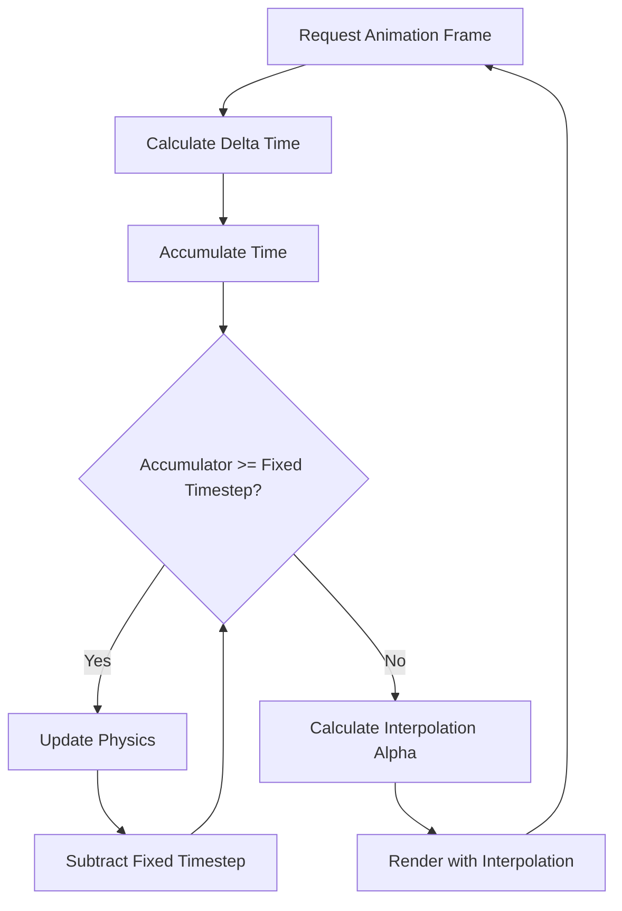
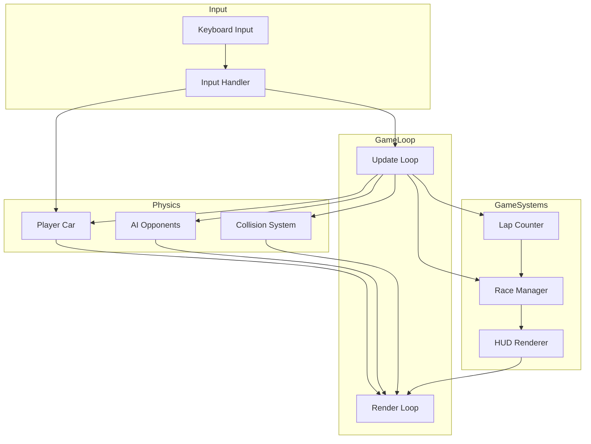
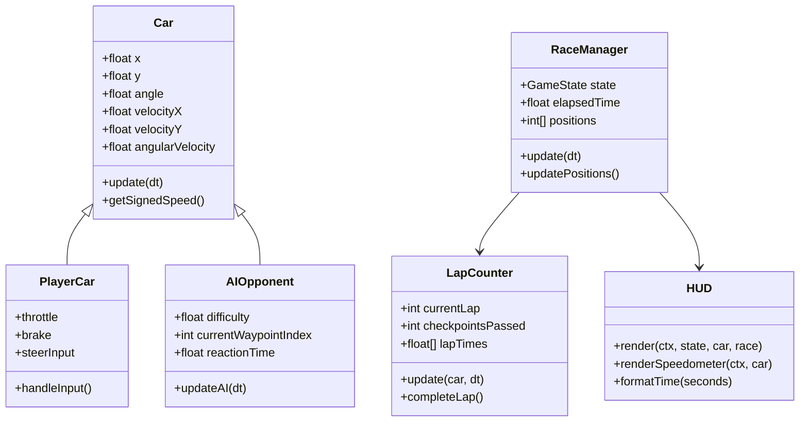

# Top-Down 2D Racing Game - Technical Architecture Specification

## Overview

This document specifies the technical architecture for a top-down 2D racing prototype featuring player-controlled and AI opponent vehicles, lap detection, collision physics, and a complete HUD system. The implementation will be contained in a single HTML file with embedded JavaScript and CSS.

---

## 1. Game Loop Architecture

### 1.1 Fixed Timestep Implementation

The game loop uses a fixed timestep for deterministic physics simulation, with interpolation for smooth rendering.

```javascript
// Constants
const FIXED_TIMESTEP = 1 / 60;  // 60 Hz physics update
const MAX_FRAME_TIME = 0.25;    // Prevent spiral of death

// Game Loop State
let lastTime = 0;
let accumulator = 0;
let deltaTime = 0;

// Main Game Loop
function gameLoop(currentTime) {
    currentTime = currentTime / 1000;  // Convert to seconds
    deltaTime = currentTime - lastTime;
    lastTime = currentTime;
    
    // Clamp delta time to prevent instability
    if (deltaTime > MAX_FRAME_TIME) {
        deltaTime = MAX_FRAME_TIME;
    }
    
    accumulator += deltaTime;
    
    // Fixed timestep physics updates
    while (accumulator >= FIXED_TIMESTEP) {
        update(FIXED_TIMESTEP);
        accumulator -= FIXED_TIMESTEP;
    }
    
    // Render with interpolation factor
    const alpha = accumulator / FIXED_TIMESTEP;
    render(alpha);
    
    requestAnimationFrame(gameLoop);
}
```

### 1.2 Update/Render Separation



### 1.3 Entity Update Order

```javascript
function update(dt) {
    // 1. Process input
    processInput();
    
    // 2. Update player car physics
    playerCar.update(dt);
    
    // 3. Update AI opponents
    aiOpponents.forEach(ai => ai.update(dt));
    
    // 4. Collision detection and resolution
    detectAndResolveCollisions();
    
    // 5. Update lap/checkpoint state
    updateLapDetection();
    
    // 6. Update game state (countdown, race status)
    updateGameState(dt);
    
    // 7. Update HUD
    updateHUD();
}

function render(alpha) {
    // Clear canvas
    ctx.clearRect(0, 0, canvas.width, canvas.height);
    
    // Render track
    renderTrack();
    
    // Render entities with interpolation
    renderCar(playerCar, alpha);
    aiOpponents.forEach(ai => renderCar(ai, alpha));
    
    // Render HUD
    renderHUD();
}
```

---

## 2. Physics System

### 2.1 Car Movement Model

#### 2.1.1 Car State Structure

```javascript
class Car {
    constructor(x, y, angle) {
        // Position
        this.x = x;
        this.y = y;
        
        // Orientation
        this.angle = angle;           // Radians, 0 = facing right
        this.angularVelocity = 0;
        
        // Velocity (world space)
        this.velocityX = 0;
        this.velocityY = 0;
        
        // Car dimensions
        this.width = 40;
        this.height = 20;
        this.collisionRadius = 25;    // For circle collision
        
        // Physics properties
        this.maxSpeed = 300;          // pixels/second
        this.maxReverseSpeed = -100;
        this.acceleration = 200;      // pixels/second²
        this.brakeForce = 400;
        this.friction = 50;           // Linear drag
        this.turnSpeed = 3.0;         // Radians/second at max speed
        this.minTurnSpeedMultiplier = 0.3;  // Turn slower when not moving
        
        // Input state
        this.throttle = 0;
        this.brake = 0;
        this.steerInput = 0;
    }
}
```

#### 2.1.2 Physics Update Formula

```javascript
update(dt) {
    // Store previous position for interpolation
    this.prevX = this.x;
    this.prevY = this.y;
    this.prevAngle = this.angle;
    
    // 1. Calculate speed from velocity vector
    const speed = Math.sqrt(this.velocityX ** 2 + this.velocityY ** 2);
    const currentSpeed = this.getSignedSpeed();
    
    // 2. Apply throttle/brake forces (in car's forward direction)
    const forwardX = Math.cos(this.angle);
    const forwardY = Math.sin(this.angle);
    
    if (this.throttle > 0) {
        // Acceleration
        this.velocityX += forwardX * this.acceleration * this.throttle * dt;
        this.velocityY += forwardY * this.acceleration * this.throttle * dt;
    }
    
    if (this.brake > 0) {
        // Braking (opposite to current direction)
        if (currentSpeed > 0) {
            this.velocityX -= forwardX * this.brakeForce * this.brake * dt;
            this.velocityY -= forwardY * this.brakeForce * this.brake * dt;
        } else {
            // Reverse acceleration when braking while stopped
            this.velocityX -= forwardX * this.acceleration * 0.5 * this.brake * dt;
            this.velocityY -= forwardY * this.acceleration * 0.5 * this.brake * dt;
        }
    }
    
    // 3. Apply friction (linear drag)
    this.velocityX -= this.velocityX * this.friction * dt;
    this.velocityY -= this.velocityY * this.friction * dt;
    
    // 4. Clamp speed to maximum
    const newSpeed = Math.sqrt(this.velocityX ** 2 + this.velocityY ** 2);
    if (newSpeed > this.maxSpeed) {
        const scale = this.maxSpeed / newSpeed;
        this.velocityX *= scale;
        this.velocityY *= scale;
    }
    if (newSpeed < this.maxReverseSpeed) {
        const scale = this.maxReverseSpeed / newSpeed;
        this.velocityX *= scale;
        this.velocityY *= scale;
    }
    
    // 5. Steering (only when moving)
    const speedFactor = Math.max(this.minTurnSpeedMultiplier, 
                                  Math.abs(currentSpeed) / this.maxSpeed);
    const turnAmount = this.steerInput * this.turnSpeed * speedFactor * dt;
    
    // Reverse steering when going backward for natural feel
    const directionMultiplier = currentSpeed >= 0 ? 1 : -1;
    this.angle += turnAmount * directionMultiplier;
    
    // 6. Update position
    this.x += this.velocityX * dt;
    this.y += this.velocityY * dt;
    
    // 7. Keep angle normalized
    this.angle = this.normalizeAngle(this.angle);
}

// Get signed speed (positive = forward, negative = reverse)
getSignedSpeed() {
    const forwardX = Math.cos(this.angle);
    const forwardY = Math.sin(this.angle);
    return this.velocityX * forwardX + this.velocityY * forwardY;
}

normalizeAngle(angle) {
    while (angle > Math.PI) angle -= 2 * Math.PI;
    while (angle < -Math.PI) angle += 2 * Math.PI;
    return angle;
}
```

### 2.2 Collision Detection

#### 2.2.1 Circle-Based Collision

For simplicity and performance, cars use circle collision detection.

```javascript
// Check collision between two cars
function checkCircleCollision(car1, car2) {
    const dx = car2.x - car1.x;
    const dy = car2.y - car1.y;
    const distance = Math.sqrt(dx * dx + dy * dy);
    const minDistance = car1.collisionRadius + car2.collisionRadius;
    
    return {
        colliding: distance < minDistance,
        distance: distance,
        minDistance: minDistance,
        overlap: minDistance - distance,
        normalX: distance > 0 ? dx / distance : 1,
        normalY: distance > 0 ? dy / distance : 0
    };
}
```

#### 2.2.2 Track Boundary Collision

```javascript
// Track boundary represented as line segments
function checkTrackBoundaryCollision(car, trackBoundaries) {
    for (const segment of trackBoundaries) {
        const closest = closestPointOnSegment(
            car.x, car.y,
            segment.x1, segment.y1,
            segment.x2, segment.y2
        );
        
        const dx = car.x - closest.x;
        const dy = car.y - closest.y;
        const distance = Math.sqrt(dx * dx + dy * dy);
        
        if (distance < car.collisionRadius) {
            return {
                colliding: true,
                overlap: car.collisionRadius - distance,
                normalX: dx / distance,
                normalY: dy / distance
            };
        }
    }
    return { colliding: false };
}

function closestPointOnSegment(px, py, x1, y1, x2, y2) {
    const dx = x2 - x1;
    const dy = y2 - y1;
    const t = Math.max(0, Math.min(1, 
        ((px - x1) * dx + (py - y1) * dy) / (dx * dx + dy * dy)
    ));
    return {
        x: x1 + t * dx,
        y: y1 + t * dy
    };
}
```

### 2.3 Impulse-Based Collision Resolution

```javascript
function resolveCollision(car1, car2, collisionInfo) {
    if (!collisionInfo.colliding) return;
    
    const { overlap, normalX, normalY } = collisionInfo;
    
    // 1. Positional correction (prevent sinking)
    const correctionPercent = 0.8;  // 80% correction
    const totalMass = car1.mass + car2.mass;
    const m1Ratio = car2.mass / totalMass;
    const m2Ratio = car1.mass / totalMass;
    
    car1.x -= normalX * overlap * m1Ratio * correctionPercent;
    car1.y -= normalY * overlap * m1Ratio * correctionPercent;
    car2.x += normalX * overlap * m2Ratio * correctionPercent;
    car2.y += normalY * overlap * m2Ratio * correctionPercent;
    
    // 2. Calculate relative velocity
    const relVelX = car2.velocityX - car1.velocityX;
    const relVelY = car2.velocityY - car1.velocityY;
    
    // 3. Relative velocity along collision normal
    const velAlongNormal = relVelX * normalX + relVelY * normalY;
    
    // 4. Do not resolve if velocities are separating
    if (velAlongNormal > 0) return;
    
    // 5. Calculate impulse scalar
    const restitution = 0.5;  // Bounciness (0 = inelastic, 1 = elastic)
    
    let impulseScalar = -(1 + restitution) * velAlongNormal;
    impulseScalar /= (1 / car1.mass + 1 / car2.mass);
    
    // 6. Apply impulse
    const impulseX = impulseScalar * normalX;
    const impulseY = impulseScalar * normalY;
    
    car1.velocityX -= impulseX / car1.mass;
    car1.velocityY -= impulseY / car1.mass;
    car2.velocityX += impulseX / car2.mass;
    car2.velocityY += impulseY / car2.mass;
    
    // 7. Apply angular impulse (simplified - causes spin on impact)
    const tangentX = -normalY;
    const tangentY = normalX;
    const tangentVel = relVelX * tangentX + relVelY * tangentY;
    
    car1.angularVelocity -= tangentVel * 0.01;
    car2.angularVelocity += tangentVel * 0.01;
}
```

---

## 3. Deterministic RNG

### 3.1 Seeded Random Number Generator

```javascript
class SeededRandom {
    constructor(seed) {
        this.seed = seed >>> 0;  // Ensure unsigned 32-bit
    }
    
    // Mulberry32 algorithm - fast, high-quality PRNG
    next() {
        let t = this.seed += 0x6D2B79F5;
        t = Math.imul(t ^ t >>> 15, t | 1);
        t ^= t + Math.imul(t ^ t >>> 7, t | 61);
        return ((t ^ t >>> 14) >>> 0) / 4294967296;
    }
    
    // Random float in range [min, max)
    range(min, max) {
        return min + this.next() * (max - min);
    }
    
    // Random integer in range [min, max]
    intRange(min, max) {
        return Math.floor(this.range(min, max + 1));
    }
    
    // Random boolean
    boolean() {
        return this.next() < 0.5;
    }
    
    // Reset to original seed
    reset() {
        this.seed = this.seed >>> 0;
    }
}

// Usage in game initialization
const GAME_SEED = 12345;  // Fixed seed for reproducibility
const rng = new SeededRandom(GAME_SEED);

// AI difficulty variation using deterministic RNG
const aiDifficulties = [
    rng.range(0.7, 0.85),   // Easy opponent
    rng.range(0.85, 0.95),  // Medium opponent  
    rng.range(0.95, 1.05),  // Hard opponent
];
```

---

## 4. AI System

### 4.1 Waypoint Structure

```javascript
// Track waypoints define the racing line
const trackWaypoints = [
    { x: 100, y: 100, radius: 80, speed: 200 },
    { x: 300, y: 100, radius: 80, speed: 250 },
    { x: 500, y: 200, radius: 100, speed: 180 },
    // ... more waypoints forming the track
];

class AIOpponent extends Car {
    constructor(x, y, angle, difficulty, waypointIndex) {
        super(x, y, angle);
        
        this.currentWaypointIndex = waypointIndex;
        this.difficulty = difficulty;  // 0.0 to 1.0
        
        // AI-specific properties
        this.reactionTime = 0.1 + (1 - difficulty) * 0.2;  // Faster reaction = harder
        this.steeringError = (1 - difficulty) * 0.3;       // More error = easier
        this.targetSpeedMultiplier = 0.8 + difficulty * 0.2;
        
        // State
        this.waypointReached = false;
        this.steerTimer = 0;
    }
}
```

### 4.2 Waypoint Following Steering Behavior

```javascript
updateAI(dt) {
    const currentWaypoint = trackWaypoints[this.currentWaypointIndex];
    
    // 1. Calculate direction to waypoint
    const dx = currentWaypoint.x - this.x;
    const dy = currentWaypoint.y - this.y;
    const distance = Math.sqrt(dx * dx + dy * dy);
    
    // 2. Check if waypoint reached
    if (distance < currentWaypoint.radius) {
        this.currentWaypointIndex = (this.currentWaypointIndex + 1) % trackWaypoints.length;
        return;
    }
    
    // 3. Calculate desired angle to waypoint
    const desiredAngle = Math.atan2(dy, dx);
    
    // 4. Calculate angle difference
    let angleDiff = this.normalizeAngle(desiredAngle - this.angle);
    
    // 5. Add steering error based on difficulty
    angleDiff += (Math.random() - 0.5) * this.steeringError;
    
    // 6. Determine steering input (-1 to 1)
    const steerStrength = Math.PI / 4;  // Dead zone
    if (angleDiff > steerStrength) {
        this.steerInput = Math.min(1, angleDiff / steerStrength);
    } else if (angleDiff < -steerStrength) {
        this.steerInput = Math.max(-1, angleDiff / steerStrength);
    } else {
        this.steerInput = 0;
    }
    
    // 7. Determine throttle/brake based on waypoint speed and distance
    const targetSpeed = currentWaypoint.speed * this.targetSpeedMultiplier;
    const currentSpeed = this.getSignedSpeed();
    
    if (currentSpeed < targetSpeed) {
        this.throttle = Math.min(1, (targetSpeed - currentSpeed) / 100);
        this.brake = 0;
    } else {
        this.throttle = 0;
        this.brake = Math.min(1, (currentSpeed - targetSpeed) / 100);
    }
    
    // 8. Look ahead for upcoming waypoints (advanced AI)
    if (this.difficulty > 0.7) {
        const nextWaypoint = trackWaypoints[
            (this.currentWaypointIndex + 1) % trackWaypoints.length
        ];
        const distToNext = Math.hypot(nextWaypoint.x - this.x, nextWaypoint.y - this.y);
        
        // Start turning early for sharp turns
        if (distToNext < 150) {
            this.throttle *= 0.7;  // Slow down approaching turn
        }
    }
}
```

### 4.3 Difficulty Variation

```javascript
// AI Difficulty Parameters
const AIDifficultyPresets = {
    easy: {
        reactionTime: 0.3,
        steeringError: 0.4,
        targetSpeedMultiplier: 0.75,
        brakingDistance: 1.5,
    },
    medium: {
        reactionTime: 0.15,
        steeringError: 0.15,
        targetSpeedMultiplier: 0.9,
        brakingDistance: 1.2,
    },
    hard: {
        reactionTime: 0.05,
        steeringError: 0.05,
        targetSpeedMultiplier: 1.0,
        brakingDistance: 1.0,
    }
};
```

---

## 5. Track System

### 5.1 Track Representation

```javascript
const track = {
    // Waypoints for AI navigation and lap detection
    waypoints: [
        { x: 100, y: 100, radius: 80 },
        { x: 400, y: 100, radius: 80 },
        { x: 600, y: 300, radius: 100 },
        { x: 400, y: 500, radius: 80 },
        { x: 100, y: 500, radius: 80 },
    ],
    
    // Track boundaries for collision
    innerBoundary: [
        { x: 150, y: 150 },
        { x: 350, y: 150 },
        { x: 550, y: 250 },
        // ... more points
    ],
    outerBoundary: [
        { x: 50, y: 50 },
        { x: 450, y: 50 },
        { x: 650, y: 350 },
        // ... more points
    ],
    
    // Start/finish line
    startLine: {
        x: 100,
        y: 80,
        width: 10,
        height: 60,
        normalX: 0,
        normalY: 1
    }
};
```

### 5.2 Lap Detection System

```javascript
class LapCounter {
    constructor(totalLaps = 3) {
        this.totalLaps = totalLaps;
        this.currentLap = 0;
        this.checkpointsPassed = 0;
        this.totalCheckpoints = Math.floor(track.waypoints.length / 2);
        this.finished = false;
        this.lapStartTime = 0;
        this.totalRaceTime = 0;
        this.lapTimes = [];
    }
    
    update(car, deltaTime) {
        if (this.finished) return;
        
        const currentWaypointIndex = car.currentWaypointIndex;
        const halfwayPoint = Math.floor(track.waypoints.length / 2);
        
        // Check checkpoint progress
        if (currentWaypointIndex === halfwayPoint && !this.checkpointReached) {
            this.checkpointsPassed++;
            this.checkpointReached = true;
        } else if (currentWaypointIndex === 0) {
            this.checkpointReached = false;
        }
        
        // Check start/finish line crossing
        if (this.crossedStartLine(car)) {
            // Valid lap only if all checkpoints passed
            if (this.checkpointsPassed >= this.totalCheckpoints) {
                this.completeLap(car, deltaTime);
            }
        }
    }
    
    crossedStartLine(car) {
        const startLine = track.startLine;
        
        // Check if car crossed the start line (moving in correct direction)
        const carAheadOfLine = (car.y - startLine.y) * startLine.normalY > 0;
        const carPrevBehindLine = (car.prevY - startLine.y) * startLine.normalY <= 0;
        
        return carAheadOfLine && carPrevBehindLine;
    }
    
    completeLap(car, deltaTime) {
        this.currentLap++;
        this.checkpointsPassed = 0;
        
        const lapTime = performance.now() - this.lapStartTime;
        this.lapTimes.push(lapTime);
        
        if (this.currentLap >= this.totalLaps) {
            this.finished = true;
            this.totalRaceTime = performance.now() - this.totalRaceTime;
            onRaceFinished(car);
        } else {
            this.lapStartTime = performance.now();
        }
    }
}
```

### 5.3 Checkpoint System

```javascript
// Alternative: Invisible checkpoint triggers
const checkpoints = [
    { id: 0, x: 100, y: 100, width: 100, height: 20, passed: false },
    { id: 1, x: 400, y: 200, width: 20, height: 100, passed: false },
    { id: 2, x: 100, y: 400, width: 100, height: 20, passed: false },
];

function checkCheckpoint(car, checkpoint) {
    // AABB collision check
    const carLeft = car.x - car.collisionRadius;
    const carRight = car.x + car.collisionRadius;
    const carTop = car.y - car.collisionRadius;
    const carBottom = car.y + car.collisionRadius;
    
    return carLeft < checkpoint.x + checkpoint.width &&
           carRight > checkpoint.x &&
           carTop < checkpoint.y + checkpoint.height &&
           carBottom > checkpoint.y;
}
```

---

## 6. Game State Management

### 6.1 Race State Machine

```javascript
const GameState = {
    WAITING: 'waiting',
    COUNTDOWN: 'countdown',
    RACING: 'racing',
    FINISHED: 'finished'
};

class RaceManager {
    constructor() {
        this.state = GameState.WAITING;
        this.countdownValue = 3;
        this.countdownTimer = 0;
        this.raceStartTime = 0;
        this.elapsedTime = 0;
        
        // Position tracking
        this.positions = [];
        this.playerPosition = 1;
    }
    
    update(dt) {
        switch (this.state) {
            case GameState.WAITING:
                this.handleWaitingState(dt);
                break;
            case GameState.COUNTDOWN:
                this.handleCountdownState(dt);
                break;
            case GameState.RACING:
                this.handleRacingState(dt);
                break;
            case GameState.FINISHED:
                this.handleFinishedState(dt);
                break;
        }
    }
    
    handleWaitingState(dt) {
        // Wait for player to press start
        if (input.startPressed) {
            this.state = GameState.COUNTDOWN;
            this.countdownValue = 3;
            this.countdownTimer = 1.0;
        }
    }
    
    handleCountdownState(dt) {
        this.countdownTimer -= dt;
        
        if (this.countdownTimer <= 0) {
            this.countdownValue--;
            
            if (this.countdownValue < 0) {
                this.state = GameState.RACING;
                this.raceStartTime = performance.now();
                this.startRace();
            } else {
                this.countdownTimer = 1.0;
                playCountdownSound(this.countdownValue);
            }
        }
    }
    
    handleRacingState(dt) {
        this.elapsedTime = (performance.now() - this.raceStartTime) / 1000;
        this.updatePositions();
    }
    
    handleFinishedState(dt) {
        // Show results screen
    }
    
    updatePositions() {
        // Calculate positions based on lap count and distance to next checkpoint
        const allCars = [playerCar, ...aiOpponents];
        
        this.positions = allCars.map((car, index) => ({
            index: index,
            lap: car.lapCounter.currentLap,
            checkpoint: car.currentWaypointIndex,
            distanceToNext: this.getDistanceToNextWaypoint(car)
        }));
        
        // Sort by lap (desc), checkpoint (desc), distance (asc)
        this.positions.sort((a, b) => {
            if (b.lap !== a.lap) return b.lap - a.lap;
            if (b.checkpoint !== a.checkpoint) return b.checkpoint - a.checkpoint;
            return a.distanceToNext - b.distanceToNext;
        });
        
        // Find player position
        this.playerPosition = this.positions.findIndex(p => p.index === 0) + 1;
    }
    
    getDistanceToNextWaypoint(car) {
        const waypoint = track.waypoints[car.currentWaypointIndex];
        return Math.hypot(waypoint.x - car.x, waypoint.y - car.y);
    }
}
```

### 6.2 Position Tracking Data Structure

```javascript
// Position calculation uses a "race progress" value
function calculateRaceProgress(car) {
    const totalWaypoints = track.waypoints.length;
    const lapsCompleted = car.lapCounter.currentLap;
    const currentCheckpoint = car.currentWaypointIndex;
    
    // Progress = laps * totalWaypoints + currentCheckpoint + partialProgress
    const partialProgress = 1 - (distanceToNextWaypoint / maxWaypointDistance);
    
    return lapsCompleted * totalWaypoints + currentCheckpoint + partialProgress;
}
```

---

## 7. HUD System

### 7.1 HUD Layout

```
┌─────────────────────────────────────────────────────────────┐
│  POS: 1/4    LAP: 2/3    TIME: 01:23.45    BEST: 00:45.12   │
├─────────────────────────────────────────────────────────────┤
│                                                             │
│                                                             │
│                      [Game View]                            │
│                                                             │
│                                                             │
├─────────────────────────────────────────────────────────────┤
│  [Speedometer]                                              │
│      ╱╲                                                     │
│     ╱  ╲  200                                                │
│    ╱ ▓▓ ╲                                                    │
│   ╱______╲ km/h                                             │
│                                                             │
└─────────────────────────────────────────────────────────────┘
```

### 7.2 HUD Implementation

```javascript
class HUD {
    constructor() {
        this.fontMain = 'bold 24px Arial';
        this.fontSmall = '18px Arial';
        this.fontLarge = 'bold 48px Arial';
        this.padding = 20;
    }
    
    render(ctx, gameState, playerCar, raceManager) {
        // Top bar background
        ctx.fillStyle = 'rgba(0, 0, 0, 0.7)';
        ctx.fillRect(0, 0, ctx.canvas.width, 50);
        
        // Position
        ctx.fillStyle = '#ffffff';
        ctx.font = this.fontMain;
        ctx.fillText(`POS: ${raceManager.playerPosition}/${1 + aiOpponents.length}`, 
                     this.padding, 35);
        
        // Lap count
        const lapX = ctx.canvas.width / 2 - 50;
        ctx.fillText(`LAP: ${playerCar.lapCounter.currentLap + 1}/${playerCar.lapCounter.totalLaps}`, 
                     lapX, 35);
        
        // Current time
        const timeStr = this.formatTime(raceManager.elapsedTime);
        const timeX = ctx.canvas.width / 2 + 50;
        ctx.fillText(`TIME: ${timeStr}`, timeX, 35);
        
        // Best lap time
        const bestLap = Math.min(...playerCar.lapCounter.lapTimes, Infinity);
        const bestStr = bestLap === Infinity ? '--:--.--' : this.formatTime(bestLap / 1000);
        ctx.fillText(`BEST: ${bestStr}`, ctx.canvas.width - 200, 35);
        
        // Speedometer (bottom left)
        this.renderSpeedometer(ctx, playerCar);
        
        // Countdown overlay
        if (gameState.state === GameState.COUNTDOWN) {
            this.renderCountdown(ctx, gameState.countdownValue);
        }
        
        // Finish overlay
        if (gameState.state === GameState.FINISHED) {
            this.renderFinishOverlay(ctx, raceManager);
        }
    }
    
    renderSpeedometer(ctx, car) {
        const speed = Math.abs(car.getSignedSpeed());
        const maxSpeed = car.maxSpeed;
        const speedPercent = speed / maxSpeed;
        
        const centerX = 80;
        const centerY = ctx.canvas.height - 60;
        const radius = 50;
        
        // Background arc
        ctx.beginPath();
        ctx.arc(centerX, centerY, radius, Math.PI, 0);
        ctx.strokeStyle = '#444';
        ctx.lineWidth = 10;
        ctx.stroke();
        
        // Speed arc
        ctx.beginPath();
        ctx.arc(centerX, centerY, radius, Math.PI, Math.PI + Math.PI * speedPercent);
        ctx.strokeStyle = speedPercent > 0.9 ? '#ff0000' : '#00ff00';
        ctx.lineWidth = 10;
        ctx.stroke();
        
        // Speed text
        ctx.fillStyle = '#ffffff';
        ctx.font = 'bold 20px Arial';
        ctx.textAlign = 'center';
        ctx.fillText(Math.floor(speed), centerX, centerY + 5);
        ctx.font = '12px Arial';
        ctx.fillText('km/h', centerX, centerY + 20);
    }
    
    renderCountdown(ctx, value) {
        ctx.fillStyle = 'rgba(0, 0, 0, 0.5)';
        ctx.fillRect(0, 0, ctx.canvas.width, ctx.canvas.height);
        
        ctx.fillStyle = '#ffffff';
        ctx.font = this.fontLarge;
        ctx.textAlign = 'center';
        ctx.textBaseline = 'middle';
        
        const text = value === 0 ? 'GO!' : value.toString();
        ctx.fillText(text, ctx.canvas.width / 2, ctx.canvas.height / 2);
    }
    
    formatTime(seconds) {
        const mins = Math.floor(seconds / 60);
        const secs = Math.floor(seconds % 60);
        const ms = Math.floor((seconds % 1) * 100);
        return `${mins.toString().padStart(2, '0')}:${secs.toString().padStart(2, '0')}.${ms.toString().padStart(2, '0')}`;
    }
}
```

---

## 8. File Structure

### 8.1 Single HTML File Organization

```html
<!DOCTYPE html>
<html lang="en">
<head>
    <meta charset="UTF-8">
    <meta name="viewport" content="width=device-width, initial-scale=1.0">
    <title>Top-Down Racer</title>
    <style>
        /* CSS Reset and Base Styles */
        * { margin: 0; padding: 0; box-sizing: border-box; }
        
        /* Canvas Styles */
        #gameCanvas {
            display: block;
            margin: 0 auto;
            background: #2d5016;
        }
        
        /* UI Overlay Styles */
        #ui-layer { ... }
        
        /* Button Styles */
        .btn { ... }
    </style>
</head>
<body>
    <canvas id="gameCanvas" width="800" height="600"></canvas>
    
    <script>
        // ============================================
        // SECTION 1: CONSTANTS AND CONFIGURATION
        // ============================================
        const CONFIG = {
            FIXED_TIMESTEP: 1/60,
            GAME_SEED: 12345,
            // ... other constants
        };
        
        // ============================================
        // SECTION 2: UTILITIES
        // ============================================
        
        // 2.1 Seeded Random Number Generator
        class SeededRandom { ... }
        
        // 2.2 Math Utilities
        const MathUtils = {
            normalizeAngle: (angle) => { ... },
            clamp: (value, min, max) => { ... },
            lerp: (a, b, t) => { ... },
        };
        
        // ============================================
        // SECTION 3: INPUT HANDLING
        // ============================================
        class InputHandler { ... }
        
        // ============================================
        // SECTION 4: PHYSICS CLASSES
        // ============================================
        
        // 4.1 Base Car Class
        class Car { ... }
        
        // 4.2 Player Car (extends Car)
        class PlayerCar extends Car { ... }
        
        // 4.3 AI Opponent (extends Car)
        class AIOpponent extends Car { ... }
        
        // 4.4 Collision Detection
        const Collision = {
            checkCircleCollision: (a, b) => { ... },
            resolveCollision: (a, b, info) => { ... },
        };
        
        // ============================================
        // SECTION 5: TRACK AND WAYPOINTS
        // ============================================
        const track = { ... };
        const trackWaypoints = [ ... ];
        
        // ============================================
        // SECTION 6: LAP DETECTION
        // ============================================
        class LapCounter { ... }
        
        // ============================================
        // SECTION 7: AI SYSTEM
        // ============================================
        const AIController = {
            update: (ai, dt) => { ... },
            calculateSteering: (ai, waypoint) => { ... },
        };
        
        // ============================================
        // SECTION 8: GAME STATE MANAGEMENT
        // ============================================
        const GameState = { ... };
        class RaceManager { ... }
        
        // ============================================
        // SECTION 9: HUD SYSTEM
        // ============================================
        class HUD { ... }
        
        // ============================================
        // SECTION 10: GAME LOOP
        // ============================================
        let lastTime = 0;
        let accumulator = 0;
        
        function gameLoop(currentTime) { ... }
        function update(dt) { ... }
        function render(alpha) { ... }
        
        // ============================================
        // SECTION 11: INITIALIZATION
        // ============================================
        function init() {
            // Initialize RNG
            rng = new SeededRandom(CONFIG.GAME_SEED);
            
            // Create entities
            playerCar = new PlayerCar(...);
            aiOpponents = [ ... ];
            
            // Initialize systems
            raceManager = new RaceManager();
            hud = new HUD();
            
            // Start game loop
            requestAnimationFrame(gameLoop);
        }
        
        // Start the game
        init();
    </script>
</body>
</html>
```

### 8.2 Code Section Sizes (Estimated)

| Section | Lines | Description |
|---------|-------|-------------|
| Constants/Config | 30 | Game configuration values |
| Utilities | 50 | RNG, math helpers |
| Input Handling | 40 | Keyboard input management |
| Physics Classes | 200 | Car classes, collision |
| Track/Waypoints | 50 | Track data structures |
| Lap Detection | 80 | Lap counter logic |
| AI System | 100 | AI steering behaviors |
| Game State | 100 | Race manager, positions |
| HUD System | 100 | Rendering UI elements |
| Game Loop | 50 | Main loop, update/render |
| Initialization | 30 | Setup and startup |
| **Total** | **~830** | Complete single-file implementation |

---

## Appendix A: Physics Constants Reference

```javascript
const PHYSICS = {
    // Car properties
    CAR_WIDTH: 40,
    CAR_HEIGHT: 20,
    CAR_MASS: 1000,  // kg (arbitrary units)
    CAR_COLLISION_RADIUS: 25,
    
    // Movement
    MAX_SPEED: 300,           // pixels/second
    MAX_REVERSE_SPEED: -100,
    ACCELERATION: 200,        // pixels/second²
    BRAKE_FORCE: 400,
    FRICTION: 50,             // drag coefficient
    
    // Steering
    TURN_SPEED: 3.0,          // radians/second at max speed
    MIN_TURN_MULTIPLIER: 0.3, // minimum turn speed when stationary
    
    // Collision
    RESTITUTION: 0.5,         // bounciness
    POSITIONAL_CORRECTION: 0.8, // 80% position correction
};
```

---

## Appendix B: Data Flow Diagram



---

## Appendix C: Class Diagram


